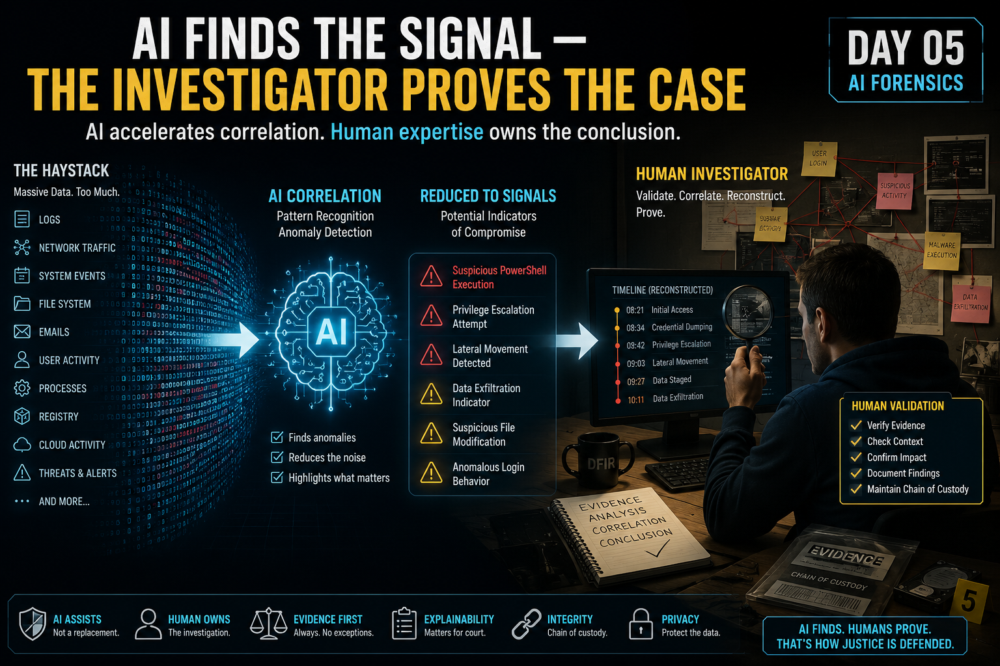

# Day 05 — AI Forensics

<p align="center">
  
</p>

> AI can accelerate correlation and help me find the evidence that matters. It cannot become the expert, the evidence, or the final authority.

## At a Glance

**Reading time:** about 21 minutes

This entry explores how AI can support DFIR while preserving evidence integrity, explainability, reproducibility, privacy, and human accountability.

**Key takeaways:**

- AI output can identify a lead, but it is not forensic evidence by itself.
- Accuracy, precision, and recall represent different operational trade-offs.
- A defensible conclusion requires preserved evidence, documented processing, and human validation.

**Suggested path:** Read the metric sections first, then continue with chain of custody, auditability, and the four trust questions near the end.

**Quick navigation:** [Performance metrics](#performance-metrics-can-be-misleading) · [Chain of custody](#chain-of-custody-does-not-disappear-because-ai-is-involved) · [Four trust questions](#my-four-questions-before-trusting-ai-in-dfir) · [Key takeaway](#key-takeaway)

## From AI Security to AI-Assisted Investigation

Until this point in my AI Security journey, most of my questions were about the AI system itself.

How does it work?

Can I trust its model and data?

How can it be attacked?

How do prompts influence its behaviour?

Day 05 changed the perspective.

The question became:

> **What happens when I actually use AI during a digital forensic investigation?**

At first, the value seems obvious.

Digital Forensics and Incident Response can involve enormous amounts of data:

* endpoint events;
* authentication logs;
* network telemetry;
* emails;
* files;
* processes;
* memory artefacts;
* cloud logs;
* user activity.

Finding one important event among millions can become a classic:

> **Needle in a haystack problem.**

AI and Machine Learning can help reduce that haystack.

But during this Day I realised that making an investigation faster and proving what actually happened are two different problems.

That distinction became the foundation of everything else I learned.

---

## Why AI Makes Sense in DFIR

DFIR has a natural problem that AI is good at addressing:

**scale.**

Imagine an investigation containing:

```text
8,000,000 events
        ↓
Endpoints
Firewall
Authentication
Applications
Network
Cloud
        ↓
Human Investigator
```

A human can investigate those events.

But manually examining every individual event is not realistic.

AI/ML can help process large volumes of information, recognise patterns and identify anomalies much faster.

Conceptually:

```text
Millions of Events
        ↓
AI / ML Analysis
        ↓
Patterns + Anomalies + Prioritisation
        ↓
Smaller Investigation Surface
        ↓
Human Investigation
```

This is where I see one of the strongest applications of AI in DFIR.

AI does not necessarily solve the investigation.

It helps tell me:

> **Look here first.**

---

## Anomaly Detection: Turning the Haystack into Something Smaller

One of the most useful capabilities of Machine Learning in security is anomaly detection.

A model can learn patterns representing normal behaviour for:

* users;
* endpoints;
* applications;
* networks;
* authentication;
* processes.

It can then identify deviations from those patterns.

For example:

```text
User Behaviour Baseline

08:00–18:00
Internal network
Known workstation
Normal applications
Typical file access
```

Then suddenly:

```text
03:01
External source
Multiple authentication failures
Successful login
Privilege escalation
Sensitive file access
```

The model does not necessarily know the complete story.

But it can recognise:

> **This does not look normal.**

That can reduce millions of events into a much smaller group of events that deserve investigation.

This is extremely valuable.

But it also creates the first important boundary:

> **An anomaly is an investigative lead, not automatically proof of malicious activity.**

---

## AI Finding Something Suspicious Is Not the Same as Proving What Happened

This distinction became one of my strongest takeaways.

Imagine an ML model flags:

```text
/opt/company/source/product.c

Classification: SUSPICIOUS
```

The investigator checks the file and discovers that it is simply legitimate proprietary source code.

Was the AI useless?

No.

It produced a **false positive**.

But it still directed attention toward something that looked unusual according to the model.

The investigator then provided the context the model lacked.

This reinforced a principle that has followed me throughout this journal:

> **An indicator is not a root cause.**

In DFIR I would extend that to:

> **A suspicious classification is not a forensic conclusion.**

---

## Finding Evidence and Proving a Case Are Different Tasks

An AI system may identify several suspicious artefacts:

```text
Suspicious Email
Suspicious Document
Authentication Anomaly
Privilege Escalation
Persistence Mechanism
Sensitive Archive
```

But the investigator still needs to establish relationships between them.

For example:

```text
Phishing
   ↓
Malicious Document
   ↓
Credential Harvesting
   ↓
Account Access
   ↓
Privilege Escalation
   ↓
Persistence
   ↓
Sensitive Data Access
   ↓
Data Theft
```

The value of AI is helping surface the pieces.

The role of the investigator is determining whether those pieces actually belong to the same puzzle.

That requires questions such as:

* Who performed the action?
* When did it happen?
* Which process initiated it?
* What happened immediately before?
* What happened afterward?
* Does another artefact confirm the same event?
* Is there an alternative explanation?
* Is the evidence intact?
* Can the conclusion be reproduced and defended?

That is why I no longer think of AI in DFIR as:

```text
Evidence
   ↓
AI
   ↓
Truth
```

I think of it more like:

```text
Evidence
   ↓
AI-Assisted Identification
   ↓
Potential Leads
   ↓
Correlation
   ↓
Human Validation
   ↓
Forensic Conclusion
```

---

## Performance Metrics Can Be Misleading

Another important part of this Day was learning that a single performance number can hide serious weaknesses.

Imagine a dataset containing:

```text
10,000 files

9,990 benign
10 malicious
```

Now imagine a terrible model that classifies everything as benign.

Its result would be:

```text
9,990 benign → BENIGN
10 malicious → BENIGN
```

That model is correct 9,990 times out of 10,000.

Its accuracy is:

```text
99.9%
```

That sounds excellent.

But from a security perspective the model missed:

```text
100% of the malicious files
```

So despite having extremely high accuracy, it failed completely at the task I actually cared about.

This changed how I interpret model performance.

> **A high accuracy number does not automatically mean a useful security model.**

---

## Accuracy

Accuracy asks:

> **How many predictions were correct overall?**

Conceptually:

```text
Correct Predictions
───────────────────
Total Predictions
```

Accuracy is useful.

But in a highly imbalanced dataset, it can create a misleading picture.

If almost everything is benign, predicting:

```text
BENIGN
```

for almost everything can still produce impressive accuracy.

That is why other metrics matter.

---

## Recall

Recall asks:

> **Of all the real positive cases, how many did the model actually find?**

For a malware detector:

```text
10 real malware samples
        ↓
8 detected
2 missed
```

The recall would be:

```text
8 / 10 = 80%
```

The mental shortcut I want to remember is:

> **Recall tells me how much of the real threat population I managed to find.**

In security, high recall can be extremely important because low recall means malicious activity may pass unnoticed.

---

## Precision

Precision asks a different question:

> **Of everything the model said was positive, how much was actually positive?**

Imagine:

```text
208 files flagged as malware

8 actually malicious
200 actually benign
```

The model found most of the malware.

But it also created a huge number of false alarms.

That means its precision is poor.

My mental shortcut became:

> **Recall tells me how many real problems I found.**

> **Precision tells me how often I was right when I said there was a problem.**

---

## Precision and Recall Represent an Operational Trade-Off

This became easier for me when I connected it to SOC operations.

### High Recall, Low Precision

```text
Most threats detected
        +
Many false positives
```

This reduces the chance of missing attacks.

But analysts may spend significant time investigating false alarms.

### High Precision, Low Recall

```text
Most alerts are real
        +
Some actual threats are missed
```

This reduces unnecessary investigation.

But malicious activity may escape detection.

For many DFIR and detection scenarios, I would rather investigate additional false positives than intentionally accept a high number of false negatives.

But that does not mean precision is unimportant.

Too many false positives can create:

* analyst fatigue;
* wasted investigation time;
* increased cost;
* alert desensitisation;
* slower response to genuine incidents.

The correct balance depends on the investigation and the consequences of each type of error.

---

## False Positive vs False Negative

This distinction is important enough for me to keep explicit.

### False Positive

```text
Reality: BENIGN
Model:   MALICIOUS
```

Possible consequence:

> unnecessary investigation.

### False Negative

```text
Reality: MALICIOUS
Model:   BENIGN
```

Possible consequence:

> actual malicious activity remains undetected.

Neither is desirable.

But they represent very different operational risks.

---

## Accuracy, Precision and Recall Need Context

During the learning exercise I initially interpreted poor classification performance too quickly as a possible training issue such as overfitting.

That was another useful correction.

If a model misses malicious samples, that tells me something about its **performance**.

It does not automatically tell me the **root cause**.

The cause could involve:

* training data;
* model design;
* thresholds;
* bias;
* environment changes;
* insufficient representation;
* configuration;
* another issue.

Again:

> **Performance degradation is an indicator to investigate, not a root-cause diagnosis by itself.**

This connects directly with what I learned in earlier Days.

---

## Garbage In, Garbage Out

AI does not rescue bad evidence.

This sounds obvious, but it becomes especially important in forensics.

Imagine:

```text
Corrupted Evidence
        ↓
Advanced AI Model
        ↓
Beautiful Correlation
        ↓
Detailed Timeline
        ↓
Wrong Conclusion
```

A sophisticated model cannot magically restore trust that was already lost in the evidence.

If the source data is:

* corrupted;
* incomplete;
* improperly collected;
* manipulated;
* unrepresentative;
* incorrectly parsed;

then the output may also be unreliable.

This is the classic:

> **Garbage In, Garbage Out — GIGO**

For DFIR, I interpret this even more strongly:

> **AI can analyse evidence faster, but it cannot compensate for evidence whose integrity cannot be trusted.**

---

## Nondeterminism Becomes More Serious in Forensics

Day 04 taught me that LLMs are nondeterministic.

Conceptually:

```text
Same Input
   ↓
Run 1 → Output A
Run 2 → Output B
```

For a general chatbot, small variations may not matter much.

In DFIR, the implications are different.

Imagine two investigators processing exactly the same evidence and receiving:

```text
Investigator A → Timeline A

Investigator B → Timeline B
```

Now the question is no longer only:

> **Which output is better?**

It becomes:

> **Which conclusion can I reproduce and defend?**

That makes nondeterminism a forensic concern.

Forensic work needs:

* repeatability;
* traceability;
* explainability;
* defensibility.

If an AI-assisted process changes significantly between runs, those variations need to be understood and controlled as much as possible.

---

## Explainability Matters More Than a High Score

Imagine an AI reviews 500,000 emails and returns:

```text
37 emails → HIGHLY SUSPICIOUS
```

Someone asks:

> **Why these 37?**

And the investigator responds:

> The model normally has 97% accuracy.

That does not answer the question.

Accuracy tells me something about the model's general performance.

Explainability helps me understand a **specific decision**.

In forensic work, I may need to explain:

* which characteristics influenced the classification;
* which evidence supported the conclusion;
* what process was used;
* whether alternative explanations were considered.

This gave me an important distinction:

> **High accuracy can tell me that a model usually performs well. Explainability helps me defend why this particular result should be trusted.**

---

## Black Boxes Create a Forensic Problem

Some AI models are difficult to interpret internally.

We may understand:

```text
Input
  ↓
Model
  ↓
Output
```

without being able to clearly explain all of the internal reasoning behind the decision.

This creates a challenge when AI is used in environments where conclusions may be challenged.

A forensic investigator cannot simply say:

> **The algorithm said so.**

The underlying evidence still needs to support the conclusion.

AI output should therefore guide the investigator toward evidence that can be independently examined.

---

## Bias Can Change Which Evidence Gets Attention

Bias is not only an abstract fairness issue.

It can directly influence an investigation.

Imagine a model trained primarily on English-language communications.

During an international investigation:

```text
English Messages
      ↓
Strong Analysis

Portuguese Messages
      ↓
Frequently Deprioritised

Spanish Messages
      ↓
Frequently Deprioritised
```

The model may not have been attacked.

It may simply perform better on patterns that were better represented during training.

But the forensic consequence can still be serious.

Relevant evidence may be:

* ranked lower;
* classified incorrectly;
* reviewed later;
* or potentially overlooked.

This gave me another useful way to think about bias:

> **Bias in DFIR can influence which evidence gets seen first, later, or not at all.**

That can affect the entire direction of an investigation.

---

## AI Bias Can Become a Real-World Justice Problem

In ordinary technical systems, bias may reduce model quality.

In forensic or legal contexts, the consequences can extend beyond technical performance.

If an AI-assisted method systematically performs worse for certain populations, languages, environments or types of evidence, that can influence:

* investigative priorities;
* conclusions;
* legal decisions;
* fairness;
* trust in the investigation.

This means model validation in DFIR needs to consider more than:

```text
Does the model work?
```

It should also ask:

```text
For whom does it work?

On what data?

Under which conditions?

Where does it fail?
```

---

## Chain of Custody Does Not Disappear Because AI Is Involved

Chain of custody is fundamental to digital forensics.

Evidence needs to be handled in a traceable and controlled manner.

Introducing AI creates additional steps that may need to be documented.

Consider:

```text
Original Evidence
       ↓
AI Processing
       ↓
Intermediate Output
       ↓
AI Summary
       ↓
Investigator Interpretation
       ↓
Final Report
```

If months later someone asks:

> **How did you get from the original evidence to this conclusion?**

I need to be able to reconstruct the process.

That may require documenting information such as:

* evidence source;
* integrity verification;
* tool used;
* model/version;
* processing environment;
* relevant configuration;
* prompts or analysis instructions;
* intermediate outputs;
* timestamps;
* transformations;
* investigator actions.

The exact requirements will depend on the investigation and legal environment.

But the principle is clear:

> **AI should not create an invisible step inside the chain of custody.**

---

## Auditability Matters

This led me to think about AI-assisted forensics almost like any other forensic tooling.

If a tool modifies, transforms, parses or interprets evidence, I need to understand what happened.

Conceptually:

```text
Evidence A
   ↓
Known Process
   ↓
Documented Transformation
   ↓
Result B
```

is much easier to defend than:

```text
Evidence A
   ↓
Unknown AI Process
   ↓
Result B
```

If I cannot reconstruct the AI-assisted analysis process, I may not be able to defend the conclusion produced by that process.

---

## Cloud AI Introduces Another Evidence Boundary

Using cloud AI can be operationally attractive.

It can provide:

* scalability;
* strong processing capability;
* rapid analysis;
* access to sophisticated models.

But forensic evidence can contain extremely sensitive information:

```text
PII
Credentials
Emails
Employee Data
Internal Documents
Intellectual Property
Investigation Details
```

Sending that information to an external service creates another security and privacy boundary.

Before doing so, I would need to understand:

* where the data is processed;
* whether it is retained;
* who can access it;
* how it is protected;
* whether it may be reused;
* which jurisdiction applies;
* which contractual protections exist;
* whether the processing is legally permitted.

An excellent AI analysis does not justify creating a confidentiality or privacy incident in the process.

---

## Privacy Is Part of Forensic Integrity

This was another change in perspective for me.

I previously thought primarily about whether the AI output was technically correct.

But an investigation also needs to consider whether the **process used to obtain that output was appropriate**.

Conceptually:

```text
Technically Excellent Analysis
              +
Improper Handling of Sensitive Evidence
              =
Potentially Serious Problem
```

The quality of the answer does not erase the way the evidence was handled.

---

## Controlled Environments Make More Sense for Sensitive Investigations

For highly sensitive evidence, controlled AI environments can reduce some of these concerns.

Depending on the situation, that could mean:

```text
Forensic Evidence
       ↓
Controlled / Approved Environment
       ↓
AI-Assisted Processing
       ↓
Logged Outputs
       ↓
Human Validation
```

rather than:

```text
Forensic Evidence
       ↓
Unknown Public Service
       ↓
Unknown Retention / Processing
       ↓
AI Output
```

The key lesson for me is not:

> **Cloud AI is always wrong.**

It is:

> **The processing environment becomes part of the forensic and privacy risk assessment.**

---

## AI Does Not Own the Conclusion

This may be the most important distinction of the entire Day.

Imagine an investigator being asked:

> **Was it the AI that determined the suspect performed the action?**

The answer should not be:

> Yes, the AI concluded that.

A more defensible model is:

```text
AI-Assisted Tool
       ↓
Identified Potentially Relevant Artefacts
       ↓
Investigator Examined Original Evidence
       ↓
Correlations Independently Validated
       ↓
Investigator Reached Conclusion
```

The AI can support the investigation.

The investigator remains responsible for interpreting and validating the evidence.

This is important technically, ethically and professionally.

---

## AI as an Investigative Assistant

My mental model after Day 05 became:

```text
AI ≠ Investigator
AI ≠ Expert Witness
AI ≠ Judge
AI ≠ Truth
```

Instead:

```text
AI
 ↓
Investigative Assistant
 ↓
Pattern Detection
Anomaly Detection
Prioritisation
Correlation
Classification
Summarisation
 ↓
Human Investigator
 ↓
Validation
Context
Judgment
Accountability
Conclusion
```

This is where I see the real value.

AI can increase the investigator's reach.

It should not replace the investigator's responsibility.

---

## Why Human Validation Is Still Essential

Human validation is not necessary merely because:

> **AI sometimes makes mistakes.**

The reason is broader.

The human investigator provides things the model may not have:

### Context

The model may flag proprietary source code as suspicious.

The investigator knows why that file exists.

### Evidence Validation

The model may describe a relationship.

The investigator verifies that relationship against original artefacts.

### Alternative Hypotheses

The model may identify one plausible explanation.

The investigator considers whether another explanation fits the evidence.

### Legal and Procedural Awareness

The investigator understands evidence handling requirements, privacy constraints and investigative procedures.

### Accountability

Ultimately, someone must own and defend the conclusion.

That cannot simply be delegated to:

> **The algorithm.**

---

## AI Can Find the Needle Faster

The classic metaphor for DFIR is:

> **Finding a needle in a haystack.**

After Day 05, I would modify it.

AI can help:

```text
Huge Haystack
     ↓
AI / ML
     ↓
Much Smaller Haystack
     ↓
Human Investigator
     ↓
Needle
```

That is extremely valuable.

But there is another step:

```text
Needle Found
     ↓
Is it relevant?
     ↓
Is it authentic?
     ↓
How does it relate to other evidence?
     ↓
What does it actually prove?
```

Those questions still require forensic investigation.

---

## A Model Can Be Useful Without Being Perfect

The false-positive example helped me understand something else.

If AI flags one legitimate file as suspicious, I should not immediately conclude:

```text
The entire model is useless.
```

Instead, I should evaluate:

* overall performance;
* precision;
* recall;
* false-positive rate;
* false-negative consequences;
* context;
* operational workload;
* investigation objectives.

Security tools have always required tuning and interpretation.

AI-assisted tools are no exception.

The important difference is remembering that their output can appear extremely confident even when it is wrong.

---

## Confidence Is Not Evidence

This distinction deserves its own place.

An AI system can produce:

```text
Assessment: MALICIOUS
Confidence: 98%
```

That number does not replace evidence.

The investigator still needs:

```text
Claim
  ↓
Supporting Artefact
  ↓
Independent Validation
  ↓
Correlation
  ↓
Conclusion
```

A confidence score is information about the model's assessment.

It is not proof that the event happened.

---

## Evidence Reported by AI Still Needs to Exist

This connects directly with Day 04.

A structured AI response might say:

```text
Evidence:
- suspicious authentication
- privilege escalation
- persistence mechanism
- sensitive archive created
```

That structure is useful.

But each claim still needs to be checked.

```text
AI Claim
   ↓
Original Evidence
   ↓
Confirmed?
```

Asking AI to provide evidence makes validation easier.

It does not make generated evidence automatically true.

---

## AI Can Accelerate Correlation

One of the strongest benefits I see for AI in DFIR is correlation.

A human investigator might need to connect:

```text
Email
 ↓
Attachment
 ↓
Process Execution
 ↓
Authentication
 ↓
Privilege Escalation
 ↓
File Creation
 ↓
Network Activity
```

AI can potentially help surface those relationships much faster.

But correlation itself still needs to be verified.

Two events occurring near each other does not automatically mean one caused the other.

Again:

> **Correlation helps build the theory. Evidence validates the theory.**

---

## Reproducibility and Defensibility

One of my answers during this Day came from thinking about the scientific nature of forensic investigation.

A conclusion should not depend only on:

> **Trust me. The AI said it.**

The methodology needs to be understandable and defensible.

This becomes challenging with probabilistic systems.

If:

```text
Evidence X
   ↓
AI Run 1
   ↓
Conclusion A
```

and:

```text
Evidence X
   ↓
AI Run 2
   ↓
Conclusion B
```

the investigator needs to understand why.

This does not necessarily mean AI cannot be used.

It means AI-assisted methods require additional care around:

* documentation;
* configuration;
* versioning;
* logging;
* validation;
* repeatability;
* interpretation.

The stronger the consequence of the conclusion, the stronger the need for defensibility.

---

## AI Output and Forensic Evidence Are Not the Same Thing

This distinction became increasingly important to me.

Suppose AI analyses authentication logs and says:

> **The attacker gained access at 03:01.**

The AI statement itself is not necessarily the primary evidence.

The underlying authentication record is.

A safer mental model is:

```text
Authentication Log
       ↓
Evidence

AI Interpretation
       ↓
Investigative Assistance
```

The investigator can use the AI interpretation to locate and understand the relevant record.

But the conclusion should remain grounded in the underlying evidence.

---

## What Happens When the Model Is Wrong?

This Day also made me think differently about AI errors.

If a model produces a false positive:

```text
Legitimate File → SUSPICIOUS
```

the result may cause additional investigation.

If it produces a false negative:

```text
Malicious File → BENIGN
```

the evidence may never receive attention.

These are not equivalent consequences.

So model evaluation should not only ask:

> **How often is it wrong?**

It should also ask:

> **What happens when it is wrong?**

This connects with another principle from earlier Days:

> **Risk is not only probability. Impact matters too.**

---

## AI Performance Is Not Forensic Trust

Day 03 taught me:

> **Model performance and model trust are not the same thing.**

Day 05 extended that principle.

A model can have excellent benchmark performance and still create forensic problems if:

* its decisions cannot be explained;
* its data are biased;
* evidence handling is undocumented;
* intermediate processing is lost;
* sensitive evidence is improperly shared;
* results cannot be meaningfully reproduced;
* investigators accept its conclusions without validation.

So in DFIR:

```text
High Performance
      ≠
Forensic Trust
```

Trust needs more than a metric.

---

## My Four Questions Before Trusting AI in DFIR

By the end of this Day, I found myself reducing the problem to four questions.

### 1. Is it useful?

Does the AI actually help me:

* process evidence;
* identify anomalies;
* correlate events;
* prioritise investigation;
* reduce manual work?

### 2. Is it reliable?

What do I know about:

* accuracy;
* precision;
* recall;
* false positives;
* false negatives;
* bias;
* input quality?

### 3. Is it verifiable?

Can I:

* inspect the underlying evidence;
* understand the result;
* reproduce the process;
* audit what happened;
* explain the conclusion?

### 4. Is it defensible?

If someone challenges the result, can I demonstrate:

* evidence integrity;
* methodology;
* chain of custody;
* appropriate handling;
* human validation?

For me, these four questions provide a much stronger framework than simply asking:

> **Does the AI work?**

---

## What Changed in My Understanding

Before Day 05, the value proposition seemed straightforward:

> **AI can process evidence faster than humans.**

That is still true.

But it is only the beginning.

Now I think about AI-assisted DFIR as a balance between:

```text
Speed
Scale
Pattern Recognition
Correlation
```

and:

```text
Integrity
Explainability
Bias
Privacy
Chain of Custody
Reproducibility
Human Judgment
Accountability
```

The first group explains why I want AI.

The second group determines whether I can responsibly use what it gives me.

---

## The Investigator Still Owns the Investigation

This is the most important change in my mental model.

AI can help me:

* search;
* classify;
* prioritise;
* correlate;
* summarise;
* detect anomalies.

But the human investigator still needs to:

* verify;
* contextualise;
* challenge;
* reproduce;
* document;
* interpret;
* conclude.

My own way of expressing it became:

> **In digital forensics, AI should be treated as an investigative assistant and correlation accelerator, not as the expert or judge that determines the truth.**

---

## Key Takeaway

If I had to summarise Day 05 in one idea:

> **AI can help me find the needle faster. It cannot decide by itself whether that needle proves the case.**

Or from an operational perspective:

```text
Evidence
   ↓
AI-Assisted Analysis
   ↓
Potential Findings
   ↓
Human Validation
   ↓
Defensible Conclusion
```

AI can accelerate correlation.

The investigator validates the evidence and owns the conclusion.

That distinction is what makes AI useful in Digital Forensics without allowing convenience to replace forensic discipline.

---

## Next

The next part of this journey will continue based on the next AI Security topic I study.

Rather than defining the conclusion in advance, I want each new Day to begin with the same process:

**Learn → Question → Understand → Apply → Share**

---

## Module 1 — Mastery Check

With the first learning module completed, I also completed its **Mastery Check successfully, with all answers correct**.

The assessment revisited several concepts explored throughout Days 01–05, including:

- validation sets and their role in identifying overfitting;
- bias as both an ethical and potential legal concern in investigations;
- model theft through repeated API querying and behavioural replication;
- reinforcement learning through rewards and penalties;
- practical applications of defensive AI capabilities in SOC workflows.

More importantly than the score, the checkpoint helped confirm that concepts introduced separately throughout the first module are beginning to connect.

Model behaviour depends on data and training.

Model performance needs validation.

AI systems introduce new attack surfaces.

AI-assisted investigations still require human validation.

And security decisions cannot rely on model output alone.

My biggest takeaway from completing this first module is:

> **Model behaviour, data quality, security threats, investigation, and human validation are not isolated AI Security topics. They are different parts of the same system.**

This officially closes:

> **Module 1 — AI Fundamentals**

The next stage of the journey moves from understanding how AI works, where its risks come from, and how it can support cybersecurity toward a new question:

> **How do we actually secure AI systems?**

That will be the starting point for:

**Module 2 — Secure AI Systems**

---

## References

- [NIST — Digital Forensics](https://www.nist.gov/itl/ai/digital-forensics)
- [NIST — Computer Forensics Tool Testing Program](https://www.nist.gov/itl/csd/secure-systems-and-applications/computer-forensics-tool-testing-program-cftt)
- [NIST — Four Principles of Explainable Artificial Intelligence](https://www.nist.gov/publications/four-principles-explainable-artificial-intelligence)
- [NIST — AI Risk Management Framework](https://www.nist.gov/itl/ai-risk-management-framework)

---

## About This Learning Journal

This repository documents my personal learning journey and reflections while studying AI Security.

The learning path is inspired by my studies using **TryHackMe's AI Security material**, combined with my previous cybersecurity and incident-management experience.

The explanations, analogies, examples, and conclusions presented here represent my own understanding and reflections.

This repository does not reproduce TryHackMe labs, questions, solutions, flags, or proprietary course content.

**Learn → Question → Understand → Apply → Share**
