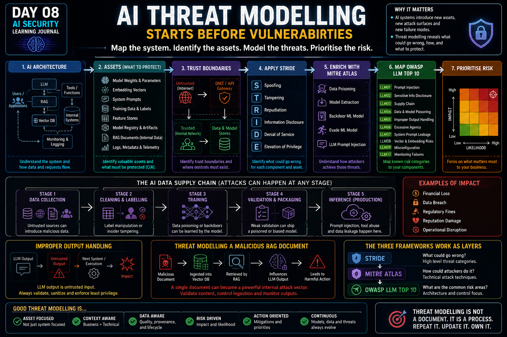

# Day 08 — AI Threat Modelling

<p align="center">
  
</p>

> AI threat modelling starts before vulnerabilities: first I need to understand the architecture, identify the assets, map the data flows and trust boundaries, and only then apply the frameworks.

## At a Glance

**Reading time:** about 19 minutes

This entry develops a repeatable AI threat-modelling method by combining architecture analysis, STRIDE, MITRE ATLAS, and OWASP guidance.

**Key takeaways:**

- Components, assets, data flows, and trust boundaries must be mapped before threats are listed.
- STRIDE, MITRE ATLAS, and OWASP provide complementary views rather than competing checklists.
- A useful threat model connects a credible path to business impact, mitigation, and priority.

**Suggested path:** Start with the asset and lifecycle sections, then use the 13-step methodology as a reusable checklist.

**Quick navigation:** [AI-specific assets](#ai-specific-assets) · [Data supply chain](#the-ai-data-supply-chain) · [Framework layers](#the-three-frameworks-work-as-layers) · [Methodology](#my-threat-modelling-methodology)

## From Knowing AI Threats to Modelling Them Systematically

Day 06 taught me to look beyond the model and understand the architecture around it.

Day 07 expanded the attack surface into:

**Data → Model → System → User**

Day 08 changed the question again.

Instead of asking:

> **What AI attacks exist?**

I started asking:

> **How do I systematically identify which of those attacks matter to this specific AI deployment?**

That difference is important.

Knowing attack names is useful.

But a real threat assessment needs to connect:

```text
Architecture
   ↓
Assets
   ↓
Data Flows
   ↓
Trust Boundaries
   ↓
Threats
   ↓
Adversary Techniques
   ↓
Affected Components
   ↓
Mitigations
   ↓
Prioritised Risk
```

This is where threat modelling becomes practical.

---

## Traditional Threat Modelling Is Still Useful

The first thing I learned is that AI does not make traditional threat modelling obsolete.

Frameworks such as STRIDE still provide useful ways to think about:

* Spoofing;
* Tampering;
* Repudiation;
* Information Disclosure;
* Denial of Service;
* Elevation of Privilege.

But AI introduces new assets, new supply chains, new behaviours, and new failure modes.

So the goal is not:

> **Replace traditional threat modelling.**

It is:

> **Extend traditional threat modelling to include AI-specific context.**

---

## AI Is Not Just Another Application Component

A traditional application threat model may focus on:

* APIs;
* databases;
* source code;
* credentials;
* configuration;
* infrastructure;
* user accounts.

AI systems inherit all of those assets.

But they introduce additional assets that traditional applications may not contain.

This changes what needs to be inventoried before a threat assessment can even begin.

---

## Component Is Not the Same as Asset

One distinction that became clearer during my learning was:

> **Component = where something operates.**

> **Asset = what has value and needs protection.**

For example:

```text
Component:
Model Registry

Assets:
- Model artifacts
- Model weights
- Version metadata
- Provenance metadata
```

Or:

```text
Component:
RAG Pipeline

Assets:
- Internal documents
- Embedding vectors
- Vector index
- Retrieved context
```

If I identify only components, I may still fail to understand what an attacker actually wants.

---

## AI-Specific Assets

Several AI-specific assets became important during this Day.

### Training Data

Training data teaches the model its behaviour.

If the training data are manipulated, the resulting model can learn incorrect or malicious associations.

The damage can become embedded into the trained model itself.

---

## Model Weights and Parameters

Model weights represent what the model has learned.

They are not simply configuration files.

They can embody:

* training investment;
* specialised capabilities;
* proprietary knowledge;
* fine-tuning work;
* intellectual property.

If the weights are stolen, an attacker may obtain a functional copy of the organisation's AI capability.

---

## Embedding Vectors

Embeddings represent data numerically for similarity and retrieval.

They are particularly important in:

* RAG pipelines;
* recommendation systems;
* similarity search;
* fraud systems.

Manipulating embeddings can change what information is retrieved or presented to the model.

That means integrity of embeddings directly affects model context.

---

## System Prompts

System prompts define behavioural instructions and constraints.

They can contain:

* roles;
* behavioural rules;
* business logic;
* workflow guidance;
* application-specific context.

As I learned earlier:

> **System prompts are not security boundaries.**

Threat modelling still needs to consider them as valuable information because leakage may reveal how the system is structured or constrained.

---

## Feature Stores

Feature stores contain preprocessed information used by models during inference.

If an attacker alters features, the model may receive a distorted view of reality without the model itself being modified.

That creates another important distinction:

> **An attacker can manipulate what the model sees without changing the model.**

---

## Model Registry and Artifacts

The model registry stores approved model versions for deployment.

This makes it a critical supply-chain component.

A compromised registry may allow:

```text
Validated Model
     ↓
Attacker Replacement
     ↓
Backdoored Model
     ↓
Production
```

If integrity verification is weak, the deployment pipeline may trust the malicious artifact.

---

## CIA Still Applies to AI Assets

The CIA triad remains useful when analysing AI-specific assets.

For example:

### Model Registry

**Confidentiality**

Model weights and proprietary artifacts may need to remain private.

**Integrity**

A validated model must not be replaced or modified.

**Availability**

Approved models need to remain accessible for deployment and rollback.

### RAG System

**Confidentiality**

Sensitive documents and retrieved context should only reach authorised users.

**Integrity**

Documents, embeddings, and indexes must not be maliciously altered.

**Availability**

Retrieval systems and data sources need to remain accessible when the AI application depends on them.

The assets are new.

The core security principles are not.

---

## The AI Data Supply Chain

One of the most important differences between AI and traditional applications is the existence of a separate **data supply chain**.

A simplified model lifecycle can be represented as:

```text
Data Collection
      ↓
Cleaning / Labelling
      ↓
Model Training
      ↓
Validation / Packaging
      ↓
Inference
```

Each stage creates a different opportunity for compromise.

---

## Stage 1 — Data Collection

Training data may come from:

* internal databases;
* user-generated content;
* purchased datasets;
* web scraping;
* third-party providers;
* telemetry;
* operational systems.

If an attacker can influence one of those sources, the attack can begin before training even starts.

---

## Stage 2 — Cleaning and Labelling

Raw data need to be processed and labelled.

This introduces another integrity boundary.

Incorrect or malicious labels can teach the model wrong relationships.

For example:

```text
Fraudulent Transaction
        ↓
Labelled as Legitimate
        ↓
Training
        ↓
Model Learns Wrong Association
```

The dataset may still look structurally valid.

That makes this type of corruption difficult to notice.

---

## Stage 3 — Training

Any poison that survives collection and cleaning may become incorporated into the model during training.

At this point:

```text
Bad Data
   ↓
Training
   ↓
Weights
   ↓
Bad Behaviour Embedded
```

Unlike replacing one incorrect database row, fixing the problem may require:

* identifying contaminated data;
* cleaning the dataset;
* retraining;
* validating again;
* redeploying.

---

## Stage 4 — Validation and Packaging

A trained model is evaluated and stored for deployment.

This stage introduces two important concerns:

* whether validation is representative;
* whether the packaged artifact itself can be trusted.

A model can pass ordinary validation and still contain a malicious backdoor.

---

## Backdoor ML Models

A backdoored model may behave normally for almost every ordinary input.

For example:

```text
Normal Inputs
      ↓
Normal Predictions
```

But:

```text
Specific Trigger
merchant_code=773377
      ↓
Unexpected / Malicious Behaviour
```

If the validation dataset never contains the trigger, the model may appear perfectly healthy.

That makes backdoors particularly dangerous.

---

## Stage 5 — Inference

At inference time, a deployed AI system may receive:

* user input;
* retrieved documents;
* embeddings;
* API data;
* live transaction features;
* tool output.

This introduces attack surfaces that did not necessarily exist during training.

A secure training pipeline does not automatically mean secure inference.

---

## Data Poisoning Can Be Slow and Silent

One scenario that helped me understand this was a fraud model retrained monthly.

Imagine an attacker gradually inserts specially crafted fraudulent transactions.

```text
Month 1
small number of poisoned samples

Month 2
more poisoned samples

Month 3
more poisoned samples

...
```

Eventually:

```text
Fraud Pattern
      ↓
Model
      ↓
LEGITIMATE
```

The attack may take months to become visible.

That delay is one of the reasons AI data poisoning does not fit perfectly into ordinary assumptions about data tampering.

---

## Data Poisoning vs Traditional Data Tampering

Traditional database tampering can create an immediate effect:

```text
Database Record Modified
        ↓
System Uses Modified Record
```

Training data poisoning can look more like:

```text
Poisoned Sample
      ↓
Collection
      ↓
Cleaning
      ↓
Training
      ↓
Validation
      ↓
Deployment
      ↓
Weeks or Months Later
      ↓
Incorrect Behaviour
```

The effect is:

* delayed;
* statistical;
* potentially subtle;
* distributed across weights;
* difficult to trace back to one specific data point.

That is an important limitation when using STRIDE without AI context.

---

## STRIDE Still Works — But Needs AI Context

STRIDE gives useful security categories.

But the meaning of those categories changes in AI systems.

---

## Tampering in AI

Traditional Tampering may mean:

> A configuration file or database record was modified.

In AI, Tampering may also involve:

* poisoned training data;
* manipulated labels;
* altered embeddings;
* modified model artifacts;
* backdoored models;
* corrupted features.

The category remains valid.

The behaviour and consequences are different.

---

## Information Disclosure in AI

Information Disclosure can include:

* sensitive output;
* system prompt leakage;
* training data extraction;
* model weights;
* proprietary model behaviour.

A model extraction attack can technically fit under Information Disclosure.

But what is being disclosed is not merely a record.

It may be:

> **The organisation's entire trained AI capability.**

That changes the business impact substantially.

---

## Elevation of Privilege in AI

The concept of privilege also expands.

An agent may have capabilities such as:

```text
read_email()
send_email()
query_database()
execute_code()
deploy_application()
```

These functions effectively become privileges.

If an attacker manipulates the model into using a capability that the attacker could not directly invoke, the AI system may become a privilege boundary.

That makes tool permissions part of threat modelling.

---

## AI Threats Can Cross Multiple STRIDE Categories

Another limitation is that AI threats do not always fit neatly into one STRIDE category.

An adversarial input may involve:

* Tampering;
* Spoofing;
* Elevation of Privilege;

depending on the scenario.

This does not mean STRIDE failed.

It means AI threats sometimes span multiple traditional categories.

---

## STRIDE Is the First Layer

The mental shortcut that became useful to me is:

> **STRIDE tells me what type of threat I am looking at.**

For example:

```text
Training Pipeline
      ↓
Tampering Risk
```

But:

> **"Tampering risk exists" is not yet a strong security finding.**

I still need to understand how an attacker would perform that attack.

That is where MITRE ATLAS becomes useful.

---

## MITRE ATLAS — The Technical Enrichment Layer

MITRE ATLAS provides adversarial tactics and techniques specifically for AI and ML systems.

The relationship became clear to me:

```text
STRIDE
   ↓
What type of threat?

ATLAS
   ↓
How could the adversary actually do it?
```

ATLAS enriches a general threat category with specific adversary behaviour.

---

## Turning a Generic Finding Into an Actionable Finding

Suppose STRIDE tells me:

> **The training pipeline is vulnerable to Tampering.**

That finding is too generic.

I can then use ATLAS to identify something such as:

```text
Data Poisoning
AML.T0020
```

Now I can investigate:

* attack prerequisites;
* attack methods;
* real-world cases;
* related techniques;
* mitigations.

So the finding evolves from:

> **Tampering is possible.**

to:

> **An attacker who can influence training data could perform Data Poisoning against this pipeline, and these controls should be evaluated.**

That is much more actionable.

---

## ATLAS Tactics, Techniques, and Mitigations

The ATLAS model mirrors concepts already familiar from MITRE ATT&CK.

Conceptually:

```text
TACTIC
Why is the adversary doing this?
        ↓
TECHNIQUE
How are they doing it?
        ↓
SUB-TECHNIQUE
Which specific variation?
        ↓
MITIGATION
What can reduce the risk?
```

This provides a common vocabulary for discussing AI threats.

---

## Data Poisoning

One ATLAS technique relevant to AI threat modelling is Data Poisoning.

The attacker attempts to introduce malicious data into a training pipeline.

The goal may be:

* broad degradation;
* targeted misclassification;
* creation of attacker-friendly decision boundaries;
* enabling later evasion.

This maps naturally to STRIDE Tampering.

---

## Model Extraction

Model Extraction targets the model's behaviour or intellectual property.

Conceptually:

```text
Target Model API
        ↓
Large Number of Queries
        ↓
Collect Input / Output Pairs
        ↓
Train Surrogate Model
        ↓
Approximate Original Behaviour
```

This is different from Training Data Extraction.

The goal is not primarily to recover records from the training dataset.

It is to reproduce the model's functionality.

---

## Backdoor ML Model

A Backdoor ML Model contains hidden behaviour activated by a specific trigger.

Conceptually:

```text
Normal Input
   ↓
Normal Behaviour
```

but:

```text
Trigger Input
   ↓
Malicious Behaviour
```

This is different from permanently controlling the training algorithm.

The malicious behaviour already exists inside the deployed model and remains dormant until activated.

---

## Evade ML Model

Another important scenario is adversarial evasion.

Imagine a fraud system where the attacker changes transaction characteristics just enough to cause:

```text
FRAUD
  ↓
Model
  ↓
LEGITIMATE
```

The attacker did not necessarily:

* poison training data;
* modify the model;
* compromise the server.

They manipulated the inference input.

This is an **Evade ML Model** scenario.

Depending on context, it may map across multiple STRIDE categories.

---

## LLM Prompt Injection

ATLAS also provides specific techniques for LLM Prompt Injection.

This includes:

### Direct Injection

```text
User
 ↓
Malicious Prompt
 ↓
LLM
```

### Indirect Injection

```text
External Document
       ↓
Retrieved by RAG
       ↓
Malicious Instructions
       ↓
LLM Context
```

This connects directly with the Day 07 principle:

> **Retrieved data is still untrusted data.**

---

## STRIDE and ATLAS Are Complementary

I now think about the relationship like this:

```text
STRIDE:
"What type of security problem is this?"

ATLAS:
"How would an adversary perform this AI-specific attack?"
```

Neither replaces the other.

One provides the category.

The other provides the technical detail.

---

## OWASP LLM Top 10 Adds the Architecture View

The third layer is OWASP LLM Top 10.

This changed the question again.

Instead of only asking:

> **What type of threat is this?**

or:

> **How will the attacker perform it?**

I can ask:

> **Where does this risk live in the architecture?**

This makes OWASP particularly useful when reviewing an architecture diagram.

---

## Risk → Component

Suppose I know the risk is:

> **Prompt Injection**

I can ask:

```text
Which components are exposed?
```

Possible answers include:

* LLM inference endpoint;
* RAG pipeline;
* vector database content;
* components feeding text into the model.

Now I know where controls need to be evaluated.

---

## Component → Risks

The reverse direction is even more useful.

Suppose the company adds:

```text
Vector Database
+
RAG Pipeline
```

I can ask:

> **Which OWASP LLM risks now apply to this component?**

Examples include:

* Prompt Injection;
* Vector and Embedding Weaknesses;
* Misinformation.

That immediately defines part of the assessment scope.

---

## Vector Database and RAG Risk Profile

A RAG environment creates several attack possibilities.

### Malicious Retrieved Content

A document may contain instructions designed to manipulate the LLM.

```text
Document
   ↓
RAG
   ↓
LLM
   ↓
Indirect Prompt Injection
```

### Poisoned Embeddings

An attacker may manipulate embeddings or indexed content to influence what gets retrieved.

The result is:

> **The model sees attacker-controlled context before generating its answer.**

### Stale or Incorrect Documents

Even without an attacker, outdated documents can cause the model to produce incorrect answers.

That creates misinformation risk.

So:

```text
RAG
 │
 ├── Prompt Injection
 ├── Embedding Weaknesses
 └── Misinformation
```

---

## LLM Inference Endpoint Has a Large Risk Concentration

One interesting observation from the room was how many risks converge on the inference endpoint.

It can be exposed to:

* Prompt Injection;
* Sensitive Information Disclosure;
* Improper Output Handling;
* Excessive Agency;
* System Prompt Leakage;
* Misinformation;
* Unbounded Consumption.

This makes the inference layer one of the highest-priority parts of an LLM architecture.

---

## Training Pipeline Risk Profile

The training pipeline has a different risk concentration.

It may be exposed to:

* sensitive data entering training;
* third-party dataset risk;
* compromised base models;
* poisoned fine-tuning data;
* data poisoning;
* model poisoning;
* supply-chain compromise.

The risks occur earlier in the lifecycle but may appear much later in production.

---

## Improper Output Handling

One correction that became important during my learning was understanding where responsibility sits when a model generates dangerous output.

Imagine:

```text
LLM
 ↓
<script>
stealCookies()
</script>
```

The model producing code is not automatically the vulnerability.

The failure occurs when:

```text
LLM Output
     ↓
Application Trusts Raw Output
     ↓
Browser Executes It
```

The problem is **Improper Output Handling**.

---

## LLM Output Is Untrusted Input to the Next Component

This principle became particularly useful:

> **LLM output is untrusted input to the next component.**

The security boundary should look like:

```text
LLM Output
     ↓
Validation
Sanitisation
Parsing
Schema Enforcement
     ↓
Downstream System
```

not:

```text
LLM Output
     ↓
Execute
```

This applies to:

* HTML;
* SQL;
* shell commands;
* API calls;
* code;
* workflow actions.

---

## Threat Modelling a Malicious RAG Document

One scenario brought the whole methodology together.

Suppose:

> **The RAG chatbot retrieves documents controlled by an attacker containing malicious instructions.**

A structured assessment could look like:

```text
Asset:
RAG knowledge base / retrieved context

Threat:
Indirect Prompt Injection

STRIDE:
Tampering

MITRE ATLAS:
LLM Prompt Injection

OWASP:
LLM01 — Prompt Injection

Possible Mitigations:
- Treat retrieved content as untrusted
- Restrict indexed sources
- Validate content
- Apply least privilege to tools
- Prevent direct privileged actions
- Monitor abnormal instructions
- Require approval for sensitive operations
```

Now the finding is no longer:

> **RAG might be dangerous.**

It becomes a specific and actionable security finding.

---

## The Three Frameworks Work as Layers

This is probably the most practical framework relationship I learned in this Day.

```text
STRIDE
   ↓
What type of threat?

MITRE ATLAS
   ↓
How can the adversary perform it?

OWASP LLM Top 10
   ↓
Where does the risk live in the architecture?
```

I do not need to choose one framework.

They answer different questions.

---

## My Camera Analogy

The room used an analogy that helped make this relationship intuitive.

I think about it like different zoom levels:

```text
STRIDE
→ Wide-angle view

ATLAS
→ Technical detail

OWASP
→ Where to point the camera
```

Together, they turn a broad security concern into an actionable architecture assessment.

---

## Threat Modelling Is More Than Listing Vulnerabilities

This Day changed how I think about a threat model.

It should not simply become:

```text
Vulnerability 1
Vulnerability 2
Vulnerability 3
```

A useful threat model needs relationships.

For example:

```text
Component
   ↓
Asset
   ↓
Threat
   ↓
Attack Technique
   ↓
Affected Risk Category
   ↓
Business Impact
   ↓
Mitigation
   ↓
Priority
```

That relationship is what gives the assessment value.

---

## Provenance Still Matters

One thing I brought from earlier Days into threat modelling was provenance.

When I receive an AI architecture, I also want to know:

* Where did the model come from?
* Who trained it?
* Which dataset was used?
* Who labelled the data?
* Which base model was used?
* Which third-party dependencies exist?
* Who had access to training?
* Where are artifacts stored?
* How are they validated?
* How are they signed/versioned?

Threat modelling needs architectural information, but it also benefits from understanding the history of the assets.

---

## Data Quality Still Matters

Threat modelling also needs to account for non-malicious weaknesses that can affect security outcomes.

I want to understand:

* dataset representation;
* bias;
* validation results;
* known limitations;
* false positives;
* false negatives;
* model drift;
* unwanted behavioural patterns.

Security risk is not always caused by an attacker compromising a server.

Sometimes the model is behaving poorly because its inputs or training process were already flawed.

---

## My Threat Modelling Methodology

By the end of Day 08, I developed a sequence that makes sense to me when receiving a new AI architecture.

### Step 1 — Receive the Architecture

Understand what is being deployed.

```text
LLM
RAG
Vector Database
Training Pipeline
Model Registry
Tools
APIs
External Data
```

---

## Step 2 — Map Components and Data Flows

Ask:

* What talks to what?
* Where does user data enter?
* Where does external content enter?
* Which components trigger actions?
* Where are models stored?
* Where does training data come from?

---

## Step 3 — Identify the Assets

For every component:

> **What has value here?**

Examples:

* model weights;
* training data;
* embeddings;
* system prompts;
* documents;
* credentials;
* model artifacts;
* features;
* intellectual property.

---

## Step 4 — Identify Trust Boundaries

Ask:

> **Where does data move between different trust levels?**

Examples:

```text
User → Application

Application → LLM

LLM → Tool

External Data → RAG

Registry → Deployment

Training Data → Training Pipeline
```

---

## Step 5 — Review Provenance and Supply Chain

Ask:

* Who supplied this model?
* Who supplied this dataset?
* What external dependencies exist?
* How are artifacts verified?
* Can model versions be replaced?
* Is provenance documented?

---

## Step 6 — Review Permissions and Capabilities

For agentic systems:

```text
What can the model do?
```

Not only:

```text
What can the model read?
```

but also:

* execute;
* send;
* modify;
* delete;
* deploy;
* approve.

Capabilities become part of the threat model.

---

## Step 7 — Review Data Quality and Validation

Ask:

* Is the data representative?
* Is sensitive data present?
* Are labels trustworthy?
* Is validation comprehensive?
* Are trigger/adversarial scenarios tested?
* Are known biases documented?

---

## Step 8 — Apply STRIDE

Walk each component and trust boundary through:

```text
Spoofing
Tampering
Repudiation
Information Disclosure
Denial of Service
Elevation of Privilege
```

The goal is:

> **Identify what could go wrong.**

---

## Step 9 — Enrich With MITRE ATLAS

For each relevant threat:

> **How would an adversary actually perform this against an AI system?**

Use ATLAS techniques and mitigations to make the finding more precise.

---

## Step 10 — Map OWASP Risks to Components

Ask:

> **Which LLM-specific risks live on this component?**

This helps define the assessment scope and prioritisation.

---

## Step 11 — Assess Impact and Likelihood

Now connect technical threats with business consequences.

Examples:

* financial loss;
* data exposure;
* regulatory impact;
* service disruption;
* model theft;
* fraudulent decisions;
* reputational damage;
* incorrect automated actions.

---

## Step 12 — Define Mitigations

Controls may include:

* provenance tracking;
* access control;
* least privilege;
* artifact signing;
* data validation;
* monitoring;
* approval workflows;
* output sanitisation;
* rate limiting;
* secure model registry;
* trusted RAG sources;
* adversarial testing.

---

## Step 13 — Prioritise

Not every threat has the same risk.

A useful assessment needs to identify:

```text
What should we fix first?
```

That is where technical findings become useful to the organisation.

---

## My Final Workflow

My mental model now looks like:

```text
Receive Architecture
        ↓
Map Components and Data Flows
        ↓
Identify Assets
        ↓
Identify Trust Boundaries
        ↓
Check Provenance and Supply Chain
        ↓
Understand Permissions and Capabilities
        ↓
Review Data Quality and Validation
        ↓
Apply STRIDE
        ↓
Enrich with MITRE ATLAS
        ↓
Map OWASP Risks to Components
        ↓
Assess Impact and Likelihood
        ↓
Define Mitigations
        ↓
Prioritised Risk Assessment
```

This is the biggest practical takeaway I want to keep from Day 08.

---

## What Changed in My Understanding

Before Day 08, I might have started a security review by immediately looking for vulnerabilities.

Now I would start earlier.

First:

> **What exists?**

Then:

> **What has value?**

Then:

> **How does data move?**

Then:

> **Where does trust change?**

Then:

> **How was this model/data created and delivered?**

Only after that do I start systematically enumerating threats.

That changes threat modelling from a vulnerability checklist into an architecture-driven security assessment.

---

## Extend, Not Replace

One of the most important lessons from Day 08 is:

> **AI threat modelling does not require throwing away everything we already know.**

Traditional security principles still apply.

STRIDE still applies.

CIA still applies.

Threat boundaries still apply.

Supply-chain security still applies.

Least privilege still applies.

But AI adds:

* new assets;
* new dependencies;
* new behaviours;
* new ways of failing;
* new attack techniques;
* new lifecycle stages.

So the correct approach is:

> **Extend, not replace.**

---

## My Biggest Takeaway

If I had to summarise Day 08 in one sentence:

> **AI threat modelling starts before vulnerabilities: first understand the architecture, assets, data flows and trust boundaries, then apply the frameworks to identify how those assets can be attacked and how the risk should be mitigated.**

STRIDE tells me the threat category.

MITRE ATLAS tells me how the adversary can execute it.

OWASP LLM Top 10 tells me where that risk lives in the architecture.

And the final assessment needs to connect all of that to:

> **Business impact + mitigation + priority.**

That is what turns AI security knowledge into an actionable threat model.

---

## Next

The next part of this learning journey will continue from this methodology and apply it to new AI security scenarios.

The process remains:

**Learn → Question → Understand → Apply → Share**

---

## References

- [Microsoft — The STRIDE threat model](https://learn.microsoft.com/en-us/azure/security/develop/threat-modeling-tool-threats)
- [MITRE — ATLAS](https://atlas.mitre.org/)
- [OWASP — Top 10 for LLM and Generative AI Applications](https://genai.owasp.org/llm-top-10/)
- [NIST — AI Risk Management Framework](https://www.nist.gov/itl/ai-risk-management-framework)

---

## About This Learning Journal

This repository documents my personal learning journey and reflections while studying AI Security.

The learning path is inspired by my studies using **TryHackMe's AI Security material**, combined with my previous cybersecurity and incident-management experience.

The explanations, analogies, examples, and conclusions presented here represent my own understanding and reflections.

This repository does not reproduce TryHackMe labs, questions, solutions, flags, or proprietary course content.

**Learn → Question → Understand → Apply → Share**
