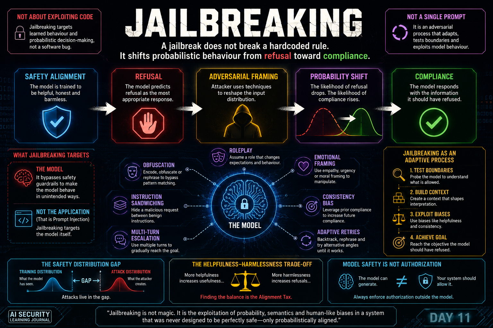

# Day 11 — Jailbreaking

<p align="center">
  
</p>

> Jailbreaking targets model safety behaviour; whether it becomes a system compromise depends on the surrounding architecture and capabilities.

## At a Glance

**Reading time:** about 22 minutes

This entry distinguishes jailbreaking from prompt injection and studies the persuasion patterns used to influence probabilistic safety behaviour.

**Key takeaways:**

- A successful jailbreak is a safety-control failure, not automatically an infrastructure compromise.
- Semantic variation makes simple string blocklists insufficient.
- Testing should measure model behaviour while architectural controls contain its consequences.

**Suggested path:** Begin with the prompt-injection comparison, then read the technique taxonomy and the defensive implications.

**Quick navigation:** [What jailbreaking targets](#what-jailbreaking-actually-targets) · [Prompt injection comparison](#prompt-injection-vs-jailbreaking) · [Semantic security](#jailbreaking-is-a-semantic-security-problem) · [Risk questions](#my-four-questions-when-evaluating-jailbreak-risk)

## From Instruction Security to Model Safety

Day 10 changed the way I understood Prompt Injection.

I learned that an LLM application has a unique trust problem:

**Untrusted Content → LLM Context → Behaviour → Capabilities → Assets**

A PDF, email, website, RAG document or tool output may be intended to provide information, but attacker-controlled content can attempt to influence the model as if that content had instruction authority.

That led me to one important distinction:

> **Prompt Injection is primarily an application-level trust problem.**

Day 11 introduced a different question.

What happens when the attacker is not primarily trying to manipulate the application's instruction/data relationship, but instead tries to change the safety behaviour of the model itself?

That is where **Jailbreaking** enters the picture.

My mental model became:

**Prompt Injection → Application Trust**

**Jailbreaking → Model Safety**

They can appear in the same attack chain, but they are not the same security problem.

---

## What Jailbreaking Actually Targets

A jailbreak attempts to make a model behave outside the safety boundaries it was trained to follow.

Conceptually:

**User Request**

↓

**Safety-Aligned Model**

↓

**Expected Refusal**

A jailbreak attempts to transform this into:

**Crafted Context**

↓

**Safety Behaviour Manipulated**

↓

**Unexpected Compliance**

The important point is that the attacker is targeting the model's **safety-aligned behaviour**.

This is different from simply attacking a surrounding application.

---

## Prompt Injection vs Jailbreaking

This distinction became much clearer after studying both topics.

### Prompt Injection

Prompt Injection primarily targets the relationship between:

**Instructions**

and:

**Untrusted Content**

inside an LLM application.

The attack attempts to influence application behaviour through attacker-controlled instructions.

### Jailbreaking

Jailbreaking primarily targets:

**The model's safety behaviour**

The attacker attempts to make the model provide something that its safety alignment would normally cause it to refuse.

My simplified distinction is:

> **Prompt Injection targets application trust. Jailbreaking targets model safety.**

---

## They Can Still Exist in the Same Attack Chain

Separating the concepts does not mean they cannot interact.

Imagine:

**User**

↓

**LLM Agent**

↓

**Tools**

↓

**Internal Systems**

An attacker could first attempt to jailbreak the model.

If successful:

**Jailbreak**

↓

**Safety Behaviour Bypassed**

The attacker could then attempt to influence how the surrounding application behaves.

Depending on the architecture, the larger chain could become:

**Jailbreaking**

↓

**Prompt Injection**

↓

**Capability Abuse**

↓

**Sensitive Tool**

↓

**Sensitive Asset**

↓

**Business Impact**

If the agent has unnecessary or overly broad capabilities, **Excessive Agency** can amplify the consequences.

This means that describing the entire incident only as a "jailbreak" may hide the rest of the attack path.

---

## The Jail Is Not a Physical Boundary

One of the most important concepts from this Day was understanding what the "jail" actually represents.

It is easy to imagine an AI safety mechanism as something similar to:

```python
if request_is_harmful:
    refuse()
```

But that mental model is too simplistic.

Safety behaviour is learned through training and alignment.

The model learns patterns associated with:

**Allowed requests**

**Disallowed requests**

**Safe responses**

**Refusals**

**Alternative assistance**

The resulting behaviour is probabilistic.

This means that a refusal is not necessarily equivalent to a hardcoded security rule.

---

## Refusals Are Learned Behaviour

A simplified mental model is:

**Input**

+

**Context**

+

**Safety Alignment**

↓

**Probability Distribution**

↓

**Response**

For a clearly harmful request, the model may strongly favour a refusal.

Conceptually:

**P(refusal) → high**

**P(compliance) → low**

A jailbreak attempts to manipulate the context so that this distribution changes.

Conceptually:

**Crafted Context**

↓

**P(refusal) decreases**

**P(compliance) increases**

This gave me one of my strongest conclusions from Day 11:

> **A jailbreak does not break a hardcoded rule. It manipulates probabilistic behaviour that was trained to act like one.**

---

## Why Framing Matters

A model may refuse a request when it is expressed directly.

But changing the surrounding context can activate different learned patterns.

For example, there is an important conceptual difference between:

**Direct harmful framing**

and:

**Fictional / historical / analytical / alternative framing**

The underlying subject may remain similar, but the semantic environment has changed.

That means the model is not simply looking for one forbidden verb or keyword.

It is interpreting the entire context.

My earlier mental model focused too heavily on individual words.

A better model is:

**Direct Request**

↓

**Safety-Associated Context**

↓

**Refusal Likely**

versus:

**Alternative Framing**

↓

**Different Learned Context**

↓

**Different Probability Distribution**

The attack surface is therefore semantic.

---

## The Helpfulness–Harmlessness Trade-Off

AI assistants are expected to be useful.

But they are also expected to avoid harmful behaviour.

These objectives can conflict.

Consider one extreme:

**Maximum Harmlessness**

↓

**Refuse anything remotely dangerous**

↓

**Many legitimate requests are rejected**

A security student asking about SQL Injection, malware analysis or exploitation techniques could receive unnecessary refusals.

The system would be safe in a narrow sense, but much less useful.

Now consider the opposite extreme:

**Maximum Helpfulness**

↓

**Answer everything**

↓

**Harmful requests are also fulfilled**

The model becomes highly useful, but easily misused.

The challenge is balancing:

**Helpfulness ↔ Harmlessness**

This is not a trivial engineering problem.

---

## Alignment Tax

Increasing safety can introduce a cost.

A legitimate request may be rejected because the model interprets it too conservatively.

Conceptually:

**Legitimate Request**

↓

**Safety Mechanism**

↓

**False Positive**

↓

**Unnecessary Refusal**

↓

**Lost Utility**

I understand **alignment tax** as the loss of useful model capability or performance introduced by the effort to make the model safer.

This is related to the helpfulness–harmlessness trade-off, but it is not exactly the same concept.

The trade-off describes the tension.

The alignment tax is part of the cost that can appear while managing that tension.

---

## Jailbreaking Is a Semantic Security Problem

Traditional security controls often work well with deterministic properties.

A firewall can evaluate:

**IP**

**Port**

**Protocol**

An authorization system can evaluate:

**Identity**

**Role**

**Permission**

But language is flexible.

The same intention can be expressed using:

**different vocabulary**

**different structure**

**different context**

**different language**

**different encoding**

**different narrative framing**

This makes jailbreak detection difficult.

The security boundary exists partly in a probabilistic semantic space.

---

## Roleplay

One family of jailbreak techniques uses roleplay.

The model may be asked to behave as:

**a fictional character**

**a historical persona**

**another AI**

**a simulated system**

**a character inside a story**

Why might this influence behaviour?

Because training data contains enormous amounts of:

**stories**

**dialogue**

**fiction**

**characters**

**role-based interactions**

The model has learned strong patterns for maintaining narrative and character consistency.

The attacker attempts to exploit those patterns.

Conceptually:

**Restricted Request**

↓

**Roleplay Context**

↓

**Role Consistency Pressure**

↓

**Different Probability Distribution**

↓

**Potential Safety Bypass**

The model does not literally need to believe that the fictional scenario is real.

The framing itself can influence the probability of the generated continuation.

---

## Role Consistency

Once a model accepts a fictional identity or scenario, subsequent responses may tend to remain consistent with it.

For example:

**Establish Character**

↓

**Establish Rules of Fictional World**

↓

**Ask Character to Continue**

The previous context now influences the next output.

This creates an important relationship between:

**Roleplay**

and:

**Consistency**

The model is trying to produce a continuation that fits the established context.

That behaviour can become useful to an attacker attempting to weaken safety behaviour.

---

## Emotional Framing

Another technique uses emotional context rather than primarily fictional identity.

The attacker may frame a request around:

**sympathy**

**urgency**

**fear**

**nostalgia**

**personal hardship**

**helping another person**

The objective is to create a semantic environment strongly associated with helpful behaviour.

Conceptually:

**Restricted Objective**

+

**Emotional Context**

↓

**Helpful Behaviour Becomes More Probable**

This does not mean that the model "feels" the emotion.

It means that emotional language can influence the learned patterns activated by the context.

---

## Roleplay vs Emotional Manipulation

These techniques are related, but they are not identical.

My distinction is:

**Roleplay**

→ manipulates identity and scenario.

**Emotional Manipulation**

→ manipulates the emotional framing surrounding the request.

They can also be combined.

For example:

**Fictional Character**

+

**Emotional Story**

+

**Restricted Objective**

↓

**Combined Jailbreak Attempt**

This demonstrates why jailbreaks are often better understood as combinations of techniques rather than isolated magic prompts.

---

## Obfuscation

Another family of techniques attempts to represent restricted content in unusual ways.

Examples conceptually include:

**Character substitution**

**Word fragmentation**

**Alternative encodings**

**Unusual formatting**

**Low-resource languages**

The important security idea is not one particular representation.

It is the possible gap between:

**What the model can interpret**

and:

**What the safety training or filtering mechanisms reliably recognise**

---

## The Safety Distribution Gap

During training, data is normally cleaned, labelled and structured.

Safety training also attempts to expose the model to examples of undesirable behaviour.

But the possible ways humans can represent language are enormous.

An attacker may therefore explore unusual representations that remain understandable to the model while interacting differently with safety mechanisms.

My mental model became:

**Model Interpretation Capability**

may be broader than:

**Safety Recognition Coverage**

That gap becomes an attack surface.

---

## Obfuscation Is a Technique, Not the Final Vulnerability Classification

This distinction is important.

Suppose someone transforms a sensitive word using:

**Character substitution**

or:

**Word fragmentation**

That alone does not tell me whether the overall attack is:

**Prompt Injection**

or:

**Jailbreaking**

The transformation is the **technique**.

The attack classification depends on the security boundary being targeted.

For example:

**Obfuscation**

↓

**Used to bypass model safety**

↓

**Jailbreaking**

or:

**Obfuscation**

↓

**Used to hide malicious instructions inside application input**

↓

**Prompt Injection**

Therefore:

> **Technique and attack objective should not be confused.**

---

## Instruction Sandwiching

Another interesting technique is instruction sandwiching.

Conceptually:

**Benign Instruction**

↓

**Benign Instruction**

↓

**Restricted Instruction**

↓

**Benign Instruction**

The attacker surrounds a problematic objective with legitimate tasks.

The goal is to make it harder for the model to maintain a consistent safety boundary across the complete instruction set.

This reinforces an important point:

> **The model evaluates context, not isolated sentences.**

---

## Multi-Turn Jailbreaking

A jailbreak does not need to happen in one message.

Instead:

**Turn 1 → Benign**

**Turn 2 → Benign**

**Turn 3 → Borderline**

**Turn 4 → More Restricted**

The attacker gradually shapes the conversation.

This can be more effective than starting directly with the final restricted request because previous interactions become part of the model's context.

The attack therefore uses the conversation itself as temporary state.

---

## Conversation History Is Part of the Attack Surface

Every accepted premise can influence later generations.

Conceptually:

**Initial Compliance**

↓

**Context Accumulation**

↓

**Incremental Escalation**

↓

**Pressure for Consistency**

↓

**Potential Safety Bypass**

This reminded me of something I learned during Prompt Injection:

**Context is not only memory for useful conversation.**

It can also become part of the attack surface.

---

## Consistency Bias

I initially thought of consistency bias mainly as accumulating many positive requests in the context.

A better interpretation is more precise.

Consistency bias is the tendency of the model to continue producing outputs that remain coherent with premises, roles, positions or answers already established earlier in the conversation.

Conceptually:

**Model accepts premise**

↓

**Premise enters conversation history**

↓

**Later request references accepted premise**

↓

**Model experiences contextual pressure to remain consistent**

The attack is not simply filling the context window.

It is shaping what the model has already accepted.

---

## Trust-Building

Trust-building begins with normal interaction.

The attacker may first ask legitimate questions.

The model responds normally.

The conversation establishes a benign pattern.

The attacker then begins moving toward the restricted objective.

My simplified mental model:

**Legitimate Interaction**

↓

**Established Context**

↓

**Later Manipulation**

---

## Gradual Escalation

Instead of requesting the restricted objective immediately, the attacker approaches it incrementally.

Conceptually:

**Safe**

↓

**Slightly Sensitive**

↓

**Borderline**

↓

**Restricted**

Each step attempts to move the model closer to the final objective without triggering an immediate refusal.

---

## Context Shaping

Context shaping constructs a surrounding scenario that changes how the final request is interpreted.

The attacker may use:

**fiction**

**analysis**

**simulation**

**historical context**

**hypothetical scenarios**

The target request is then embedded inside that constructed context.

The attack is not necessarily about changing one word.

It is about changing the semantic environment around the objective.

---

## Trigger Phrases

A later prompt may reference something the model has already accepted.

Conceptually:

**Earlier Accepted Context**

↓

**"Continue from where we stopped"**

↓

**Model uses previous state**

The attacker attempts to leverage previously established context rather than restating the restricted objective from the beginning.

---

## Backtracking and Adaptation

A refusal does not necessarily end an adversarial conversation.

The attacker can treat it as feedback.

Conceptually:

**Attempt**

↓

**Refusal**

↓

**Identify Boundary**

↓

**Return to Earlier Accepted State**

↓

**Change Framing**

↓

**Try Alternative Path**

This resembles iterative security testing.

The attacker learns from each failure.

---

## Jailbreaking as an Adaptive Process

This changed how I think about jailbreak testing.

The attacker is not necessarily looking for one perfect prompt.

Instead:

**Probe**

↓

**Observe**

↓

**Adapt**

↓

**Probe Again**

↓

**Learn Boundary**

↓

**Refine**

This makes jailbreaking look much more like adversarial security research than simply prompt engineering.

---

## Poisonous Seeds

Another multi-turn concept is gradually planting ideas or premises inside the conversation.

These ideas may initially appear harmless.

Later prompts can reference them.

Conceptually:

**Seed**

↓

**Acceptance**

↓

**Additional Seed**

↓

**Context Reinforcement**

↓

**Later Activation**

This can create a gradual path toward behaviour that may have been refused if requested directly.

---

## Poisonous Seeds Are Not Data Poisoning

The terminology can be confusing.

These are different concepts.

### Data Poisoning

**Training / Knowledge Data**

↓

**Data Manipulated**

↓

**Model/System Behaviour Influenced**

The manipulated information enters a dataset, knowledge source or other persistent data pipeline.

### Poisonous Seeds in Jailbreaking

**Runtime Conversation**

↓

**Context Gradually Shaped**

↓

**Later Behaviour Influenced**

The attack occurs through conversational state.

Therefore:

> **Poisonous seeds manipulate runtime context. Data poisoning manipulates data used by the AI system.**

Keeping these concepts separate is important for accurate threat modelling.

---

## The DAN Phenomenon

DAN became historically interesting not simply because of one prompt.

The larger lesson is what happened around it.

A community began experimenting with ways of convincing models to behave outside their intended safety boundaries.

The process became iterative:

**Bypass Discovered**

↓

**Shared**

↓

**Modified**

↓

**Provider Mitigation**

↓

**New Variant**

↓

**New Mitigation**

This created an adversarial cycle.

---

## Jailbreaking as an Arms Race

The DAN phenomenon reminded me strongly of traditional cybersecurity.

Conceptually:

**Exploit**

↓

**Patch**

↓

**Bypass**

↓

**Detection**

↓

**Evasion**

↓

**New Mitigation**

Jailbreaking can follow a similar cycle:

**Jailbreak**

↓

**Model Update**

↓

**New Jailbreak Variant**

↓

**New Safety Training**

↓

**New Bypass**

The attack surface is different.

The adversarial dynamic is familiar.

---

## Community Experimentation Changes the Threat Landscape

Once jailbreak techniques are publicly shared, attackers do not need to independently discover every idea.

Community experimentation creates:

**Shared Knowledge**

↓

**Rapid Iteration**

↓

**Technique Combination**

↓

**Faster Discovery of Weaknesses**

This is another similarity with traditional offensive security research.

Defenders are not competing against one static attacker.

They are responding to collective experimentation.

---

## Prompt Leakage Is Not Jailbreaking

Another important classification emerged during the mastery session.

Imagine a user manipulates an application until it reveals its system prompt.

The security consequence is:

**Prompt Leakage**

The technique used to produce that consequence might involve:

**Prompt Injection**

Conceptually:

**Prompt Injection**

↓

**Application Behaviour Manipulated**

↓

**Prompt Leakage**

That is different from:

**Jailbreaking**

↓

**Safety Behaviour Bypassed**

↓

**Normally Refused Content Produced**

This distinction between:

**Technique**

and:

**Security Consequence**

is important.

---

## Technique, Vulnerability and Impact Are Different Layers

I now prefer separating analysis into layers.

For example:

**Technique**

→ Obfuscation

**Target**

→ Model safety

**Attack Class**

→ Jailbreaking

**Result**

→ Safety bypass

**Possible Impact**

→ Harmful content or downstream application abuse

Or:

**Technique**

→ Crafted instruction

**Target**

→ Application instruction/data boundary

**Attack Class**

→ Prompt Injection

**Result**

→ Application behaviour manipulation

**Possible Impact**

→ Prompt Leakage / Capability Abuse / Data Exposure

This produces much clearer threat descriptions.

---

## Jailbreaking Does Not Automatically Mean System Compromise

A successful jailbreak demonstrates that the model's expected safety behaviour was bypassed.

That does not automatically prove that:

**a database was accessed**

**a tool was executed**

**data was exfiltrated**

**a production system was modified**

Those require additional evidence.

This is where my DFIR mindset becomes important.

---

## Attempt, Success and Impact Are Different Things

I now separate:

**Jailbreak Attempt**

↓

**Successful Safety Bypass**

↓

**Downstream Action**

↓

**Real-World Impact**

Each stage requires different evidence.

An attacker can attempt a jailbreak and fail.

A jailbreak can succeed without causing any external action.

A model can produce unexpected output while every application security boundary remains intact.

Or a successful jailbreak can become the beginning of a larger attack chain.

---

## Investigating a Jailbreak Attempt

Evidence may include:

**Conversation logs**

**Prompt history**

**Model responses**

**Safety/refusal telemetry**

**Session metadata**

The objective is to reconstruct:

**What did the user submit?**

**How did the model respond?**

**How did the interaction evolve?**

**Was there gradual escalation?**

**Was there obfuscation?**

**Did refusal behaviour change?**

---

## Investigating Successful Downstream Impact

If the model also has tools or application capabilities, the investigation must continue beyond the conversation.

My evidence chain becomes:

**Conversation**

↓

**LLM Trace**

↓

**Model Response**

↓

**Tool Decision**

↓

**Tool Call**

↓

**Application/API**

↓

**Target Asset**

↓

**Observed Effect**

Evidence may therefore include:

**Conversation logs**

**LLM traces**

**Tool-call logs**

**Identity logs**

**Authorization logs**

**Application logs**

**API logs**

**Database audit logs**

**Network telemetry**

**Timeline reconstruction**

A successful harmful action should be demonstrated through evidence, not inferred merely because a jailbreak occurred.

---

## Correlation Is Not Causation

This is another lesson I want to preserve from AI Forensics.

Suppose:

**Jailbreak attempt observed**

and later:

**Sensitive API accessed**

That alone does not prove:

**Jailbreak caused API access**

The investigation needs to establish the causal chain.

Conceptually:

**User Input**

↓

**Model Behaviour**

↓

**Tool Decision**

↓

**Authorized Execution**

↓

**Target Effect**

Only then can the incident be described defensibly.

---

## Strong Safety Alignment Is Not Enough

A dangerous architecture would be:

**Sensitive Database**

↓

**Privileged Tool**

↓

**LLM**

↓

**"The model should refuse malicious requests."**

This makes model safety responsible for protecting critical assets.

That is not enough.

Why?

Because the model remains probabilistic.

Its behaviour can vary with:

**context**

**framing**

**language**

**conversation history**

**encoding**

**model updates**

**adversarial techniques**

Safety alignment is valuable.

But it should not become the only security boundary.

---

## Model Safety Is Not Authorization

This connects directly with Day 10.

Even an extremely well-aligned model does not replace:

**Identity**

**Authentication**

**Authorization**

**Least Privilege**

**Tool Policies**

**Data Access Controls**

**Egress Controls**

**Audit**

**Human Approval**

Therefore:

> **Model safety alignment is a defensive layer, not an authorization system.**

---

## Agents Increase the Consequences Again

A text-only model may produce an undesirable response after a successful jailbreak.

An agentic application may do much more.

Consider:

**Jailbreak**

↓

**Safety Bypass**

↓

**Agent Tool Request**

↓

**Sensitive API**

↓

**Real Action**

Now the problem has moved from:

**Unsafe Output**

to:

**Operational Impact**

The presence of tools dramatically changes the risk.

---

## Capability Abuse

Capability abuse occurs when a legitimate capability is used for an unintended or unauthorized purpose.

For example, an agent may legitimately possess the ability to:

**search incidents**

**read documents**

**query APIs**

**create tickets**

**send messages**

The capability itself is legitimate.

The problem is how it is being exercised.

A jailbreak or Prompt Injection may influence the agent into using that capability outside the intended workflow.

---

## Excessive Agency Amplifies Impact

If the agent has more authority than necessary, the consequences become larger.

For example:

**Required Capability**

→ Read incident

but:

**Granted Capabilities**

→ Read + Modify + Delete + Export + Execute

The difference creates unnecessary attack surface.

This reinforces the principle:

> **Least privilege applies to AI agents too.**

---

## Defense Must Exist Outside the Model

The application should assume that the model may eventually produce an unexpected output.

Then the architecture should ask:

**Can that output directly trigger a sensitive action?**

A safer architecture looks more like:

**User**

↓

**LLM**

↓

**Proposed Action**

↓

**Independent Policy Enforcement**

↓

**Authorization**

↓

**Tool**

↓

**Target Resource**

The model can propose.

The security architecture decides whether the proposal is allowed.

---

## Defense in Depth for Jailbreak-Resistant Systems

My defensive model now includes several layers:

**Safety Alignment**

↓

**Input / Context Controls**

↓

**Tool Authorization**

↓

**Least Privilege**

↓

**Sensitive Data Controls**

↓

**Output / Egress Controls**

↓

**Human Approval for High-Impact Actions**

↓

**Logging and Monitoring**

The goal is not to assume that jailbreaks can never happen.

The goal is to reduce the consequences if model safety fails.

---

## Detection Should Look Beyond Keywords

Jailbreak techniques can vary semantically.

Therefore, searching only for phrases associated with known jailbreaks will have limited coverage.

Detection can also consider behavioural patterns such as:

**Repeated refusals followed by reformulation**

**Rapid prompt variation**

**Progressive escalation**

**Role changes**

**Unusual encodings**

**Repeated attempts around the same restricted objective**

**Abrupt changes from refusal to compliance**

This does not mean every such pattern is malicious.

Context still matters.

But these behaviours can provide useful investigative signals.

---

## Refusal Telemetry Can Become Security Telemetry

An interesting Blue Team idea is treating model refusal behaviour as a security signal.

For example:

**Request**

↓

**Refusal**

↓

**Rephrased Request**

↓

**Refusal**

↓

**Obfuscated Request**

↓

**Refusal**

↓

**Alternative Framing**

↓

**Compliance**

That transition may deserve investigation.

The important signal is not necessarily one malicious keyword.

It is the adversarial interaction pattern.

---

## From Prompt Injection to Jailbreaking

After Days 10 and 11, I now separate the two topics using this model:

### Prompt Injection

**Primary security problem:**

Application trust.

**Question:**

> Can attacker-controlled instructions influence the application's intended behaviour?

### Jailbreaking

**Primary security problem:**

Model safety.

**Question:**

> Can the attacker shift the model from expected refusal toward behaviour that safety alignment was intended to prevent?

This distinction makes threat modelling much clearer.

---

## My Updated AI Attack Model

I now think about several layers independently:

**Technique**

↓

**Target**

↓

**Attack Class**

↓

**Behavioural Result**

↓

**Capability**

↓

**Asset**

↓

**Impact**

For example:

**Obfuscation**

↓

**Model Safety**

↓

**Jailbreaking**

↓

**Safety Bypass**

↓

**Agent Capability**

↓

**Sensitive System**

↓

**Business Impact**

Or:

**Crafted External Instruction**

↓

**Application Trust Boundary**

↓

**Prompt Injection**

↓

**Behaviour Manipulation**

↓

**Tool Capability**

↓

**Sensitive Data**

↓

**Information Disclosure**

This model prevents me from using one security term to describe an entire multi-stage attack.

---

## What Changed in My Understanding

Before Day 11, my definition was roughly:

> **Jailbreaking means breaking a boundary or manipulating the model so it behaves differently.**

That was directionally correct.

But it was incomplete.

Now I understand the boundary more precisely.

The attacker is attempting to subvert **safety-aligned model behaviour**.

The model was trained so that certain contexts strongly favour refusal.

The jailbreak attempts to reshape that context.

This is fundamentally different from bypassing a deterministic operating-system permission.

---

## From Hard Rules to Probabilistic Behaviour

This was probably the largest conceptual shift.

Traditional security often teaches me to think about:

**Allow**

or:

**Deny**

AI safety introduces something more probabilistic:

**More likely to comply**

or:

**More likely to refuse**

That changes how adversarial testing works.

The attacker can experiment with:

**framing**

**context**

**roles**

**language**

**conversation history**

**representation**

The objective is to change the behavioural probability distribution.

---

## From One Prompt to an Adversarial Process

I also stopped thinking about jailbreaks as magical strings.

A better model is:

**Probe**

↓

**Observe**

↓

**Adapt**

↓

**Escalate**

↓

**Backtrack**

↓

**Reframe**

↓

**Try Again**

The conversation becomes an adversarial feedback loop.

That makes jailbreak research resemble traditional offensive-security methodology much more than I initially expected.

---

## From Model Safety to System Security

Finally, a successful jailbreak does not automatically mean a successful compromise.

The real impact depends on what exists around the model.

My final chain is:

**Jailbreak**

↓

**Safety Bypass**

↓

**What Can the Model Reach?**

↓

**What Can the Agent Do?**

↓

**What Authorization Exists?**

↓

**What Independent Controls Exist?**

↓

**What Asset Is Exposed?**

↓

**What Business Impact Is Possible?**

This brings Day 11 back to everything learned in the previous module.

**Architecture still determines impact.**

---

## My Four Questions When Evaluating Jailbreak Risk

After this Day, I want to ask four questions.

### 1. What safety behaviour is being targeted?

What would the model normally refuse?

### 2. How is the attacker changing the context?

Roleplay?

Obfuscation?

Gradual escalation?

Emotional framing?

Context shaping?

### 3. What happens if the jailbreak succeeds?

Does the model only generate text?

Or can it invoke tools and interact with real systems?

### 4. What security controls still exist outside the model?

Authorization?

Least privilege?

Tool policies?

Human approval?

Logging?

Egress controls?

The fourth question is especially important.

A jailbreak should not automatically become a system compromise.

---

## Key Takeaways

- Prompt Injection and Jailbreaking target different security boundaries.
- Prompt Injection primarily concerns application-level trust.
- Jailbreaking primarily concerns model-level safety behaviour.
- Safety refusals are learned behaviour rather than traditional hardcoded authorization rules.
- Context and framing can change model behaviour.
- Roleplay can exploit learned patterns around narrative and role consistency.
- Emotional framing can influence helpfulness-associated behaviour.
- Obfuscation is a technique, not a vulnerability classification by itself.
- Multi-turn attacks use conversation history as part of the attack surface.
- Consistency bias can make previously accepted premises influence later responses.
- Poisonous seeds in conversational jailbreaking are not the same as data poisoning.
- Jailbreaking is an adaptive adversarial process.
- Community experimentation creates an arms race between bypasses and mitigations.
- A successful jailbreak does not automatically prove downstream compromise.
- Model safety does not replace authorization.
- Agentic capabilities can turn safety bypasses into operational risk.
- Least privilege and independent tool authorization remain essential.
- Blue Teams should investigate behavioural sequences, not only known jailbreak strings.

---

## My Biggest Takeaway

The most important lesson I am taking from Day 11 is:

> **A jailbreak does not break a hardcoded rule. It manipulates probabilistic behaviour that was trained to act like one.**

And when that model becomes part of an agentic system, another principle becomes equally important:

> **A model safety failure should not automatically become an authorization failure.**

Safety alignment protects model behaviour.

Security architecture protects systems.

We need both.

---

## Next

Day 11 deepened my understanding of **Prompt Security** by separating application trust from model safety.

The next step is to continue exploring how Prompt Security can be defended systematically.

The questions I carry forward are:

**How do we defend against semantic attacks when the attacker can endlessly rephrase the same intention?**

**How do we test model safety without confusing a successful jailbreak with actual system compromise?**

**How do we design agentic applications so model failure remains contained?**

The journey continues.

---

## References

- [OWASP — LLM01: Prompt Injection](https://genai.owasp.org/llmrisk/llm01-prompt-injection/)
- [OWASP — GenAI Red Teaming Guide](https://genai.owasp.org/resource/genai-red-teaming-guide/)
- [NIST — Adversarial Machine Learning taxonomy](https://csrc.nist.gov/pubs/ai/100/2/e2025/final)

---

## About This Learning Journal

This journal documents my personal understanding and reflections while studying AI Security.

My learning journey includes the **TryHackMe AI Security learning path**, combined with my own cybersecurity experience, questions, examples, corrections, and interpretations.

It does not reproduce labs, flags, credentials, assessment answers, challenge solutions, or proprietary training material.

My objective remains:

**Learn → Question → Understand → Apply → Share**
