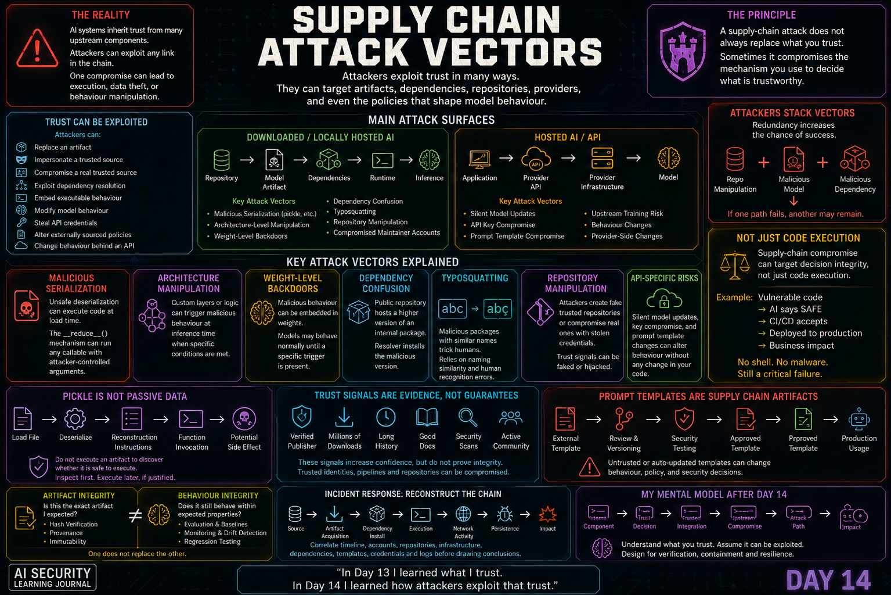

# Day 14 — Supply Chain Attack Vectors

<p align="center">
  
</p>

> AI supply-chain attacks exploit trusted relationships upstream of deployment, often before the model reaches its final environment.

## At a Glance

**Reading time:** about 22 minutes

This entry examines how attackers can compromise models, serialized artifacts, packages, repositories, credentials, datasets, and update paths.

**Key takeaways:**

- Safe serialization reduces one risk; it does not establish artifact trust.
- Dependency and repository compromise can bypass model-focused controls.
- Provenance, integrity, behaviour, and operational monitoring answer different questions.

**Suggested path:** Read the serialized-model and dependency sections, then connect them through the end-to-end attack paths.

**Quick navigation:** [Attack surfaces](#the-main-attack-surfaces) · [Malicious serialization](#malicious-model-serialization) · [Dependency attacks](#dependency-attacks) · [Unified attack model](#a-unified-attack-model)

## AI Security Learning Journal

Day 13 changed the way I look at trust in AI systems.

I stopped seeing a model as an isolated artifact and started looking at the chain behind it:

```text
Models
Datasets
Frameworks
Dependencies
Repositories
Maintainers
Transformations
Providers
```

The question became:

> **What exactly am I trusting?**

Day 14 moved to the next question:

> **How can an attacker exploit that trust?**

This distinction is important.

An attacker does not always need to attack my application directly.

Sometimes the easier path is to compromise something my application already considers trustworthy.

A model artifact.

A dependency.

A repository.

A maintainer identity.

A prompt template.

An API credential.

Or even the behaviour behind an API endpoint.

The most important shift in my thinking was this:

> **A supply-chain attack does not always replace what I trust. Sometimes it compromises the mechanism I use to decide what is trustworthy.**

---

## From Trust Mapping to Trust Exploitation

My Day 13 mental model was largely about provenance:

```text
Artifact
   ↓
Where did it come from?
   ↓
Who created it?
   ↓
Who transformed it?
   ↓
How did it reach me?
   ↓
Why should I trust it?
```

Day 14 adds an attacker to that graph:

```text
                Attacker
                   │
                   ▼
             Trust Relationship
                   │
                   ▼
                 Victim
```

This creates several possibilities.

The attacker may:

```text
Replace an artifact

Impersonate a trusted source

Compromise a real trusted source

Exploit dependency resolution

Embed executable behaviour

Modify model behaviour

Steal API credentials

Alter externally sourced policies

Change behaviour behind an API
```

The attack surface is therefore larger than the model itself.

---

## The Main Attack Surfaces

I now separate the supply-chain attack surface into two broad consumption models.

### Downloaded / Locally Hosted AI

```text
Repository
    ↓
Model Artifact
    ↓
Dependencies
    ↓
Runtime
    ↓
Inference
```

Important attack vectors include:

```text
Malicious Serialization
Architecture-Level Manipulation
Weight-Level Manipulation
Dependency Confusion
Typosquatting
Repository Manipulation
Compromised Maintainer Accounts
```

### Hosted AI / API

```text
Application
    ↓
Provider API
    ↓
Provider Infrastructure
    ↓
Model
```

The local model-file attack surface becomes less relevant to the consumer, but other risks become more important:

```text
Silent Model Updates
API Key Compromise
Prompt Template Compromise
Upstream Training Risk
Behaviour Changes
Provider-Side Supply-Chain Changes
```

The supply chain still exists.

The observable attack surface changes.

---

## Malicious Model Serialization

One of the most concrete attack vectors in this topic involves serialized model artifacts.

Serialization conceptually means:

```text
Python Object
      ↓
Serialization
      ↓
Stored Artifact
```

Later:

```text
Stored Artifact
      ↓
Deserialization
      ↓
Reconstructed Python Object
```

The security problem is that some serialization mechanisms are capable of reconstructing much more than passive values.

They may reconstruct objects by invoking functions.

This changes the security meaning of loading an untrusted artifact.

Instead of thinking:

```text
Load File
   ↓
Read Data
```

I need to consider:

```text
Load File
   ↓
Interpret Reconstruction Instructions
   ↓
Potential Function Invocation
   ↓
Potential Side Effect
```

That is a very different trust boundary.

---

## Pickle Is Not Just Passive Data

Python pickle can serialize complex Python objects.

The flexibility is useful.

But from a security perspective, flexibility also means that deserialization can invoke behaviour required to reconstruct those objects.

This leads to an important principle:

> **An untrusted serialized object should not automatically be treated as passive data.**

The danger exists because the application may believe it is doing this:

```text
Model File
    ↓
Model Weights
```

while the deserializer may actually process something conceptually closer to:

```text
Serialized Instructions
        ↓
Function Resolution
        ↓
Arguments
        ↓
Function Invocation
```

The security boundary is crossed during loading.

---

## Understanding `__reduce__()`

One concept I needed to refine was Python's `__reduce__()` mechanism.

It is not simply "the function that executes malware."

Its purpose is to tell pickle how an object should be reconstructed.

Conceptually:

```text
Object
   ↓
__reduce__()
   ↓
Reconstruction Recipe
   ↓
Callable + Arguments
```

During deserialization, pickle can follow that recipe.

The danger appears when the reconstruction recipe references a function capable of causing an unsafe side effect.

Therefore the important relationship is:

```text
Untrusted Object
      ↓
Reconstruction Instructions
      ↓
Dangerous Callable
      ↓
Attacker-Controlled Arguments
      ↓
Execution During Deserialization
```

The attacker abuses legitimate reconstruction functionality.

---

## Load-Time Execution

This gives serialization attacks an important characteristic:

> **The attack may execute when the model is loaded, before normal inference begins.**

The application may never reach:

```text
prediction = model(input)
```

before the compromise has already occurred.

The attack path can instead be:

```text
Download Model
      ↓
Load Model
      ↓
Deserialize
      ↓
Malicious Reconstruction
      ↓
Code Execution
```

This makes "I will load it and test whether it behaves correctly" a dangerous validation strategy.

The act of loading can itself be the attack.

---

## Do Not Execute an Artifact to Discover Whether It Is Safe to Execute

This was one of my strongest defensive takeaways from the topic.

If the concern is that deserialization can execute code, then testing the artifact by deserializing it defeats the purpose of the investigation.

The safer principle is:

> **Inspect first. Execute later, if justified.**

Conceptually:

```text
Unknown Artifact
      ↓
Static / Non-Executing Inspection
      ↓
Security Assessment
      ↓
Controlled Decision
```

instead of:

```text
Unknown Artifact
      ↓
Execute
      ↓
"Let's see what happens"
```

This seems obvious when written down.

But AI workflows can normalize loading downloaded models as if they were ordinary data files.

That assumption is exactly what needs to change.

---

## Inspecting Serialization Without Reconstructing Objects

A safer analysis approach is to inspect the serialized representation without actually reconstructing the objects contained within it.

For pickle, this means examining its operations rather than executing the artifact.

Conceptually:

```text
Pickle Artifact
      ↓
Disassembly / Parsing
      ↓
Serialization Operations
      ↓
Security Analysis
```

This can expose suspicious relationships such as:

```text
Function Resolution
       +
Dangerous Function
       +
Suspicious Argument
       +
Execution Operation
```

without intentionally loading the model into the application.

The distinction is fundamental:

```text
Inspection
    ≠
Deserialization
```

---

## Context Matters More Than One Opcode

Another important lesson was not to turn security analysis into simplistic keyword matching.

An operation used by serialization machinery may appear in legitimate artifacts.

Therefore:

```text
One Opcode
    ≠
Malware
```

What matters is the context around it.

For example, an analyst should ask:

```text
What function is being resolved?

What arguments are supplied?

What reconstruction operation follows?

Does this make sense for an ML artifact?

Does it create filesystem, process or network behaviour?
```

This produces a more useful principle:

> **Security analysis needs context, not just opcode matching.**

A suspicious chain matters more than an isolated token.

---

## Serialization-Level vs Architecture-Level Attacks

Day 13 introduced three model-level attack categories:

```text
Serialization
Architecture
Weights
```

Day 14 made the timing difference much clearer.

### Serialization-Level

```text
Model Artifact
      ↓
Load
      ↓
Deserialization
      ↓
Malicious Behaviour
```

The attack can trigger at **load time**.

### Architecture-Level

```text
Model Artifact
      ↓
Load
      ↓
Model Exists
      ↓
Inference
      ↓
Malicious Architecture Logic
```

The malicious behaviour can manifest at **inference time**.

This distinction matters because a control designed for one does not necessarily detect the other.

---

## Custom Model Logic Can Become an Attack Surface

Modern ML frameworks may allow custom processing logic inside model architectures.

That capability has legitimate purposes.

But legitimate extensibility can also become an attack surface.

Conceptually:

```text
Input
   ↓
Normal Layers
   ↓
Custom Logic
   ↓
Condition
  ↙   ↘
Normal  Manipulated
Output  Output
```

The artifact may load successfully.

Nothing necessarily happens during deserialization.

The malicious behaviour appears only when the model processes particular inputs.

That makes architecture-level attacks different from malicious pickle payloads.

---

## Safe Serialization Does Not Validate Architecture

This creates another important boundary.

Suppose I remove unsafe serialization.

I may achieve:

```text
Serialization Attack
       ↓
Mitigated
```

But I have not automatically achieved:

```text
Architecture Verified
Weights Verified
Training Verified
Provenance Verified
```

So:

> **Safe serialization is a control against a class of attacks, not proof of model safety.**

This reinforces the lesson from Day 13:

> **A safer file format removes an attack vector, not the entire supply-chain risk.**

---

## Weight-Level Backdoors

The third category is even more subtle.

Instead of relying on executable serialization or explicit architecture logic, malicious behaviour can be learned or embedded into model weights.

Conceptually:

```text
Normal Input
     ↓
Expected Behaviour

Specific Trigger
     ↓
Unexpected Behaviour
```

The model can continue to look legitimate under ordinary testing.

This creates a different detection problem.

A static scan of the file structure may find nothing obviously executable.

Yet the model behaviour can still contain a hidden condition.

---

## GGUF Does Not Mean Trusted

This is especially relevant to locally hosted LLMs.

A format that avoids pickle-style arbitrary deserialization removes an important attack surface.

But:

```text
No Pickle
   ≠
No Backdoor
```

An attacker could manipulate a model before it is converted or quantized.

Conceptually:

```text
Base Model
    ↓
Malicious Fine-Tuning
    ↓
Manipulated Weights
    ↓
Conversion / Quantization
    ↓
Local Model Artifact
```

The final format can be structurally safe from pickle-style execution while the model behaviour itself remains untrusted.

This gives me another distinction:

> **File-format safety and behavioural trust are different security properties.**

---

## Artifact Integrity vs Behaviour Integrity

This distinction became one of the most important ideas I took from Day 14.

### Artifact Integrity

Artifact integrity asks:

> **Is this the exact artifact I expected?**

For example:

```text
Expected Artifact
      ↓
Cryptographic Hash

Downloaded Artifact
      ↓
Cryptographic Hash

Match?
```

If they match, I have strong evidence that the downloaded artifact is identical to the expected artifact.

But what if the expected artifact itself contains unwanted learned behaviour?

Then:

```text
Artifact Integrity ✓
Behaviour Integrity ✗
```

### Behaviour Integrity

Behaviour integrity asks:

> **Does the model continue to behave within the properties and boundaries I expect?**

This can require:

```text
Behaviour Baselines
Security Evaluation
Known Test Sets
Adversarial Testing
Regression Testing
Monitoring
```

The two properties complement each other.

Neither replaces the other.

---

## Dependency Attacks

The model artifact is only one entry point.

AI systems still rely on software packages.

That means attackers can target the dependency graph.

Two important attack vectors are:

```text
Dependency Confusion
Typosquatting
```

They may look similar because both involve package names.

But they exploit different trust assumptions.

---

## Dependency Confusion

Consider an internal dependency:

```text
internal-ai-utils
```

The organization expects:

```text
Private Registry
      ↓
internal-ai-utils
```

But its package manager can also consult a public registry.

Now suppose the same package name appears publicly with a version preferred by the resolver.

Conceptually:

```text
Private Registry
internal-ai-utils 2.x
        │
        ├────────────┐
                     ▼
                  Resolver
                     ▲
        ┌────────────┘
        │
Public Registry
internal-ai-utils 99.x
```

If the resolver selects the public package, the attacker has exploited a gap between:

```text
Version Resolution
```

and:

```text
Source Trust
```

This gives me an important principle:

> **Version precedence is not provenance enforcement.**

The package manager can correctly implement its version-selection logic and still produce the wrong security outcome.

---

## Typosquatting

Typosquatting targets a different weakness.

Instead of publishing the same internal package name, an attacker creates a name that resembles a legitimate dependency.

Conceptually:

```text
Expected:
trusted-package

Attacker:
trustd-package
```

The security failure depends heavily on human recognition.

The developer sees something familiar.

The package looks plausible.

The wrong artifact is selected.

So:

```text
Dependency Confusion
→ resolution/source trust

Typosquatting
→ naming/human recognition trust
```

Keeping those mechanisms separate helps me reason about the appropriate controls.

---

## Malicious Is Not the Same as Vulnerable

This was another useful correction to my thinking.

Dependency security tools often identify known vulnerabilities by comparing:

```text
Package
   +
Version
   ↓
Known Advisory / Vulnerability Database
```

That is valuable.

But imagine an attacker creates a new package whose intended functionality is malicious.

There may be:

```text
No CVE
No known vulnerability
No historical advisory
```

because the software is not accidentally vulnerable.

It is intentionally malicious.

Therefore:

> **Malicious does not necessarily mean vulnerable.**

Supply-chain security cannot rely exclusively on vulnerability databases.

It also requires provenance, package identity, source validation and behavioural analysis.

---

## Repository Manipulation

Repositories are another critical part of the trust chain.

When developers choose models, they often rely on signals such as:

```text
Organization Name
Verification
Download Count
Documentation
Model Card
Community Activity
Upload History
File Format
```

Attackers can attempt to manipulate those signals.

One approach is imitation.

Another is compromising the legitimate source itself.

These are very different threat levels.

---

## Fake Repository vs Compromised Real Repository

Consider:

```text
Fake Organization
      ↓
Professional-Looking Repository
      ↓
Malicious Artifact
```

There may still be warning signs:

```text
No verification
Little history
Low adoption
Recently created account
Sparse provenance
```

Now compare:

```text
Legitimate Organization
       ↓
Maintainer Credential Compromise
       ↓
Legitimate Repository
       ↓
Malicious Update
```

This is much harder to detect using reputation alone.

The repository can still have:

```text
✓ Correct name
✓ Verified identity
✓ Long history
✓ Large adoption
✓ Existing trust
```

The attacker has compromised the mechanism producing the trust signal.

This leads to one of my main Day 14 lessons:

> **A supply-chain attack does not always imitate trust. Sometimes it hijacks real trust.**

---

## Trust Signals Are Evidence, Not Guarantees

The previous distinction reinforces something from Day 13.

Signals such as:

```text
Verified Publisher
Large Download Count
Long History
Detailed Documentation
Security Scans
```

are useful.

They should absolutely contribute to a security decision.

But:

```text
Trust Signal
    ≠
Integrity Proof
```

A trusted identity can be compromised.

A trusted build pipeline can be compromised.

A trusted repository can distribute a malicious artifact.

The goal is not to ignore reputation.

The goal is to understand what reputation can and cannot prove.

---

## Attackers Can Stack Supply-Chain Vectors

One of the most important lessons from Day 14 was that these vectors should not be imagined as mutually exclusive.

An attacker does not have to choose:

```text
Malicious Model
OR
Dependency Attack
OR
Repository Manipulation
```

They may use:

```text
Repository Manipulation
        +
Malicious Model
        +
Dependency Attack
```

Each serves a different purpose.

Conceptually:

```text
Repository Manipulation
        ↓
Build Trust

Malicious Artifact
        ↓
Primary Execution Path

Malicious Dependency
        ↓
Secondary Execution Path
```

If one path fails, another may remain.

---

## Redundancy Works for Attackers Too

In security architecture, redundancy is usually something I associate with resilience.

But attackers can also design for resilience.

```text
Attack Vector A
      ↓
Blocked
      │
      └────→ Attack Vector B
                    ↓
                  Success
```

This means stopping one malicious artifact does not prove the incident is contained.

An analyst needs to ask:

```text
What other components arrived with it?

What dependencies were installed?

What repositories were trusted?

What credentials were exposed?

What external communication occurred?

What other persistence paths exist?
```

The attacker's first visible vector may not be their only vector.

---

## Defence in Depth Must Cover Different Surfaces

Suppose a model loader successfully blocks unsafe deserialization.

That control worked.

But if a malicious dependency executes during installation, the environment may still be compromised.

```text
Model Loader
    ↓
Attack Blocked ✓

Dependency Installation
    ↓
Attack Succeeds ✗
```

The correct conclusion is not:

```text
The model loader failed
```

It is:

```text
The model loader protected its boundary

BUT

the overall architecture had another unprotected path
```

This is what defence in depth means in practice.

Controls need to cover independent attack surfaces.

---

## Supply-Chain Incident Reconstruction

Day 14 also reinforced an incident-response mindset.

Imagine I observe:

```text
Unknown Model Repository
        ↓
Suspicious Model Artifact
        ↓
Unexpected Dependency
        ↓
Outbound Network Connection
```

I should not immediately stop at:

> "The model was malicious."

I need to reconstruct the chain.

```text
Initial Source
      ↓
Artifact Acquisition
      ↓
Dependency Installation
      ↓
Execution
      ↓
Network Activity
      ↓
Persistence
      ↓
Further Access
```

This is where supply-chain security becomes DFIR.

The question changes from:

> What suspicious file did I find?

to:

> **How did trust in an upstream component become execution and impact downstream?**

---

## Correlation Before Causation

Now imagine I simultaneously discover:

```text
Suspicious Model
      ↓
Outbound Traffic
```

and:

```text
External Prompt Template
      ↓
Unexpected Policy Change
      ↓
Agent Behaviour Change
```

There are at least two hypotheses:

```text
Hypothesis A
One coordinated supply-chain campaign

Hypothesis B
Two unrelated incidents
```

I should not assume either immediately.

I would correlate:

```text
Timeline
Accounts
Credentials
Repositories
Deployment History
Network Indicators
Infrastructure
Dependency Changes
Template Changes
Provider Logs
```

Only then can I establish whether there is a causal relationship.

This preserves a principle from earlier in my journey:

> **Potential attack path does not equal confirmed attack path.**

---

## The API Supply Chain Is Different

The second half of this topic changed the attack surface significantly.

When I use:

```text
Application
    ↓
Hosted AI API
```

I do not receive the model weights.

I do not deserialize a local model artifact.

Therefore:

```text
Pickle
SafeTensors
GGUF
```

are no longer the primary direct concern for my application.

But the supply chain has not disappeared.

Instead, I now depend more heavily on the provider and on artifacts surrounding the API integration.

---

## Silent Model Updates

A particularly interesting API supply-chain risk is a provider-side model change.

Imagine my application continues calling:

```text
model = "company-model"
```

Yesterday:

```text
company-model
      ↓
Model Version A
```

Today:

```text
company-model
      ↓
Model Version B
```

My application code did not change.

The API endpoint did not change.

The model identifier may not appear to change.

But behaviour can change.

This is a **silent model update** problem.

---

## No Commit Does Not Mean No Change

This has important consequences for incident investigation.

Imagine:

```text
Git History
    ↓
No Application Change
```

but:

```text
Production Behaviour
    ↓
Changed
```

In traditional troubleshooting, I might immediately focus on infrastructure, data or environment changes.

With externally hosted AI, I also need to ask:

> **Did the model behind the service change?**

This is another form of upstream dependency.

---

## Version Telemetry Creates Evidence

Where supported, recording the actual model version used for each important decision can improve forensic traceability.

Conceptually:

```text
Request
   ↓
Model Version
   ↓
Response
   ↓
Decision
```

Then an investigation can correlate:

```text
Version A
→ expected behaviour

Version B
→ unexpected behaviour begins
```

Without version information, both may appear only as:

```text
company-model
```

This gives me another useful principle:

> **Version telemetry can turn an invisible provider-side change into investigable evidence.**

---

## API Keys Are Supply-Chain Credentials

Hosted AI also introduces credential risk.

An API key may be exposed through:

```text
Source Code
CI/CD Logs
Environment Files
Misconfigured Secrets
Developer Workstations
```

If compromised, an attacker may be able to:

```text
Impersonate the application
Consume provider resources
Generate unexpected costs
Access allowed API capabilities
Abuse application workflows
```

depending on the permissions and architecture.

This is both credential security and AI supply-chain security.

The credential is part of the trust relationship between:

```text
Application
    ↔
Provider
```

---

## Prompt Templates Are Supply-Chain Artifacts

This was probably the most interesting connection between the Prompt Security module and AI Supply Chain Security.

Consider:

```text
Application
      ↓
External Prompt Template Repository
      ↓
System Prompt
      ↓
LLM
```

At first glance, the template is "just text."

But that text can control:

```text
Role
Behaviour
Policy
Escalation
Decision Criteria
Tool Usage
Output Expectations
```

If the application automatically consumes that text from an external source, then the template influences production behaviour.

Therefore:

> **A prompt template can be a supply-chain artifact.**

The artifact does not need to be executable code.

It only needs to influence a trusted system in a security-relevant way.

---

## Trusted Instructions Can Have an Untrusted Origin

This creates a fascinating connection to Prompt Injection.

Earlier I learned:

> **Untrusted data can become instructions.**

Now supply-chain security adds:

> **Trusted instructions can themselves arrive through an untrusted or compromised supply chain.**

Suppose the production policy originally requires:

```text
Security-Critical Change
        ↓
Human Review
```

An externally sourced template changes to:

```text
Security-Critical Change
        ↓
Automatic Approval
```

Nothing else necessarily changed:

```text
Same Model
Same Application
Same Dependencies
Same Infrastructure
```

Yet the system's security behaviour changed because its **policy artifact changed**.

---

## Treat Prompts Like Code

If a prompt or policy controls production behaviour, I should not automatically pull its newest version directly into production.

A safer lifecycle looks like:

```text
External Template
      ↓
Review
      ↓
Internal Version Control
      ↓
Security Testing
      ↓
Approval
      ↓
Production
```

rather than:

```text
External Template
      ↓
Automatic Update
      ↓
Production
```

This connects directly with Prompt Defence:

> **External sources can propose changes. The system should decide what becomes trusted production state.**

---

## Behaviour Can Be the Compromise

Supply-chain compromise does not always need to result in:

```text
Reverse Shell
Malware
Credential Theft
Remote Code Execution
```

Imagine an AI model used to classify security findings in CI/CD.

```text
Code Change
    ↓
AI Security Review
    ↓
Classification
    ↓
CI/CD Decision
```

Now an upstream model update changes the classifier.

```text
Vulnerable Code
      ↓
AI says SAFE
      ↓
CI/CD accepts
      ↓
Production
```

No shell was opened.

No malware was installed.

But the integrity of a security decision was compromised.

The downstream impact could include:

```text
Vulnerabilities reaching production
Data exposure
Fraud
Service compromise
Downtime
Incident-response costs
Regulatory impact
Loss of customer trust
```

This gives me another important principle:

> **Supply-chain compromise can target decision integrity, not only code execution.**

---

## Behaviour Monitoring Matters More With APIs

When I control an artifact, I can inspect and hash it.

With hosted AI, much of the underlying artifact may be inaccessible.

This increases the importance of behavioural controls:

```text
Fixed Evaluation Set
      ↓
Behaviour Baseline
      ↓
Periodic Re-Evaluation
      ↓
Drift / Regression Detection
```

This does not prove the provider is uncompromised.

But it gives the consumer evidence when behaviour changes.

---

## Model Drift vs Supply-Chain Change

Unexpected behaviour should still be investigated carefully.

Not every change means an attack.

Potential causes include:

```text
Input Distribution Change
Model Drift
Provider Update
Prompt Change
Retrieval Change
Configuration Change
Supply-Chain Compromise
```

The analyst should avoid jumping directly from:

```text
Behaviour Changed
```

to:

```text
Attacker Compromised Provider
```

Evidence still matters.

Monitoring finds the change.

Investigation determines the cause.

---

## A Unified Attack Model

After Days 13 and 14, I now picture AI supply-chain attacks like this:

```text
                         ATTACKER
                            │
        ┌───────────────────┼────────────────────┐
        │                   │                    │
        ▼                   ▼                    ▼
   Repository          Dependency          Provider/API
   Manipulation        Manipulation         Manipulation
        │                   │                    │
        ▼                   ▼                    ▼
 Malicious Model      Malicious Package    Behaviour Change
        │                   │                    │
        ├──── Serialization │                    ├── Silent Update
        ├──── Architecture  │                    ├── Key Compromise
        └──── Weights       │                    └── Template Change
        │                   │                    │
        └───────────────────┼────────────────────┘
                            ▼
                       TRUSTED SYSTEM
                            │
                            ▼
                         IMPACT
```

Different vectors.

Different trust boundaries.

Potentially the same business outcome.

---

## My Incident-Response Questions

If I suspect an AI supply-chain incident, I now want to ask:

```text
What artifact changed?

What dependency changed?

What repository supplied it?

Who had publishing rights?

Did maintainer credentials change or leak?

Was the model transformed?

Did the model version change?

Did a prompt or policy template change?

Did an API credential leak?

When did behaviour change?

What network activity followed?

What other attack paths could still exist?
```

And importantly:

> **If I block the first vector I find, what other vector might the attacker already have prepared?**

---

## My Updated Trust Model

Day 13:

```text
What am I trusting?
```

Day 14:

```text
How can that trust be exploited?
```

The combined model becomes:

```text
External Component
       ↓
Trust Decision
       ↓
Trusted Integration
       ↓
Potential Upstream Compromise
       ↓
Attack Path
       ↓
System Behaviour / Execution
       ↓
Business Impact
```

This makes supply-chain security fundamentally about more than scanning files.

It is about understanding and protecting **trust relationships**.

---

## My Biggest Takeaway

My biggest takeaway from Day 14 is that attackers can exploit trust in many different ways.

They can exploit the way an artifact is loaded.

They can manipulate model architecture or weights.

They can exploit dependency resolution.

They can imitate trusted package or model names.

They can compromise legitimate repositories.

They can steal credentials.

They can alter external prompt templates.

They can exploit provider-side changes that consumers cannot directly inspect.

And they can combine these vectors so that blocking one path does not necessarily stop the attack.

The progression from Day 13 to Day 14 now feels very clear to me:

> **In Day 13 I learned that I must understand what I trust. In Day 14 I learned how attackers exploit that trust across artifacts, dependencies, repositories, and providers — often combining multiple attack vectors so that one failed path does not stop the compromise.**

And the principle I want to carry forward is:

> **A supply-chain attack does not always replace what I trust. Sometimes it compromises the mechanism I use to decide what is trustworthy.**

---

## Key Takeaways

- Untrusted serialized model files should not automatically be treated as passive data.
- Deserialization can become an execution boundary.
- `__reduce__()` describes object reconstruction and can be abused through dangerous callables and attacker-controlled arguments.
- Untrusted serialization should be inspected without reconstructing the objects whenever possible.
- Security analysis should evaluate context rather than flag isolated serialization operations.
- Serialization-level attacks can execute at load time.
- Architecture-level malicious behaviour can manifest during inference.
- Weight-level backdoors may exist without obvious executable code.
- Safe serialization mitigates a class of attacks but does not prove model safety.
- GGUF avoiding pickle-style execution does not establish behavioural trust.
- Artifact integrity and behaviour integrity are different security properties.
- Dependency confusion exploits package resolution and source-trust assumptions.
- Typosquatting exploits naming similarity and human recognition.
- Version precedence is not provenance enforcement.
- Malicious packages do not need known vulnerabilities or CVEs.
- Repository reputation is useful evidence but cannot detect every compromised legitimate source.
- Attackers can hijack genuine trust rather than only imitate it.
- Multiple supply-chain vectors can provide attackers with redundant entry paths.
- Defence in depth needs to cover models, dependencies, repositories, runtime and provider relationships.
- API consumption removes some local artifact risks but creates different supply-chain concerns.
- Silent model updates can change production behaviour without application commits.
- Model-version telemetry improves forensic traceability.
- API credentials are part of the provider trust boundary.
- Prompt templates can be security-relevant supply-chain artifacts.
- Security-relevant prompts and policies should be reviewed, version-controlled and tested before production use.
- Supply-chain compromise can target decision integrity without requiring remote code execution.
- Behaviour monitoring becomes especially important when consumers cannot inspect provider-side artifacts.
- Unexpected behaviour is evidence for investigation, not automatic proof of compromise.
- Potential attack paths must be correlated before claiming causation.

---

## Final Reflection

Day 13 taught me to look upstream.

Day 14 taught me to think like an attacker moving through that upstream trust.

The dangerous part of a supply-chain attack is not always sophisticated exploitation.

Sometimes everything downstream works exactly as designed.

The package manager selects the version it believes it should select.

The model loader reconstructs the object it was told to reconstruct.

The application loads the policy it was configured to load.

The API client sends requests to the provider it was configured to trust.

The failure happened earlier:

> **The system trusted the wrong thing, or the thing it correctly trusted was compromised.**

That distinction changes how I think about AI security.

The next step is therefore not simply learning another attack technique.

It is learning how to establish stronger provenance, constrain dependencies, inspect artifacts, control external changes, monitor behaviour, and design the system so that one failed trust relationship does not become total compromise.

That leads directly into:

**Securing the AI Supply Chain.**

---

## References

- [OWASP — LLM03:2025 Supply Chain](https://genai.owasp.org/llmrisk/llm032025-supply-chain/)
- [MITRE — ATLAS](https://atlas.mitre.org/)
- [Python — `pickle` security warning](https://docs.python.org/3/library/pickle.html)
- [PyTorch — Security Policy](https://github.com/pytorch/pytorch/security/policy)
- [Hugging Face — Hub security](https://huggingface.co/docs/hub/security)
- [Hugging Face — Safetensors](https://huggingface.co/docs/safetensors/)
- [PyPA — Secure installs](https://pip.pypa.io/en/stable/topics/secure-installs/)

---

*This repository documents my personal learning journey in AI Security. It contains my own explanations, reflections, security reasoning, and independently structured notes based on concepts studied through multiple educational and industry sources, including the TryHackMe AI Security learning path. It does not reproduce challenge solutions, flags, credentials, proprietary lab content, internal identifiers, malicious payloads, or step-by-step walkthroughs.*

**Learn → Question → Understand → Apply → Share**	
