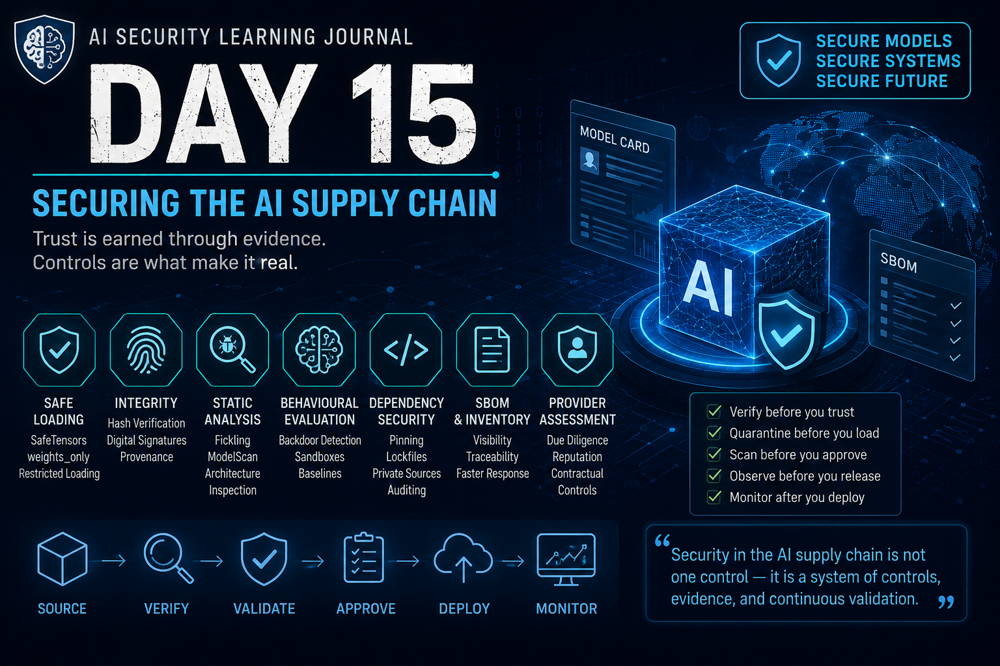

# Day 15 — Securing the AI Supply Chain

<p align="center">
  
</p>

> Securing the AI supply chain requires multiple independent forms of evidence before an artifact is trusted or promoted.

## At a Glance

**Reading time:** about 30 minutes

This entry develops a defensive assurance process using provenance, signatures, hashes, scanning, SBOMs, controlled promotion, validation, and monitoring.

**Key takeaways:**

- Integrity, provenance, serialization safety, vulnerability scanning, and behaviour validation are not interchangeable.
- Admission and promotion decisions should be policy-driven and reproducible.
- Trust must be re-evaluated when artifacts, dependencies, environments, or behaviour change.

**Suggested path:** Start with the evidence layers, then use the promotion pipeline and final review model as an implementation blueprint.

**Quick navigation:** [Quarantine](#quarantine-comes-before-trust) · [Integrity verification](#integrity-verification) · [Provenance](#provenance) · [Acquisition framework](#my-updated-model-acquisition-framework)

## AI Security Learning Journal

Today I completed the defensive side of the AI supply-chain sequence.

The progression across the last three days now feels very clear:

> **Day 13 asked: What am I trusting?**

> **Day 14 asked: How can an attacker exploit that trust?**

> **Day 15 asks: What evidence should I require before granting that trust?**

This changed the way I think about AI supply-chain security.

The objective is not to find one tool capable of declaring a model "safe."

There is no such control.

Instead, security comes from combining independent controls across different layers:

```text
Source
  ↓
Quarantine
  ↓
Provenance
  ↓
Integrity
  ↓
Serialization
  ↓
Static Analysis
  ↓
Architecture
  ↓
Dependencies
  ↓
Behaviour
  ↓
Approval
  ↓
Production Monitoring
```

Each control answers a different question.

And passing one does not automatically answer the others.

---

## From Supply-Chain Risk to Supply-Chain Controls

In the previous days, I learned that an AI application may inherit trust from many places:

- models;
- datasets;
- adapters;
- dependencies;
- repositories;
- maintainers;
- serialization formats;
- conversion pipelines;
- infrastructure;
- prompt templates;
- external APIs;
- AI providers.

That creates a fundamental defensive problem:

> **How do I decide whether an artifact or provider deserves to become part of my trusted production environment?**

My answer after this lesson is:

**I do not grant trust based on one signal. I accumulate evidence.**

A well-known publisher is evidence.

A matching hash is evidence.

A clean static scan is evidence.

A documented provenance chain is evidence.

A successful behavioural evaluation is evidence.

None of them, individually, proves security.

---

## Trust Must Be Earned Before Production

One of the strongest ideas I am taking from this module is that downloading a model should not automatically make it deployable.

There should be a controlled transition between:

```text
Received
```

and:

```text
Trusted for Production
```

A useful model acquisition lifecycle is:

```text
Acquire
   ↓
Quarantine
   ↓
Verify Source
   ↓
Verify Integrity
   ↓
Inspect
   ↓
Scan
   ↓
Evaluate
   ↓
Approve / Reject
   ↓
Promote
```

This resembles processes already familiar in cybersecurity.

We do not normally receive an unknown executable and immediately install it on a production server.

AI artifacts deserve the same security discipline.

---

## Quarantine Comes Before Trust

The first security boundary should exist before analysis begins.

An artifact that has not yet been evaluated should not land directly in the production environment.

Instead:

```text
External Source
      ↓
Isolated Staging / Quarantine
      ↓
Security Evaluation
      ↓
Approved Registry
      ↓
Production
```

This distinction matters because some model formats may have dangerous behaviour associated with loading or reconstruction.

If analysis itself can trigger the artifact, then performing the analysis inside the trusted production environment defeats the purpose of the control.

The artifact should begin its lifecycle as:

> **Untrusted until evaluated.**

Not:

> **Trusted unless something looks suspicious.**

---

## Safe Serialization

One of the most direct controls against serialization attacks is reducing what the model format is capable of doing.

This is especially important with Python pickle-based artifacts.

Pickle is powerful because it can reconstruct Python objects.

But that flexibility creates security risk.

Conceptually:

```text
Serialized Object
      ↓
Deserialization
      ↓
Object Reconstruction
      ↓
Potential Function Invocation
```

This means loading an untrusted pickle is not equivalent to reading passive data.

It can cross an execution boundary.

---

## SafeTensors

SafeTensors takes a fundamentally different approach.

Instead of supporting arbitrary Python object reconstruction, the format is designed around tensor data.

Conceptually:

```text
SafeTensors
├── Metadata / Header
└── Tensor Data
```

rather than:

```text
Pickle
├── Objects
├── Reconstruction Instructions
├── Imports
└── Potential Function Calls
```

That dramatically reduces serialization-level code execution risk.

For model weights, this is an important security improvement.

But the lesson from Day 14 still applies:

> **A safer serialization format removes an attack vector. It does not prove that the model is trustworthy.**

SafeTensors can help answer:

> "Can this serialization mechanism execute arbitrary Python during loading?"

It does not answer:

> "Are these weights malicious?"

or:

> "Does this model contain dangerous architecture logic?"

or:

> "Was this model poisoned during training?"

---

## Restricted Loading

When legacy or pickle-based model artifacts cannot immediately be eliminated, restricting deserialization becomes another defensive layer.

Modern PyTorch supports restricted loading through:

```python
torch.load("model.pt", weights_only=True)
```

The security idea is more important than the syntax.

Instead of allowing arbitrary Python objects to be reconstructed, the loader restricts what the deserializer is allowed to create.

Conceptually:

```text
Unrestricted Deserialization
        ↓
Large Capability Surface

Restricted Deserialization
        ↓
Expected Tensor Reconstruction
        ↓
Reduced Capability Surface
```

This follows a familiar cybersecurity principle:

> **Reduce capability before increasing trust.**

---

## File Extensions Are Not Security Controls

Another important lesson is that the filename cannot establish the real format.

Something called:

```text
model.safetensors
```

should not automatically be trusted merely because the extension says `safetensors`.

The security decision must be based on the artifact itself.

This is another example of a broader principle:

> **Labels describe. Validation proves properties.**

The same thinking applies to repositories, publishers, packages, model cards, and API identifiers.

Names are useful metadata.

They are not security boundaries.

---

## Integrity Verification

After controlling serialization, another question remains:

> **Did I receive the artifact that I expected?**

This is where cryptographic hashes become useful.

For example:

```text
Expected Artifact
      ↓
Expected SHA-256
      ↓
Received Artifact
      ↓
Computed SHA-256
      ↓
Compare
```

If the hashes differ:

```text
Expected ≠ Received
```

then something changed.

The artifact may have been corrupted, replaced, modified, or tampered with.

That is valuable evidence.

---

## What a Matching Hash Actually Proves

This distinction is critical.

Suppose:

```text
Expected SHA-256 == Computed SHA-256
```

What have I proven?

I have strong evidence that the artifact I received is identical to the artifact represented by the expected hash.

I have **not** proven that the artifact is benign.

A malicious publisher could publish:

```text
malicious_model
+
correct_hash_for_malicious_model
```

and my verification would succeed.

So:

> **Integrity answers "Did the artifact change?"**

It does not necessarily answer:

> **"Should I trust the artifact?"**

This distinction between **integrity** and **trustworthiness** became one of the recurring themes of this module.

---

## Artifact Integrity vs Behaviour Integrity

I now separate two important concepts.

### Artifact Integrity

```text
Is this exactly the artifact I expected?
```

Controls include:

- cryptographic hashes;
- signatures;
- controlled registries;
- immutable versions;
- provenance records.

### Behaviour Integrity

```text
Does this artifact behave within the security properties I expect?
```

Controls include:

- behavioural testing;
- regression testing;
- adversarial evaluation;
- security evaluation;
- production monitoring.

These properties can diverge.

For example:

```text
Hash correct .............. YES
Expected artifact ......... YES
Behaviour trustworthy ..... NO
```

A correct hash can coexist with a backdoored model.

That means:

> **Artifact integrity is necessary evidence, but behavioural integrity is a separate security problem.**

---

## Digital Signatures Add Identity

Checksums establish integrity relative to an expected value.

Digital signatures can add another dimension:

```text
Artifact
   ↓
Integrity
+
Publisher Identity
```

This allows the security process to ask not only:

> "Has this artifact changed?"

but also:

> "Who signed or published this artifact?"

That improves provenance.

But again, signatures do not eliminate all risk.

A compromised legitimate publisher could sign a malicious artifact.

The recurring pattern remains:

> **Every control strengthens evidence. No single control eliminates the need for the others.**

---

## Provenance

Provenance answers questions such as:

- Who created this model?
- Which organization published it?
- Which version is this?
- Where was it obtained?
- What training data is documented?
- Which framework was used?
- Was the artifact transformed?
- Was it converted by another service?
- Was it fine-tuned?
- Was an adapter added?
- Who approved it?
- Which artifact actually reached production?

This is the model's chain of trust.

Without provenance, an artifact may function perfectly while leaving us unable to explain where it came from or what happened to it before deployment.

---

## Model Cards as Security Evidence

Model cards are not security certificates.

But they are useful provenance evidence.

I would expect documentation around areas such as:

```text
Model Identity
├── Author
├── Organization
├── Version
└── License

Purpose
├── Intended Use
└── Out-of-Scope Use

Training
├── Data Sources
├── Methodology
└── Known Constraints

Evaluation
├── Metrics
└── Benchmarks

Limitations
├── Biases
├── Failure Modes
└── Known Risks
```

Missing information does not automatically prove malicious intent.

But it increases uncertainty.

That leads to an important distinction from previous days:

> **Missing provenance is evidence of uncertainty, not evidence of compromise.**

Security decisions should respond to that uncertainty appropriately.

---

## Reputation Is a Signal, Not a Guarantee

During my study, I considered a scenario where two models had very different publisher reputations.

One came from a famous organization but failed security evaluation.

Another came from a less-known publisher but had stronger technical evidence.

My production decision would favour the model with stronger evidence.

Why?

Because:

```text
Popularity ≠ Integrity
Downloads ≠ Security
Reputation ≠ Provenance
Verification Badge ≠ Behavioural Safety
```

A publisher being unknown does not prove maliciousness.

A publisher being famous does not prove security.

The principle I want to keep is:

> **Reputation can influence my initial confidence, but observed security evidence must influence my production decision.**

---

## LoRA Adapters Are Supply-Chain Artifacts Too

A base model is not necessarily the final model.

Modern systems increasingly modify foundation models using adapters such as LoRA.

Conceptually:

```text
Trusted Base Model
       +
Third-Party Adapter
       ↓
Modified Behaviour
```

This creates another trust relationship.

Even if the base model passed every security gate, adding an untrusted adapter changes the artifact being evaluated.

Therefore the adapter should have its own intake process:

```text
Acquire
↓
Quarantine
↓
Verify Source
↓
Inspect
↓
Scan
↓
Evaluate
↓
Approve
```

A clean base model does not automatically make every downstream adaptation trustworthy.

---

## Conversion Creates a New Trust Boundary

The same reasoning applies when a model is transformed.

For example:

```text
Original Model
      ↓
Third-Party Conversion Service
      ↓
Converted Model
```

The output is now a new artifact.

Even if I trusted the original artifact, I also need to trust:

- the conversion process;
- the service;
- the environment;
- the output;
- the provenance record.

So the converted model should be evaluated again.

This gives me a general rule:

> **When an artifact crosses a transformation boundary, reassess trust in the resulting artifact.**

---

## Static Model Scanning

Integrity and provenance still do not tell me everything contained inside an artifact.

This is where static analysis becomes important.

The goal is:

```text
Artifact
   ↓
Inspect Without Executing
   ↓
Identify Suspicious Operations
   ↓
Security Decision
```

This is particularly important for formats capable of representing executable reconstruction behaviour.

---

## Fickling

Fickling provides static analysis capabilities for Python pickle artifacts.

The important security property is that the artifact can be inspected without performing normal unsafe object reconstruction.

The defensive objective is not:

```text
Load model → observe whether something bad happens
```

but:

```text
Inspect artifact → understand what loading could do
```

This follows the principle we established in Day 14:

> **Do not execute an untrusted artifact to discover whether it is safe to execute.**

Static analysis attempts to move inspection before execution.

---

## ModelScan

ModelScan expands model security scanning across multiple machine-learning formats.

Instead of assuming that every suspicious condition means compromise, findings can be classified by severity and reviewed in context.

This matters because:

```text
Suspicious ≠ Malicious
```

For example, some custom model behaviour may be legitimate.

Security tools should provide evidence for investigation rather than replacing analysis.

That is another recurring principle:

> **Scanner output is evidence for a decision, not the decision itself.**

---

## A Clean Scan Does Not Prove a Clean Model

This is one of the most important limitations.

Suppose:

```text
SafeTensors ............... PASS
SHA-256 ................... PASS
Static Scan ............... PASS
Dependencies .............. PASS
```

Can I conclude:

```text
MODEL IS SAFE
```

No.

Static scanners detect what they are designed to identify.

A sophisticated attack might instead exist in:

- model architecture;
- weights;
- training data;
- adapters;
- external prompts;
- provider behaviour.

Therefore:

> **Passing every static check increases confidence. It does not mathematically prove trustworthiness.**

---

## Architecture Inspection

Day 14 introduced an important distinction:

```text
Serialization-Level Attack
Architecture-Level Attack
Weight-Level Attack
```

Day 15 adds defensive controls for each layer.

Serialization scanning alone cannot validate model architecture.

A model may load cleanly but contain custom components that execute or influence behaviour during inference.

Conceptually:

```text
Model Load
   ↓
No Problem
   ↓
Inference Begins
   ↓
Custom Architecture Logic
   ↓
Unexpected Behaviour
```

This is why architecture inspection matters.

---

## Custom Layers Require Investigation

Custom layers are not automatically malicious.

Machine-learning developers legitimately create custom operations.

But in a model received from an external source, unexpected custom logic increases the review requirement.

The correct reasoning is:

```text
Custom Layer
    ↓
Suspicious?
    ↓
Investigate
```

not:

```text
Custom Layer
    ↓
Automatically Malicious
```

This distinction matters because security tools must avoid turning unusual implementation choices directly into compromise conclusions.

---

## SafeTensors Does Not Protect Architecture

This is another useful boundary.

SafeTensors protects the serialization of tensor data.

It does not validate application or architecture logic surrounding those tensors.

So:

```text
Safe Serialization
      ≠
Safe Architecture
```

and:

```text
Safe Architecture
      ≠
Safe Weights
```

Different attack surfaces require different controls.

---

## Behavioural Backdoors

One of the scenarios I considered during my study involved a model that passed:

```text
Safe format
Integrity verification
Static scanning
Architecture inspection
Dependency auditing
```

but behaved incorrectly only when a very specific input pattern appeared.

That would make me investigate a possible behavioural or weight-level backdoor.

Conceptually:

```text
Normal Input
    ↓
Expected Behaviour

Trigger Input
    ↓
Unexpected / Malicious Behaviour
```

This type of issue may not require:

- dangerous serialization;
- custom architecture;
- shell execution;
- network activity.

The malicious property can exist in what the model has learned.

That is why behavioural evaluation remains necessary even after technical artifact inspection.

---

## Behavioural Evaluation

Before production, the model should be evaluated against expected security and functional properties.

This may include:

- fixed test cases;
- known-correct responses;
- adversarial cases;
- safety boundary testing;
- regression tests;
- comparison against an approved baseline.

Conceptually:

```text
Candidate Model
      ↓
Isolated Evaluation
      ↓
Known Test Battery
      ↓
Expected Behaviour?
   ↙              ↘
 Yes              No
 ↓                 ↓
Continue        Reject / Investigate
```

This moves the security decision beyond:

> "Does the model load?"

toward:

> "Does the model behave within the properties required by this application?"

---

## Dependencies Are Part of the AI Supply Chain

An AI model rarely operates alone.

The surrounding software may depend on:

```text
Python
├── ML Framework
├── Tokenizer
├── HTTP Client
├── Data Libraries
├── Serialization Libraries
└── Transitive Dependencies
```

Each dependency adds another trust relationship.

This means model security cannot stop at the model file.

---

## Version Pinning

A basic dependency control is specifying exactly what should be installed.

Without controlled versions:

```text
package
```

may mean:

```text
whatever version the resolver selects today
```

With pinning:

```text
package==approved-version
```

the expected dependency becomes more deterministic.

This reduces unexpected changes.

But version pinning alone still does not establish provenance or integrity.

---

## Lockfiles

Lockfiles extend dependency control by recording the exact dependency resolution.

Depending on the ecosystem, this can include:

- exact versions;
- transitive dependencies;
- cryptographic hashes.

Conceptually:

```text
Application
   ↓
Lockfile
   ↓
Exact Dependency Graph
   ↓
Repeatable Installation
```

This makes development, testing, CI/CD, and production more reproducible.

---

## Dependency Confusion Revisited

Day 14 taught me the offensive side:

```text
Private Registry
    ↓
internal-package

Public Registry
    ↓
internal-package
    ↓
higher version
```

If the resolver uses package name and version precedence without enforcing provenance, the public package may be selected.

The architectural problem is not simply that:

> "A malicious package existed."

The deeper problem is:

> **The resolver was allowed to decide provenance from package identity and version precedence.**

That gives me a defensive principle:

> **Version precedence is not provenance enforcement.**

Internal package identities should resolve through controlled sources.

---

## Private Package Sources

For internal dependencies, organizations can use controlled private registries and explicit source policies.

The security goal is not necessarily:

```text
Block the entire public ecosystem
```

but:

```text
Internal Package
      ↓
Approved Internal Source
      ↓
Cannot Be Replaced by Public Homonym
```

This preserves legitimate use of external packages while preventing public packages from impersonating internal ones.

---

## Validate What Was Actually Retrieved

Source control should be combined with artifact verification.

My defensive thinking became:

```text
Expected Package
      ↓
Expected Source
      ↓
Expected Version
      ↓
Expected Hash
      ↓
Security / Vulnerability Evaluation
      ↓
Approved Dependency
```

This creates multiple independent checks.

If one control fails, another may still expose the inconsistency.

---

## Malicious Is Not the Same as Vulnerable

Dependency scanners are extremely useful.

But their purpose must be understood correctly.

A vulnerability scanner can identify known vulnerabilities associated with packages and versions.

It may not identify a brand-new package intentionally created to perform malicious behaviour.

So:

```text
Known Vulnerability
        ≠
Intentional Malice
```

This gives me another principle:

> **A package can be malicious without containing a known CVE.**

Vulnerability management and supply-chain provenance overlap, but they are not identical security problems.

---

## Dependency Auditing

Tools such as `pip-audit` help identify known vulnerabilities in Python dependency sets.

This provides answers such as:

```text
Which package?
Which version?
Which known vulnerability?
Which version contains a fix?
```

This is valuable for vulnerability management.

But again:

> **No findings does not mean no supply-chain risk.**

It means the scanner did not identify known vulnerabilities within its scope and available intelligence.

---

## Software Bill of Materials

The SBOM was one of the concepts I found especially useful from an incident-response perspective.

A Software Bill of Materials provides a structured inventory of the components that make up an application.

Conceptually:

```text
Application
├── Package A
│   ├── Dependency A1
│   └── Dependency A2
├── Package B
└── Framework C
```

Without that inventory, a newly disclosed vulnerability can become a discovery exercise.

---

## Why SBOM Matters During an Incident

Imagine a critical vulnerability is announced for:

```text
Library X
Versions Y-Z
```

and the organization has dozens of AI/ML applications across:

```text
Development
FQA
Production
```

Without reliable component inventory, the immediate questions become:

```text
Where is Library X?
Which applications use it?
Which versions?
Is it direct or transitive?
Which environments are affected?
Which production systems require immediate action?
```

Trying to discover all of that during an emergency creates delay.

An up-to-date SBOM changes the starting point.

```text
New CVE
   ↓
Affected Component / Version
   ↓
SBOM Inventory
   ↓
Affected Applications
   ↓
Affected Deployments
   ↓
DEV / FQA / PROD
   ↓
Prioritized Remediation
```

My takeaway is:

> **Without an SBOM, a newly disclosed vulnerability can turn incident response into an infrastructure-wide discovery exercise. With an up-to-date SBOM, I can start from the affected component and identify which applications and versions require investigation.**

---

## Transitive Dependencies Matter

The dependency I explicitly install may itself install many others.

For example:

```text
My Application
    ↓
Library A
    ↓
Library B
    ↓
Library C
```

If Library C becomes vulnerable, simply reviewing my top-level dependency list may not make the relationship obvious.

This is why dependency inventory must account for the complete graph rather than only the packages developers remember installing directly.

---

## SBOM Formats

Two important SBOM ecosystems are:

```text
SPDX
CycloneDX
```

They serve similar inventory goals while emphasizing different areas.

The exact format is less important to my security reasoning than having:

- structured inventory;
- versions;
- component relationships;
- machine-readable output;
- integration with vulnerability and compliance workflows.

---

## ML Needs More Than a Traditional SBOM

Traditional SBOMs focus primarily on software components.

AI systems introduce additional artifacts:

```text
Software
+
Model
+
Dataset
+
Adapter
+
Prompt / Policy
+
Provider
```

This means AI supply-chain visibility eventually needs to capture information beyond traditional packages.

For now, different evidence sources can complement each other:

```text
SBOM
+
Model Card
+
Model Registry
+
Dataset Lineage
+
Version Telemetry
+
Prompt Versioning
```

Together they provide a richer view of the deployed AI system.

---

## The API Supply Chain

The defensive model changes when the organization does not receive a model file at all.

With a hosted provider:

```text
Application
    ↓
API
    ↓
Provider
    ↓
Unknown Internal Model Pipeline
```

Now I may not have access to:

```text
.pkl
SafeTensors
GGUF
Weights
Architecture
Training Pipeline
```

That means several local controls disappear.

I cannot simply calculate the model's SHA-256.

I cannot necessarily inspect its weights.

I cannot run my local model scanner against the provider's internal artifact.

But the supply chain still exists.

---

## The Supply Chain Becomes Less Visible

Moving to an API does not eliminate upstream trust.

It changes who controls the evidence.

I am now trusting things such as:

- provider security practices;
- training pipeline;
- model versioning;
- infrastructure;
- incident response;
- privacy practices;
- model updates;
- API authentication;
- prompt handling;
- provider transparency.

This reinforces something I learned on Day 13:

> **The supply chain does not disappear behind an API. It becomes less visible to the consumer.**

---

## Provider Due Diligence

Before integrating an external AI provider, I would want to understand areas such as:

```text
Provider
├── Data Handling
├── Retention
├── Training Use
├── Model Versioning
├── Change Notifications
├── Security Certifications
├── Incident Response
├── Vulnerability Disclosure
├── Transparency
└── Deprecation Policy
```

This does not eliminate provider risk.

It establishes evidence before trust is granted.

---

## Behavioural Baselines

Without access to the underlying model artifact, behaviour becomes especially important.

A useful approach is maintaining a fixed evaluation battery.

For example:

```text
Fixed Prompt Set
      ↓
Expected Behaviour Range
      ↓
Periodic Evaluation
      ↓
Compare Results
      ↓
Significant Change?
```

Because LLMs are probabilistic, the goal is not necessarily exact textual equality.

Instead, I would monitor properties such as:

- decision consistency;
- safety boundaries;
- refusal behaviour;
- factual accuracy;
- output format;
- task performance;
- latency;
- error patterns.

The responses can vary while still converging on expected behaviour.

---

## Behaviour as a Kind of Operational Checksum

During my study, I described this as behavioural analysis using the same prompts over time.

That led me to a useful analogy:

> **If I cannot verify the model artifact, I need to verify the model's behaviour over time. A fixed prompt battery becomes my behavioural checksum.**

It is not a cryptographic checksum.

But operationally, it provides a reference point.

If:

```text
Application ........ unchanged
Dependencies ....... unchanged
System Prompt ...... unchanged
Endpoint Name ...... unchanged
```

but:

```text
Model Behaviour ..... significantly changed
```

then an upstream provider-side change becomes one hypothesis worth investigating.

---

## Version Telemetry

Behavioural monitoring becomes even stronger when combined with provider/model version telemetry.

Without version evidence:

```text
Yesterday → same endpoint
Today     → same endpoint
```

may appear identical.

With version telemetry:

```text
Yesterday → Model Revision A
Today     → Model Revision B
```

the investigation gains another causal clue.

This does not necessarily reveal:

- who trained the model;
- what data was used;
- exactly what changed.

But it provides forensic traceability.

---

## System Prompts Are Supply-Chain Artifacts

This was one of my favourite connections between the Prompt Security and Supply Chain Security modules.

Consider:

```text
External Repository
      ↓
System Prompt Template
      ↓
AI Application
      ↓
Production Decisions
```

The template may contain only text.

But that text may define:

- policies;
- decision rules;
- escalation behaviour;
- confidentiality requirements;
- tool instructions;
- safety expectations.

If an external template changes, the application's behaviour may change even when:

```text
Model ............. unchanged
Application ....... unchanged
Dependencies ...... unchanged
Endpoint .......... unchanged
```

The policy changed.

---

## Trusted Instructions Can Have an Untrusted Origin

Earlier in the journey, Prompt Injection taught me:

> **Untrusted data can become instructions.**

Supply-chain security adds another perspective:

> **Trusted instructions can themselves arrive through an untrusted or compromised supply chain.**

That is a powerful connection.

It means prompt governance is not merely prompt engineering.

It is configuration and change-management security.

---

## Treat Security-Relevant Prompts Like Code

An externally sourced system prompt should not move directly into production.

Instead of:

```text
External Repository
       ↓
Automatic Fetch
       ↓
Production
```

I would prefer:

```text
External Source
       ↓
Proposed Change
       ↓
Internal Version Control
       ↓
Review
       ↓
Security Testing
       ↓
Approval
       ↓
Production
```

Network or repository allowlisting can strengthen this process.

But restricting the source alone is not enough.

The deeper control is:

> **Trusted instructions should reach production because they passed a trusted change process.**

---

## Sandboxed API Evaluation

When I cannot inspect a provider's internal model, dynamic evaluation becomes more important.

Before promotion, I would test the candidate model against:

```text
Functional Tests
+
Known-Correct Cases
+
Security Tests
+
Adversarial Cases
+
Baseline Comparison
```

and perform this evaluation without immediately giving the candidate unrestricted production capabilities.

Again, the pattern resembles model acquisition:

```text
Evaluate
   ↓
Collect Evidence
   ↓
Approve / Reject
   ↓
Promote
```

---

## The Model Can Pass and the System Can Still Fail

One of the broader lessons from the exercises was that individual controls should be evaluated separately.

Imagine:

```text
Model Loader Control ........ PASS
Dependency Control ........... FAIL
```

The conclusion should not be:

> "The model loader failed."

It did its job.

The architecture failed to cover another supply-chain path.

This is why defence in depth matters.

```text
Model Security
+
Dependency Security
+
Repository Security
+
Prompt Governance
+
Provider Security
+
Runtime Monitoring
```

A strong control in one layer does not compensate automatically for an unprotected adjacent layer.

---

## Applying the Controls: From Detection to Investigation

The practical exercises added another perspective that I consider important enough to include in my journal.

Supply-chain security is not only about preventing malicious artifacts from entering production.

Sometimes prevention fails.

Then the question becomes:

> **Do I have enough evidence to reconstruct what happened?**

The investigation mindset I developed was:

```text
Detection
   ↓
Timeline Reconstruction
   ↓
Deployment Provenance
   ↓
Artifact Identification
   ↓
Integrity Verification
   ↓
Safe Artifact Inspection
   ↓
Runtime Telemetry
   ↓
Network Correlation
   ↓
Causal Analysis
   ↓
Containment / Deployment Decision
```

This connects supply-chain security directly with DFIR.

---

## Start With the Timeline

A network alert happening today does not prove the compromise happened today.

The malicious artifact could have entered the environment:

```text
minutes ago
days ago
weeks ago
```

and only triggered detection later.

Therefore the first question should be:

> **What happened, and when?**

I would correlate:

- deployment events;
- registry events;
- model acquisition;
- artifact changes;
- load telemetry;
- inference activity;
- outbound connections;
- configuration changes;
- credentials;
- prompt/template updates.

This prevents me from treating the detection timestamp as the compromise timestamp.

---

## Correlation Before Causation

Suppose I find:

```text
Model deployed
      ↓
Later network beacon
```

That is interesting.

But temporal proximity alone is not enough.

I still need evidence connecting:

```text
Artifact
   ↓
Load / Runtime Behaviour
   ↓
Network Activity
```

The principle remains:

> **Potential attack path is not the same as confirmed attack path.**

Incident response should establish the causal chain before making strong attribution or root-cause conclusions.

---

## Model-Load Telemetry

Runtime telemetry can reveal behaviour that static metadata does not.

A normal model-load sequence might conceptually look like:

```text
Open Artifact
      ↓
Read Expected Data
      ↓
Construct Expected Model
      ↓
Complete
```

A suspicious sequence might include unexpected:

```text
Imports
File Access
Process Creation
Shell Calls
Network Activity
Unexpected Object Types
```

This does not mean every unusual event proves malicious intent.

But it creates valuable evidence for investigation.

---

## The Bootstrap Analogy

During the study, I found myself thinking about model loading almost like examining the bootstrap process of a system.

Before asking only:

> "What does the model answer?"

I want to know:

> "How did this artifact enter execution?"

Conceptually:

```text
Artifact Acquisition
       ↓
Verification
       ↓
Loader
       ↓
Object Reconstruction
       ↓
Architecture Initialization
       ↓
Inference
       ↓
External Capabilities
```

Understanding that chain helps identify where an unexpected behaviour entered the system.

---

## Evidence Must Survive Preventive Failure

This leads to a broader security principle:

> **Preventive controls should be complemented by evidence-producing controls.**

If prevention fails, I still want:

- deployment logs;
- artifact hashes;
- provenance records;
- model versions;
- scanner results;
- approval history;
- runtime telemetry;
- network logs;
- prompt versions;
- provider metadata.

Without them, incident response becomes guesswork.

---

## Production Approval Is an Evidence Decision

The final exercises reinforced another idea:

Production approval should not be based on one attractive property.

Not:

```text
Famous publisher → Approve
```

Not:

```text
SafeTensors → Approve
```

Not:

```text
Clean scan → Approve
```

Not:

```text
Correct answer → Approve
```

Instead:

```text
Provenance
+
Integrity
+
Serialization Safety
+
Static Analysis
+
Architecture Inspection
+
Dependency Security
+
Behavioural Evaluation
+
Governance
+
Monitoring Capability
        ↓
Production Decision
```

This is much closer to risk-based security engineering.

---

## Trust Signals vs Security Evidence

I now separate these mentally.

### Trust Signals

Examples:

- known organization;
- many downloads;
- verified profile;
- community reputation;
- professional documentation.

These influence confidence.

### Security Evidence

Examples:

- provenance;
- cryptographic integrity;
- static analysis;
- architecture review;
- dependency audit;
- SBOM;
- behavioural evaluation;
- version telemetry;
- controlled approval records.

These support a defensible production decision.

The two can complement each other.

But:

> **Trust signals should never replace security evidence.**

---

## The Production Decision

Imagine:

```text
MODEL A

Safe serialization ............ PASS
Integrity ..................... PASS
Known publisher ............... PASS
Static scan ................... PASS
Architecture .................. SUSPICIOUS
Behaviour ..................... FAIL
```

and:

```text
MODEL B

Safe serialization ............ PASS
Integrity ..................... PASS
Publisher reputation .......... LIMITED
Static scan ................... PASS
Architecture .................. PASS
Behaviour ..................... PASS
Provenance .................... DOCUMENTED
Dependencies / SBOM ........... PASS
```

I would prefer Model B based on the available evidence.

The lower publisher reputation creates a due-diligence requirement.

It does not override the technical evidence.

Meanwhile, Model A has actual security findings.

This captures one of my strongest lessons:

> **Reputation can influence my initial confidence, but observed security evidence must influence my production decision.**

---

## Passing the Gate Does Not Mean "Proven Safe"

Even after all controls pass, I would avoid saying:

```text
This model is safe.
```

A more defensible statement is:

```text
The model passed the defined security controls
and accumulated sufficient evidence for
controlled production deployment.
```

That difference matters.

Security evaluation reduces uncertainty.

It does not eliminate uncertainty.

---

## Monitoring Continues After Approval

Production approval is not the end of the supply-chain lifecycle.

The system can still change.

For example:

```text
Provider update
Dependency update
Prompt update
Adapter update
Model replacement
Configuration change
Behaviour drift
Credential compromise
```

Therefore:

```text
Acquire
↓
Evaluate
↓
Approve
↓
Deploy
↓
Monitor
↓
Re-evaluate
```

is more realistic than:

```text
Approve
↓
Trust Forever
```

---

## Prevention, Detection, and Investigation

I now see AI supply-chain controls across three broad defensive objectives.

### Prevention

Stop untrusted components from entering production.

Examples:

```text
Quarantine
Safe serialization
Private registries
Version pinning
Lockfiles
Controlled prompt deployment
Approval gates
```

### Detection

Identify suspicious or unexpected conditions.

Examples:

```text
Static scanning
Architecture inspection
Dependency auditing
Behavioural baselines
Runtime telemetry
Network monitoring
```

### Investigation

Establish what actually happened.

Examples:

```text
Provenance
Hashes
SBOM
Deployment history
Version telemetry
Prompt history
Runtime logs
Network logs
```

A mature security architecture needs all three.

---

## My Updated Model Acquisition Framework

After studying the technical controls and working through the investigation scenarios, my own mental model became:

```text
                 EXTERNAL TRUST
                       │
                       ▼
                  [ ACQUIRE ]
                       │
                       ▼
                [ QUARANTINE ]
                       │
                       ▼
               [ PROVENANCE ]
                       │
                       ▼
                [ INTEGRITY ]
                       │
                       ▼
            [ FORMAT / SERIALIZATION ]
                       │
                       ▼
               [ STATIC SCAN ]
                       │
                       ▼
              [ ARCHITECTURE ]
                       │
                       ▼
              [ DEPENDENCIES ]
                       │
                       ▼
                 [ SBOM ]
                       │
                       ▼
            [ BEHAVIOURAL TEST ]
                       │
                       ▼
               [ RISK REVIEW ]
                    /      \
                   /        \
              REJECT       APPROVE
                              │
                              ▼
                         [ REGISTRY ]
                              │
                              ▼
                        [ PRODUCTION ]
                              │
                              ▼
                         [ MONITOR ]
                              │
                              ▼
                       [ RE-EVALUATE ]
```

For API models, some controls change:

```text
Local Model                API Model
-----------                ---------
File provenance            Provider due diligence
File checksum              Version telemetry
Static model scan          Behavioural evaluation
Architecture inspection    Provider transparency
Local sandbox              API sandbox evaluation
Artifact monitoring        Behaviour monitoring
```

The implementation changes.

The security principle does not:

> **Establish evidence before granting trust.**

---

## Framework Perspective

This topic also reinforced why AI security benefits from combining multiple frameworks.

Different frameworks help answer different questions.

Conceptually:

```text
OWASP
   ↓
Where are common AI/LLM application risks?

MITRE ATLAS
   ↓
How can adversaries target ML systems and their supply chains?

NIST AI RMF
   ↓
How should AI risk be governed, measured, and managed?
```

No single framework replaces architecture-specific analysis.

They provide complementary lenses.

---

## Questions I Would Ask Before Approving an AI Component

After this module, these are the questions I would bring into a real security review:

### Provenance

Who produced it?

Where did it come from?

Can I establish the chain between publisher and deployed artifact?

### Integrity

Is this exactly the artifact I expected?

Can I verify that cryptographically?

### Serialization

Can loading this format execute code?

Can I use a safer format or restricted loader?

### Architecture

Does the model contain custom or unexpected execution logic?

### Weights and Behaviour

Does it behave correctly under normal and adversarial evaluation?

Are there trigger-specific anomalies?

### Dependencies

What software does it require?

Are versions controlled?

Are sources controlled?

Are there known vulnerabilities?

### Inventory

Do I have an SBOM?

Can I identify affected systems quickly when a new vulnerability appears?

### Prompts

Where do production prompts come from?

Are they versioned, reviewed, tested, and approved?

### APIs

What do I know about the provider?

Can the model change behind the same endpoint?

Do I maintain behavioural baselines and version telemetry?

### Operations

What happens after deployment?

Can I detect behavioural change?

Can I reconstruct an incident?

---

## What Changed in My Thinking

Before studying AI supply-chain security, it would have been easy to think:

```text
Trusted Source
+
Hash Match
+
Scanner Pass
=
Safe Model
```

I no longer see it that way.

Now I think:

```text
Source Reputation
        ↓
Initial Confidence

Provenance
Integrity
Static Analysis
Architecture
Dependencies
Behaviour
Governance
Monitoring
        ↓
Accumulated Evidence
        ↓
Risk Decision
```

This is a much stronger model of trust.

---

## The Three-Day Progression

The last three days form one continuous security story.

### Day 13 — Understanding AI Supply Chains

I learned to ask:

> **What exactly am I trusting?**

The model is only one artifact inside a much larger chain.

### Day 14 — Supply Chain Attack Vectors

I learned to ask:

> **How can an attacker exploit those trust relationships?**

Attackers can target artifacts, dependencies, repositories, identities, providers, prompts, and the mechanisms used to establish trust.

### Day 15 — Securing the AI Supply Chain

Now I ask:

> **What evidence must exist before I allow that trust to influence production?**

That moves the discussion from awareness to engineering.

---

## My Biggest Takeaway

The strongest lesson from Day 15 is not a particular scanner or file format.

It is the idea of **evidence-based trust**.

SafeTensors is useful.

Hashes are useful.

Static scanners are useful.

Architecture inspection is useful.

Dependency auditing is useful.

SBOMs are useful.

Behavioural baselines are useful.

Provider due diligence is useful.

But each one sees only part of the system.

The real security control is the process that combines them.

> **Passing every static check gives me evidence to increase trust. It does not give me proof that the model is trustworthy.**

And when the model is delivered through an API:

> **If I cannot verify the model artifact, I need to verify the model's behaviour over time.**

For incident response:

> **Preventive controls should be complemented by evidence-producing controls.**

For production decisions:

> **Reputation can influence my initial confidence, but observed security evidence must influence my production decision.**

And the principle connecting everything is:

> **Trust should not be inherited automatically. It should be established through independent evidence, constrained by security boundaries, and continuously re-evaluated as the system changes.**

---

## Key Takeaways

- AI supply-chain security requires multiple independent controls.
- New model artifacts should begin in quarantine, not production.
- Safe serialization reduces serialization-level code execution risk.
- Restricted loading can reduce dangerous deserialization capabilities.
- File extensions are not security boundaries.
- SHA-256 verifies artifact integrity relative to an expected hash, not benign behaviour.
- Digital signatures can add publisher identity to integrity verification.
- Provenance establishes where an artifact came from and how it reached production.
- Model cards provide useful provenance evidence but are not security certificates.
- Reputation is a trust signal, not a security guarantee.
- LoRA adapters and converted models create additional supply-chain trust relationships.
- Static scanning should happen before unsafe loading.
- Scanner findings require context and analysis.
- A clean static scan does not prove a clean model.
- Safe serialization does not validate model architecture.
- Architecture inspection helps identify unexpected custom logic.
- Weight-level or behavioural backdoors may survive artifact-level controls.
- Behavioural evaluation is required before production promotion.
- Dependencies are part of the AI supply chain.
- Version pinning and lockfiles improve dependency determinism.
- Internal packages require provenance-aware source control.
- Dependency confusion exploits resolution trust.
- Known-vulnerability scanning does not detect every intentionally malicious package.
- SBOMs improve dependency visibility and incident-response speed.
- Transitive dependencies must be included in supply-chain inventory.
- AI systems need visibility beyond traditional software SBOMs.
- Hosted APIs move rather than eliminate supply-chain risk.
- Provider due diligence becomes important when model artifacts are inaccessible.
- Behavioural baselines can reveal silent upstream changes.
- Model-version telemetry improves forensic traceability.
- System prompts are supply-chain artifacts when they influence production behaviour.
- Security-relevant prompts should be versioned, reviewed, tested, and approved like code.
- Production approval should be based on accumulated evidence rather than reputation.
- Preventive controls must be complemented by detection and forensic evidence.
- Detection time is not necessarily compromise time.
- Correlation should precede causal conclusions during incident response.
- Production approval is not permanent trust.
- Monitoring and re-evaluation continue after deployment.

---

## Final Reflection

Day 13 changed the object of my attention.

I stopped looking only at the final model and started looking at the chain behind it.

Day 14 changed the threat model.

I saw how attackers can exploit that chain, including the mechanisms organizations use to decide what deserves trust.

Day 15 changed the defensive question.

The goal is no longer:

> **"Can I prove this model is safe?"**

The better question is:

> **"What independent evidence do I have, what uncertainty remains, and what controls will still protect the system if one of my assumptions is wrong?"**

That feels much closer to how cybersecurity already handles other complex systems.

We do not secure an enterprise because one scanner returned green.

We combine controls.

We constrain privileges.

We preserve evidence.

We monitor change.

We investigate anomalies.

And we continuously reassess trust.

AI supply-chain security should be no different.

---

## References

- [OWASP — LLM03:2025 Supply Chain](https://genai.owasp.org/llmrisk/llm032025-supply-chain/)
- [MITRE — ATLAS](https://atlas.mitre.org/)
- [NIST — AI Risk Management Framework](https://www.nist.gov/itl/ai-risk-management-framework)
- [Hugging Face — Safetensors](https://huggingface.co/docs/safetensors/)
- [Trail of Bits — Fickling](https://github.com/trailofbits/fickling)
- [ModelScan](https://github.com/protectai/modelscan)
- [PyPA — pip-audit](https://github.com/pypa/pip-audit)
- [Anchore — Syft](https://github.com/anchore/syft)
- [OWASP — CycloneDX](https://cyclonedx.org/)
- [SPDX](https://spdx.dev/)
- [Google Research — Model Cards for Model Reporting](https://research.google/pubs/model-cards-for-model-reporting/)

---

> **Learning note:** This journal documents my own understanding, reasoning, corrections, and cybersecurity connections developed while studying AI security. It intentionally does not reproduce challenge solutions, flags, credentials, lab infrastructure, proprietary scenarios, or step-by-step walkthroughs.
