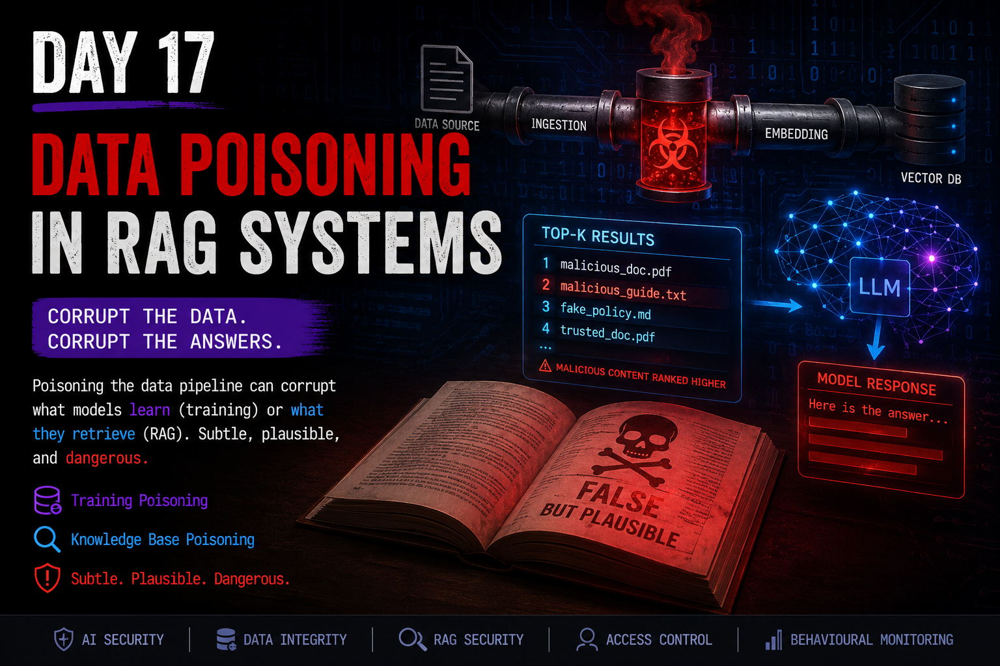

# Day 17 — Data Poisoning in RAG Systems

<p align="center">
  
</p>

> **Control over the data that an AI system learns from or retrieves can become control over its behaviour — without directly attacking the model or the user's prompt.**

## At a Glance

**Reading time:** about 28 minutes

This entry examines how adversaries can influence AI behaviour by poisoning training data, ingestion pipelines, retrieval corpora, and the information selected for RAG context.

**Key takeaways:**

- Training poisoning changes learned parameters; retrieval poisoning changes inference-time context.
- A Retriever can operate correctly while an insecure eligibility or ingestion process allows manipulated content to dominate results.
- Provenance, behavioural monitoring, independent authorization, and incident evidence are necessary because poisoning may remain subtle and operationally plausible.

**Suggested path:** Start with the training-versus-retrieval distinction, then follow the ingestion, corpus-flooding, investigation, and defensive-architecture sections.

**Quick navigation:** [Training vs retrieval poisoning](#training-poisoning-vs-retrieval-poisoning) · [Corpus flooding](#corpus-flooding) · [Investigation](#investigating-suspected-poisoning) · [Defensive architecture](#practical-defensive-architecture) · [Key takeaways](#key-takeaways)

---

## Introduction

Day 16 changed the way I think about Retrieval-Augmented Generation.

I learned that external knowledge becomes part of the inference chain and that semantic relevance does not automatically establish trust.

Day 17 pushed that idea further.

The question was no longer only:

> **Can I trust what the RAG system retrieves?**

It became:

> **What happens when someone deliberately manipulates the information that the AI system is allowed to learn from, index, retrieve, or trust?**

This is where data poisoning becomes especially important.

An attacker may not need to compromise the model server.

They may not need to modify application code.

They may not need to steal model weights.

They may not even need to interact with the chatbot.

If they can influence the data that eventually participates in training or inference, they may be able to influence behaviour indirectly.

That makes poisoning fundamentally an **integrity problem**.

The attack targets the information ecosystem surrounding the AI.

---

## From RAG Security to RAG Poisoning

My mental model from Day 16 was:

```text
External Knowledge
        ↓
Ingestion
        ↓
Vector Store
        ↓
Retrieval
        ↓
Context
        ↓
LLM
        ↓
Output
```

Day 17 adds an adversary to that architecture:

```text
                    Attacker
                       │
                       ↓
External Knowledge → Ingestion → Vector Store → Retrieval → Context → LLM
                       │              │             │
                       └──────────────┴─────────────┘
                                  Influence
                                      ↓
                                  Behaviour
```

This creates an important security observation:

> **The model can remain intact while the system's behaviour becomes attacker-influenced.**

But not every poisoning attack works at the same layer.

Understanding where the manipulation occurs is critical.

---

## Poisoning Is an Attack Class, Not Just Bad Data

AI systems naturally encounter imperfect information.

A document may be outdated.

An employee may write something incorrect.

A dataset may contain labeling mistakes.

A policy may remain indexed after being superseded.

These are serious data-quality and governance problems.

But I would not automatically call all of them poisoning.

The distinction I now use is **adversarial intent**.

Consider three situations.

### Scenario A — Stale Information

An old security procedure remains available after a new procedure replaces it.

The system retrieves the old version.

The result is incorrect.

But there is no evidence that anyone deliberately manipulated the system.

### Scenario B — Human Error

An employee accidentally documents an incorrect threshold.

The document is automatically ingested.

Again, the system may produce incorrect recommendations.

But the error itself does not establish malicious intent.

### Scenario C — Deliberate Manipulation

Someone intentionally introduces incorrect information because they know it will influence future AI responses.

Now there is:

```text
Intent
  +
Manipulation
  +
Expected Behavioural Influence
```

That is clearly poisoning.

This distinction matters during incident response.

> **Incorrect AI behaviour is not automatically evidence of poisoning.**

The behaviour is a symptom.

Attribution requires investigation.

---

## Training Data Poisoning

Training data poisoning targets what the model **learns**.

Consider a model that is fine-tuned using historical SOC tickets.

An attacker gains the ability to introduce carefully manipulated examples into the fine-tuning dataset.

Conceptually:

```text
Legitimate Training Data
          +
   Poisoned Samples
          ↓
      Fine-Tuning
          ↓
   Weight Updates
          ↓
   Modified Behaviour
```

The attacker does not need to directly edit the model weights.

Instead, the training process performs the modification.

The malicious influence enters through the data.

---

## Why Training Poisoning Can Persist

This produces an important difference from retrieval poisoning.

After training:

```text
Poisoned Data
     ↓
Gradient Updates
     ↓
Learned Parameters
     ↓
Model Behaviour
```

Removing the original poisoned document does not necessarily reverse the effect.

The model did not simply keep a pointer to the malicious file.

The training process used the information to update learned parameters.

This means remediation may require:

- identifying the contaminated training data;
- determining which model versions consumed it;
- rebuilding or cleaning the dataset;
- retraining or restoring the affected model;
- validating behaviour again;
- identifying downstream deployments.

This can turn a single poisoning event into a long-lived integrity problem.

---

## Training Poisoning vs Retrieval Poisoning

This distinction became one of the most important parts of Day 17.

### Training Poisoning

Changes what the model **learns**.

```text
Poisoned Dataset
      ↓
Training / Fine-Tuning
      ↓
Weights Change
      ↓
Persistent Learned Influence
```

### Retrieval Poisoning

Changes what the model **receives during inference**.

```text
Poisoned Corpus
      ↓
Retrieval
      ↓
Malicious / Misleading Context
      ↓
LLM Inference
```

The base model can remain completely unchanged.

My simplest way of remembering the distinction is:

> **Training poisoning changes what the model learned. Retrieval poisoning changes what the model sees.**

---

## Poisoned Knowledge Does Not Necessarily Mean a Poisoned Model

This terminology matters.

Suppose an organization uses a closed commercial LLM through an API.

The organization cannot modify the model weights.

But it maintains its own RAG knowledge base.

An attacker adds manipulated documents to that corpus.

The assistant begins providing incorrect information.

It would be inaccurate to immediately say:

> "The model was poisoned."

The model may be completely intact.

A more precise description is:

```text
Model
  ↓
Unchanged

Knowledge Corpus
  ↓
Compromised

Retrieved Context
  ↓
Manipulated

System Behaviour
  ↓
Affected
```

The **AI system** has an integrity problem without requiring compromise of the underlying model.

---

## Embeddings and Retrieval

RAG systems commonly transform documents into embeddings.

Conceptually:

```text
Document
   ↓
Embedding Model
   ↓
Vector Representation
   ↓
Vector Database
```

A user query follows a similar process:

```text
User Query
    ↓
Embedding
    ↓
Similarity Search
    ↓
Top-k Documents
```

Those documents become candidates for model context.

This creates another attack surface.

---

## Similarity Controls Influence

A Retriever usually does not ask:

> "Which document is true?"

It asks something closer to:

> "Which vector is closest to this query?"

That distinction is critical.

Imagine:

```text
Query
  ↓
Similarity Search

Document A — Approved Procedure       0.91
Document B — Manipulated Procedure    0.96
Document C — Historical Procedure     0.89
```

If ranking is based primarily on similarity, Document B may win.

The Retriever can be functioning exactly as designed while the **system still produces an unsafe result**.

This reinforces the principle from Day 16:

> **Semantic relevance is not authority.**

---

## When the Retriever Works Correctly and the System Still Fails

This was an important mental shift for me.

If malicious documents occupy the most semantically relevant positions, returning them does not necessarily mean the retrieval algorithm itself was exploited.

The algorithm may correctly calculate:

```text
Poisoned Document
        =
Highest Similarity
```

The deeper architectural failure may be that the system allowed an untrusted document to become eligible for that competition in the first place.

This changes the defensive question from:

> **How do I make similarity search smarter?**

to:

> **Which documents should be allowed to participate in similarity search at all?**

---

## Corpus Poisoning

Corpus poisoning targets the collection of documents available to retrieval.

The legitimate documents do not necessarily need to be changed.

Instead, attacker-controlled documents can compete with them.

Conceptually:

```text
Legitimate Corpus
      +
Attacker-Controlled Documents
      ↓
Vector Database
      ↓
Similarity Competition
      ↓
Top-k
```

The attacker wins by influencing what gets surfaced.

---

## Corpus Flooding

One particularly interesting technique is corpus flooding.

Imagine that one legitimate document describes the approved account-recovery process.

An attacker cannot modify or delete it.

Instead, the attacker introduces many semantically similar documents containing a subtly weakened process.

```text
Legitimate Document
        ●

Attacker Documents
   ● ● ● ● ●
  ● ● ● ● ● ●
   ● ● ● ● ●
```

The objective is to create a dense attacker-controlled region around queries likely to be used by employees.

The important point is that repetition here is not necessarily teaching the model.

The weights do not need to change.

Instead:

> **More attacker-controlled candidates increase the probability that attacker-controlled content occupies the top-k retrieval results.**

This is a retrieval problem, not necessarily a learning problem.

---

## Density, Not Learning

This distinction prevents an easy conceptual mistake.

If I insert forty similar documents into a vector database, the base LLM does not automatically "learn the idea forty times."

Instead:

```text
More Similar Documents
        ↓
Higher Local Vector Density
        ↓
More Candidates Near Query
        ↓
Greater Top-k Presence
        ↓
Greater Context Influence
```

The attack manipulates retrieval probability.

That is fundamentally different from repeated poisoned samples participating in gradient updates during training.

---

## Semantic Mimicry

An attacker may also attempt to make malicious content resemble trusted material.

That can include imitating:

- vocabulary;
- document structure;
- terminology;
- formatting;
- domain language;
- likely user queries.

The objective is not merely to fool a human reviewer.

It may also increase semantic proximity to target queries.

This creates a dangerous combination:

```text
Looks Legitimate to Humans
          +
Looks Relevant to Embeddings
          ↓
High Probability of Influence
```

---

## Relevance Can Be Weaponized

This connects directly with something I learned in Day 16.

A RAG system often treats relevance as useful.

An attacker can treat relevance as an attack primitive.

Instead of fighting the retrieval algorithm, the attacker can optimize content for it.

The attacker asks:

> **What content will the Retriever consider highly relevant to the queries I want to influence?**

The security problem is therefore not only malicious content.

It is **maliciously engineered relevance**.

---

## Ingestion Pipelines

Before a document can influence retrieval, it usually needs to enter the system.

A typical pipeline might look like:

```text
Corporate Storage
       ↓
Collection
       ↓
Parsing
       ↓
Chunking
       ↓
Embedding
       ↓
Indexing
       ↓
Vector Database
```

These processes are often automated.

Automation improves scalability and freshness.

But automation can also scale trust mistakes.

---

## Ingestion Is a Security Boundary

Before this Day, it would have been easy to think of ingestion as an engineering process.

Now I see it differently.

> **The pipeline stops being just an engineering routine and becomes an attack surface because it determines what the AI is allowed to learn from or retrieve.**

If the pipeline automatically transforms:

```text
Can Write Document
```

into:

```text
Can Influence AI
```

then an important authorization decision has been hidden inside automation.

That is a security boundary.

---

## Authorized to Write Does Not Mean Authorized to Influence AI

Imagine that an employee legitimately has permission to upload documents to a shared corporate folder.

An attacker compromises that employee's account.

From the storage system's perspective:

```text
Authenticated User
      ↓
Authorized Write
      ↓
Operation Allowed
```

RBAC may be working correctly.

But then:

```text
Uploaded Document
      ↓
Automatic Ingestion
      ↓
Embedding
      ↓
Retrieval Eligible
```

The architecture has implicitly created another permission:

```text
Authorized to Write
        =
Authorized to Influence AI
```

Those should not necessarily be equivalent.

> **Authorized to write ≠ Authorized to influence AI context.**

---

## Identity Compromise and RAG Poisoning

In that scenario, the earliest security failure may be outside RAG entirely.

For example:

```text
Credential Theft
      ↓
Trusted Identity Compromised
      ↓
Authorized Storage Access
      ↓
Malicious Document
      ↓
Automatic Ingestion
      ↓
Poisoned Corpus
```

This demonstrates why AI threat modelling still requires traditional cybersecurity.

Identity security, access control, logging, credential protection, and incident response remain part of AI Security.

AI creates new trust relationships.

It does not remove the old ones.

---

## Approval as a Separate Security Boundary

A stronger architecture could separate the ability to submit content from the ability to make that content authoritative.

For example:

```text
Document Submitted
       ↓
Candidate Content
       ↓
Automated Validation
       ↓
Human / Peer Review
       ↓
Approval
       ↓
Retrieval-Eligible Corpus
```

This introduces another independent control.

Compromising one writer no longer automatically compromises the knowledge base.

For higher-risk systems, approval could require additional evidence:

- trusted provenance;
- known ownership;
- expected classification;
- integrity verification;
- lifecycle status;
- change justification;
- peer review.

The objective is not perfect prevention.

It is to prevent a single trust failure from propagating automatically.

---

## Automation Can Multiply Poisoning Risk

Automation itself is not the vulnerability.

The problem is **automated trust without sufficient validation**.

Consider:

```text
Attacker Adds One Document
        ↓
Scheduled Job Detects Change
        ↓
Parser Processes It
        ↓
Chunker Splits It
        ↓
Embedding Model Encodes It
        ↓
Vector Database Stores It
        ↓
Retriever Surfaces It
        ↓
Many Users Receive Its Influence
```

Every technical component may be functioning correctly.

Automation simply propagates the original trust mistake efficiently.

This is a familiar cybersecurity pattern:

> **Automation scales both good controls and bad assumptions.**

---

## Poisoning Does Not Need to Break the System

A poisoning attack may be difficult to notice precisely because everything keeps working.

The application remains available.

The vector database responds.

The Retriever returns results.

The LLM generates fluent answers.

Latency remains normal.

Infrastructure monitoring stays green.

The failure is semantic and behavioural.

```text
Infrastructure Health
       =
Normal

Behavioural Integrity
       =
Compromised
```

This is why traditional uptime monitoring alone is insufficient.

---

## Obvious Poisoning

Some poisoning effects are easy to notice.

Examples might include:

- dramatic persona changes;
- obviously incorrect claims;
- extreme recommendations;
- unexpected language;
- clearly unsafe responses.

These failures attract attention.

That can make them easier to detect.

---

## Subtle Poisoning

The more interesting threat is subtle manipulation.

Imagine a security recommendation gradually changing:

```text
Week 1 → Isolation threshold: 80%
Week 2 → Isolation threshold: 82%
Week 3 → Isolation threshold: 85%
Week 4 → Isolation threshold: 88%
Week 5 → Isolation threshold: 90%
```

Every individual recommendation may appear reasonable.

Nothing crashes.

No response looks absurd.

But the operational meaning has changed.

Threats previously considered worthy of isolation may now remain active.

---

## Plausibility Can Make Poisoning More Dangerous

An obviously malicious response may immediately trigger human suspicion.

A plausible response may not.

Consider:

```text
"Disable every security control immediately."
```

versus:

```text
"Based on the current confidence level, endpoint isolation may not yet
be necessary. Additional monitoring is recommended."
```

The second sounds professional.

It may sound cautious.

It may even appear safer.

But if an attacker deliberately shifted the system toward that recommendation, plausibility becomes part of the attack.

The chain becomes:

```text
Poisoned Data
      ↓
Small Behavioural Shift
      ↓
Plausible Recommendation
      ↓
Human Trust
      ↓
Incorrect Decision
      ↓
Attacker Benefit
```

This is one reason subtle poisoning concerns me more than obvious failure.

---

## The Human Trust Surface

Poisoning ultimately targets more than data.

It can target **human trust in AI-generated information**.

If employees believe:

> "The AI retrieved this from our corporate knowledge base."

they may implicitly interpret that as:

> "Therefore this information is approved and trustworthy."

That assumption can be dangerous.

Retrieval proves that information was available to the system.

It does not prove that the information deserved authority.

---

## Behavioural Monitoring

Traditional infrastructure monitoring might tell me:

```text
Service: UP
Latency: Normal
Errors: Normal
CPU: Normal
Memory: Normal
```

None of that answers:

> **Is the system still behaving within its expected security properties?**

That is where behavioural monitoring becomes important.

---

## Behavioural Baselines

A behavioural baseline establishes expected properties of the AI system over time.

For example, a SOC assistant might be periodically evaluated against controlled scenarios:

```text
Scenario A
Malware confidence: 95%
Expected property:
Recommend isolation

Scenario B
Malware confidence: 85%
Expected property:
Recommend isolation

Scenario C
Malware confidence: 60%
Expected property:
Do not recommend automatic isolation

Scenario D
Benign activity
Expected property:
Do not recommend isolation
```

Because LLMs are probabilistic, I would not expect exact textual equality.

Instead, I want stability in important properties.

---

## Behavioural Baselines Are Not Exact-Output Checksums

This distinction is important.

Running the same prompt twice may produce different wording.

That alone is not evidence of poisoning.

The goal is to monitor stable security-relevant characteristics.

For example:

- recommendation direction;
- decision threshold;
- policy interpretation;
- presence of required warnings;
- refusal boundaries;
- sensitive-data handling;
- tool-use decisions.

The baseline is behavioural, not byte-for-byte.

---

## Baselines Make Gradual Change Visible

Without history:

```text
Current threshold: 90%
```

may look perfectly reasonable.

With history:

```text
80 → 82 → 85 → 88 → 90
```

I now have a question:

> **Why is this security-relevant property progressively changing?**

That is the value of a baseline.

But it is important not to overclaim what it tells me.

> **Behavioural baselines detect deviation. They do not determine causation.**

---

## Behavioural Drift Is a Signal, Not Proof of Poisoning

Suppose the SOC detects a sudden change in AI recommendations after a corpus update.

That does not prove poisoning.

Possible explanations include:

- legitimate document changes;
- stale information;
- incorrect data;
- new policies;
- model updates;
- embedding-model changes;
- retrieval configuration changes;
- prompt-template changes;
- ranking changes;
- accidental ingestion;
- deliberate poisoning.

Therefore:

```text
Behavioural Drift
       ↓
Indicator
       ↓
Investigation
       ↓
Evidence
       ↓
Causal Attribution
```

The same principle continues to follow me throughout this journal:

> **An indicator is not a root cause.**

---

## Temporal Correlation Is Not Causation

Imagine this timeline:

```text
10:00 Corpus Updated
10:15 Behaviour Changes
```

That is valuable evidence.

But it does not automatically establish:

```text
Corpus Update
     CAUSED
Poisoning
```

The update could be legitimate.

A new document could contain an honest mistake.

Another component could have changed at the same time.

Incident response therefore needs more than timestamps.

It needs causal reconstruction.

---

## Investigating Suspected Poisoning

My investigative model would begin with the behaviour:

```text
Unexpected Behaviour
        ↓
What Changed?
        ↓
What Context Influenced It?
        ↓
Which Documents Were Retrieved?
        ↓
Which Versions?
        ↓
When Were They Added or Modified?
        ↓
Who Submitted Them?
        ↓
Who Approved Them?
        ↓
How Were They Ingested?
        ↓
Did Retrieval Change?
        ↓
Did Model / Prompt / Embedding Configuration Change?
        ↓
Accident, Governance Failure, or Adversarial Manipulation?
```

This requires telemetry across the entire data path.

---

## Provenance Becomes Forensic Evidence

For every security-relevant document, I would want to know:

```text
Source
Author
Owner
Submission Identity
Approval Identity
Creation Time
Modification Time
Version
Hash
Classification
Lifecycle State
Ingestion Time
Ingestion Job
Index Version
Chunks Generated
Embedding Version
Retrieval Events
```

This transforms provenance from documentation into incident-response evidence.

---

## Document Version Matters

Knowing:

> "Policy.pdf was retrieved."

may not be enough.

If that file changed ten times, I need:

> **Which version of Policy.pdf was retrieved when the suspicious response was generated?**

That distinction can determine whether an investigation is possible.

```text
Document Identity
       +
Document Version
       +
Retrieval Timestamp
       =
Much Stronger Evidence
```

---

## Preserve the Inference Chain

For a suspicious RAG response, I would ideally reconstruct:

```text
User Identity
      ↓
User Query
      ↓
Authorization State
      ↓
Retrieved Document IDs
      ↓
Retrieved Versions
      ↓
Retrieval Scores
      ↓
Context Presented to Model
      ↓
Prompt / Template Version
      ↓
Model Version
      ↓
Generated Output
      ↓
Downstream Decision
      ↓
Executed Action
```

This extends the forensic lesson from Day 16:

> **It is not enough to reconstruct what the user asked. I need to reconstruct what the model actually received.**

Day 17 adds another question:

> **How did that information become eligible to reach the model in the first place?**

---

## Detection at the Ingestion Layer

Poisoning defense should begin before retrieval.

Incoming content should not automatically become trusted knowledge.

Useful controls may include:

- provenance validation;
- trusted-source restrictions;
- content ownership;
- access controls;
- peer review;
- approval workflows;
- integrity checks;
- version control;
- change tracking;
- duplicate detection;
- semantic anomaly detection;
- lifecycle enforcement.

The objective is to establish evidence before content becomes authoritative.

---

## Detecting Corpus Flooding

If an attacker attempts to populate a semantic region with many similar documents, useful signals might include:

- sudden increases in near-duplicate content;
- unusual document-volume spikes;
- many documents targeting similar concepts;
- unexpected changes in top-k composition;
- new sources dominating retrieval;
- large ranking shifts after ingestion;
- repeated semantic claims from a small set of identities.

None individually proves poisoning.

Together they can justify investigation.

---

## Eligibility Before Similarity

My strongest retrieval defense remains the same principle developed in Day 16.

Instead of:

```text
All Documents
      ↓
Similarity Search
      ↓
Top-k
```

I prefer:

```text
All Documents
      ↓
Authorization
      ↓
Approval
      ↓
Lifecycle Validation
      ↓
Classification Policy
      ↓
Eligible Corpus
      ↓
Similarity Search
      ↓
Top-k
```

This creates an important principle:

> **Similarity should rank eligible knowledge, not decide which knowledge deserves authority.**

---

## Retrieval Diversity and Dominance

Another useful monitoring question is:

> **Which sources are dominating retrieval?**

If one new document or cluster suddenly appears in a large percentage of sensitive queries, that deserves attention.

Useful metrics could include:

```text
Source Distribution
Document Frequency
Top-k Dominance
Near-Duplicate Density
Ranking Changes
Retrieval Concentration
```

Again, these are indicators.

Investigation still determines cause.

---

## Defense in Depth

There is no single poisoning filter.

A stronger architecture layers controls across the entire chain:

```text
Source Security
      ↓
Identity & Access
      ↓
Provenance
      ↓
Candidate / Quarantine State
      ↓
Validation
      ↓
Review & Approval
      ↓
Ingestion Controls
      ↓
Lifecycle Management
      ↓
Vector / Corpus Monitoring
      ↓
Retrieval Eligibility
      ↓
Context Controls
      ↓
Behavioural Monitoring
      ↓
Independent Authorization
      ↓
Human Oversight
      ↓
Incident Response
```

Every layer addresses a different failure mode.

---

## Defense in Depth Does Not Mean Perfect Prevention

An attacker may compromise a writer.

A reviewer may make a mistake.

Automated validation may miss malicious semantics.

A poisoned document may still reach the corpus.

Retrieval controls may still surface it.

The LLM may still follow it.

Security therefore cannot depend on any single layer being perfect.

The architectural objective is:

```text
Control Failure
      ≠
Automatic System Compromise
```

---

## The Last Barrier Before Impact

Suppose every upstream control fails.

The poisoned information reaches the LLM.

The LLM generates an incorrect recommendation.

Should that automatically become an operational action?

No.

For high-impact environments, I would want something like:

```text
LLM Recommendation
        ↓
Independent Policy Check
        ↓
Authorization
        ↓
Human Review
        ↓
Execution
```

This connects poisoning defense back to excessive agency and least privilege.

> **Compromised information should not automatically become privileged action.**

---

## Human-in-the-Loop Still Matters

Human review remains valuable.

But "a human looked at it" is not a complete security architecture.

Humans can:

- make mistakes;
- suffer alert fatigue;
- trust authoritative-looking AI responses;
- approve actions under pressure;
- miss subtle behavioural manipulation.

Human oversight should therefore complement independent technical controls rather than replace them.

---

## The Model Can Propose. The System Must Decide.

This principle from earlier Days becomes even more important here.

If poisoned data influences the model:

```text
Poisoned Context
      ↓
Model Manipulated
      ↓
Action Proposed
```

the system should still have independent controls capable of producing:

```text
Unauthorized / Unsafe Action
          ↓
        DENIED
```

The AI can be wrong.

The architecture should be prepared for that.

---

## Poisoning and Threat Modelling

When threat modelling a RAG system, I would now explicitly ask:

### Data Sources

Who can create information?

Who can modify it?

Which external sources are trusted?

### Ingestion

What makes a document eligible for ingestion?

Is approval required?

Can ingestion be triggered automatically?

### Embeddings

Which model generates embeddings?

Can embedding changes alter retrieval behaviour?

### Corpus

Who can add, remove, or replace documents?

Can duplicate or near-duplicate content accumulate?

### Retrieval

Does similarity alone determine influence?

Are authorization and lifecycle filters applied first?

### Context

Can retrieved content introduce instruction-like text?

Is the provenance of retrieved context visible?

### Behaviour

Are important security properties monitored over time?

### Actions

Can AI recommendations automatically trigger privileged operations?

### Evidence

Could an investigator reconstruct the entire chain later?

---

## Poisoning and the CIA Triad

Poisoning primarily threatens **integrity**.

The attacker attempts to alter:

- learned behaviour;
- retrieved knowledge;
- recommendations;
- rankings;
- decisions;
- downstream actions.

But integrity failures can propagate into other security properties.

For example:

```text
Poisoned Security Guidance
        ↓
Incorrect Access Decision
        ↓
Confidentiality Impact
```

or:

```text
Poisoned Operational Procedure
        ↓
Incorrect System Action
        ↓
Availability Impact
```

AI integrity failures can therefore become traditional cybersecurity incidents.

---

## Poisoning and Supply-Chain Security

Day 17 also connects directly with Days 13–15.

An external dataset is a supply-chain dependency.

A third-party feed is a supply-chain dependency.

An embedding model is a supply-chain dependency.

A document repository can become a supply-chain dependency.

An ingestion component is part of the trust chain.

This means:

```text
Supply-Chain Trust
        +
Data Integrity
        +
RAG Security
        =
Connected Problem
```

AI Security topics increasingly overlap rather than remain isolated categories.

---

## Poisoning and Prompt Injection Are Different

Another distinction worth preserving:

### Prompt Injection

Manipulates the instructions/context processed during inference.

```text
Attacker-Controlled Content
          ↓
Instruction Influence
          ↓
Model Behaviour
```

### Training Data Poisoning

Manipulates what becomes learned behaviour.

```text
Poisoned Training Data
          ↓
Training
          ↓
Weight Updates
```

### Corpus / Retrieval Poisoning

Manipulates which knowledge reaches inference.

```text
Poisoned Corpus
          ↓
Retrieval
          ↓
Context Influence
```

These attacks can interact, but they should not be collapsed into one concept.

Precise terminology matters for investigation and mitigation.

---

## Poisoning and Model Drift Are Different

A system behaving differently does not automatically mean poisoning.

Model drift can occur because the real-world environment changes.

Poisoning implies adversarial manipulation.

Therefore:

```text
Behaviour Changed
      ↓
Could Be Drift
Could Be Data Quality
Could Be Lifecycle Failure
Could Be Configuration
Could Be Model Update
Could Be Poisoning
```

Monitoring tells me something changed.

Investigation determines why.

---

## My Day 17 Security Model

After this Day, I think about poisoning through five questions.

### 1. What can influence the AI?

```text
Training Data
Documents
Embeddings
Vector Corpus
External Feeds
```

### 2. Who can influence those sources?

```text
Users
Administrators
Third Parties
Automations
Compromised Identities
Attackers
```

### 3. How does information become trusted?

```text
Provenance
Authorization
Validation
Approval
Lifecycle
```

### 4. How would I know behaviour changed?

```text
Behavioural Baselines
Retrieval Monitoring
Corpus Monitoring
Change Tracking
Regression Evaluation
```

### 5. What happens if every upstream control fails?

```text
Independent Authorization
Least Privilege
Human Review
Containment
Incident Response
```

This creates a complete defensive chain:

> **Prevention → Traceability → Detection → Investigation → Containment**

---

## Practical Defensive Architecture

A conceptual architecture I would prefer looks like:

```text
                    UNTRUSTED / CANDIDATE DATA
                               │
                               ▼
                     ┌──────────────────┐
                     │ Source Validation │
                     └────────┬─────────┘
                              │
                              ▼
                     ┌──────────────────┐
                     │ Quarantine       │
                     │ / Staging        │
                     └────────┬─────────┘
                              │
                              ▼
                     ┌──────────────────┐
                     │ Review / Approval│
                     └────────┬─────────┘
                              │
                              ▼
                     ┌──────────────────┐
                     │ Approved Corpus  │
                     └────────┬─────────┘
                              │
                              ▼
                     ┌──────────────────┐
                     │ Embedding / Index│
                     └────────┬─────────┘
                              │
                              ▼
User ──Identity──► Authorization ──► Eligible Documents
                                      │
                                      ▼
                                Similarity Search
                                      │
                                      ▼
                                   Top-k
                                      │
                                      ▼
                                LLM Context
                                      │
                                      ▼
                                LLM Proposal
                                      │
                                      ▼
                           Independent Policy Check
                                      │
                                      ▼
                               Human Approval
                                      │
                                      ▼
                                  Action
```

Around the entire chain:

```text
Logging
Versioning
Provenance
Behavioural Monitoring
Retrieval Monitoring
Incident Response
```

This is defense in depth applied to RAG poisoning.

---

## What I Would Monitor

If I were operating a security-sensitive RAG system, I would want visibility into at least:

```text
Document additions
Document modifications
Document removals
Approval changes
Corpus size
Near-duplicate growth
Source distribution
Top-k composition
Retrieval concentration
Ranking changes
Embedding-model changes
Prompt-template changes
Model-version changes
Behavioural baseline deviations
Sensitive-action proposals
Authorization denials
```

No individual metric proves compromise.

Together they make invisible changes more observable.

---

## Questions I Would Ask During an Incident

If poisoning were suspected, I would ask:

1. What behaviour changed?
2. When did the change begin?
3. Which model version was active?
4. Which prompt/template version was active?
5. Which embedding model was active?
6. Which documents were retrieved?
7. Which document versions were retrieved?
8. When were those documents added or changed?
9. Who submitted them?
10. Who approved them?
11. Which ingestion job processed them?
12. Did the top-k distribution change?
13. Did near-duplicate content increase?
14. Did the corpus change immediately before the behavioural shift?
15. Were there authentication or identity anomalies?
16. Was the source legitimate but compromised?
17. Was the content incorrect accidentally or deliberately?
18. Can the behaviour be reproduced?
19. Which users or decisions were affected?
20. Did any AI recommendation become a real-world action?

The goal is not to prove my initial poisoning hypothesis.

The goal is to determine what actually happened.

---

## What Changed in My Understanding

Before studying this topic, it would have been easy to describe poisoning simply as:

> "Someone puts malicious data into an AI."

That is technically directionally correct but operationally incomplete.

I now separate several different questions:

```text
Did the attacker change what the model learned?

Did the attacker change what the model retrieves?

Did the attacker change what became eligible for ingestion?

Did the attacker manipulate ranking?

Did the attacker exploit a trusted identity?

Did the system merely contain stale or incorrect information?

Did behaviour actually change?

Was the change deliberate?
```

Those distinctions determine which controls, evidence, and remediation are required.

---

## Key Takeaways

### 1. Control over data can become control over behaviour

AI systems inherit assumptions from the information they learn from and retrieve.

---

### 2. Training poisoning and retrieval poisoning are not the same

Training poisoning affects learned parameters.

Retrieval poisoning affects inference-time context.

---

### 3. A poisoned RAG system does not necessarily mean a poisoned model

The model can remain intact while the surrounding knowledge system is compromised.

---

### 4. Legitimate documents do not need to be modified

Attackers may instead manipulate which documents dominate retrieval.

---

### 5. Corpus flooding affects retrieval density, not necessarily model learning

More attacker-controlled documents can increase top-k presence without changing model weights.

---

### 6. A Retriever can work correctly inside an insecure system

Mathematical similarity does not establish trustworthiness.

---

### 7. Ingestion is a security boundary

The pipeline determines what information becomes eligible to influence future AI behaviour.

---

### 8. Write permission is not knowledge authority

> **Authorized to write ≠ Authorized to influence AI context.**

---

### 9. Automation can amplify trust failures

A correctly functioning automated pipeline can propagate malicious information at scale.

---

### 10. Subtle poisoning may be more dangerous than obvious poisoning

Plausible but systematically biased recommendations can exploit human trust.

---

### 11. Behavioural baselines provide visibility, not attribution

They help detect change.

They do not prove poisoning.

---

### 12. Behavioural drift is an indicator

> **Monitoring finds the change. Investigation finds the cause. Remediation addresses the cause.**

---

### 13. Provenance is operational security evidence

Knowing what entered the system, when, from where, under which identity, and in which version can determine whether an incident is reconstructable.

---

### 14. Similarity should operate after trust decisions

> **Similarity should rank eligible knowledge, not decide which knowledge deserves authority.**

---

### 15. The architecture should survive model manipulation

Even if poisoned information reaches the LLM, independent authorization and least privilege should prevent automatic business impact.

---

## Final Reflection

Day 16 taught me that RAG expands the AI security boundary because external knowledge becomes part of inference.

Day 17 showed me what an attacker can do with that relationship.

The attacker does not always need to compromise the model.

Sometimes the easier path is to compromise what the model is allowed to trust.

That could happen during training.

It could happen during ingestion.

It could happen inside the retrieval corpus.

It could happen through a compromised identity.

It could happen by manipulating semantic ranking.

And the resulting AI system may continue to look completely healthy.

The infrastructure can remain operational.

The Retriever can return mathematically correct results.

The LLM can generate fluent responses.

The recommendation can sound completely reasonable.

And the integrity of the decision can still be compromised.

That is why my biggest takeaway from Day 17 is:

> **Poisoning attacks do not need to break the AI system. They can succeed by quietly changing the information the system considers trustworthy.**

And from a defensive perspective:

> **The pipeline stops being just an engineering routine and becomes an attack surface because it determines what the AI is allowed to learn from or retrieve.**

The defensive objective therefore is not simply to scan documents for malicious words.

It is to build a chain of evidence and independent controls:

```text
Provenance
    ↓
Validation
    ↓
Approval
    ↓
Controlled Ingestion
    ↓
Eligible Retrieval
    ↓
Behavioural Monitoring
    ↓
Independent Authorization
    ↓
Human Judgment
```

No single layer guarantees that poisoning will never happen.

The architecture should instead be designed so that one poisoned document, one compromised identity, one failed validation, or one manipulated model response does not automatically become operational impact.

That is the same security principle I keep finding throughout this journey:

> **Assume individual controls can fail. Design the system so the failure does not automatically propagate.**

---

## References

- [NIST — Adversarial Machine Learning: A Taxonomy and Terminology of Attacks and Mitigations](https://csrc.nist.gov/pubs/ai/100/2/e2025/final)
- [OWASP — LLM04:2025 Data and Model Poisoning](https://genai.owasp.org/llmrisk/llm042025-data-and-model-poisoning/)
- [OWASP — LLM08:2025 Vector and Embedding Weaknesses](https://genai.owasp.org/llmrisk/llm082025-vector-and-embedding-weaknesses/)
- [MITRE — ATLAS](https://atlas.mitre.org/)
- [NIST — AI Risk Management Framework](https://www.nist.gov/itl/ai-risk-management-framework)

---

## Learning Journal Note

This entry documents my personal understanding of data poisoning and RAG security concepts as part of my ongoing AI Security learning journey.

The purpose is to explain the concepts in my own words, connect them with cybersecurity architecture, threat modelling, monitoring, and incident response, and document how my understanding evolves.

This repository does not reproduce training labs, assessment questions, solutions, flags, credentials, proprietary scenarios, or proprietary course content.
