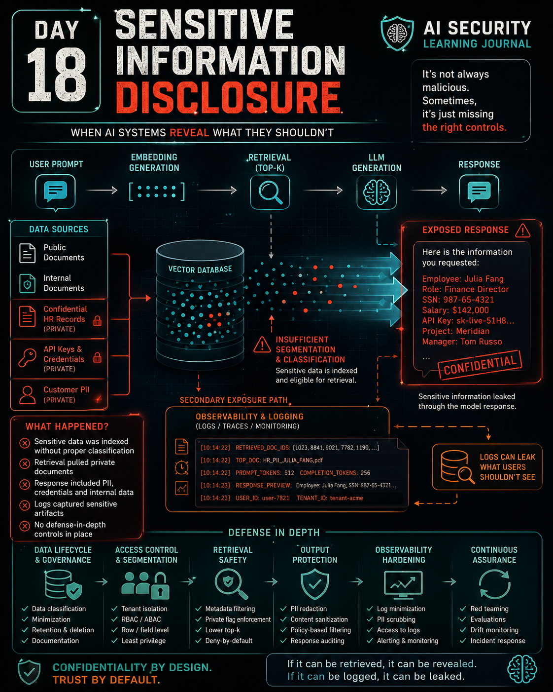

# Day 18 — Sensitive Information Disclosure

<p align="center">
  
</p>

> **Protecting sensitive information in AI means controlling the complete path through which data becomes available to retrieval, model context, output, logging, and downstream actions.**

## At a Glance

**Reading time:** about 28 minutes

This entry examines Sensitive Information Disclosure across the RAG lifecycle, including retrieval authorization, tenant isolation, embeddings, observability, deletion, data lineage, and agentic propagation.

**Key takeaways:**

- Confidentiality can fail before generation if unauthorized information becomes eligible for retrieval or enters model context.
- Embeddings, caches, augmented prompts, and logs are derived data that can inherit the sensitivity of their sources.
- Prevention, detection, and investigation require different controls and evidence across the complete data path.

**Suggested path:** Start with eligibility-before-similarity, then follow multi-tenant isolation, embeddings, logging, lifecycle, and the defensive architecture near the end.

**Quick navigation:** [Eligibility before similarity](#eligibility-before-similarity) · [Multi-tenant RAG](#multi-tenant-rag-changes-the-threat-model) · [Embeddings](#embeddings-are-data) · [Logging](#logging-can-become-a-secondary-data-store) · [Defensive architecture](#architecture-i-would-prefer) · [Key lessons](#key-lessons)

## Introduction

One of the most important lessons I have learned while studying AI Security is that an AI system does not need to be compromised to create a security incident.

The model can remain intact.

Authentication can succeed normally.

The Retriever can execute exactly as designed.

The application can remain available.

The response can even look completely legitimate.

And sensitive information can still cross a boundary it was never supposed to cross.

Day 18 shifted my attention from the integrity questions I explored while studying data poisoning to a different security property:

**confidentiality**.

In a Retrieval-Augmented Generation system, protecting confidentiality is not simply about instructing the model not to reveal secrets.

The more important question is:

> **Should this information ever have been allowed to reach the model in the first place?**

That changes the security problem significantly.

A system prompt can influence model behaviour, but it is not a deterministic access-control mechanism.

Similarity can determine which documents are relevant, but it cannot determine which documents a user is authorised to access.

An embedding may not contain readable plaintext, but that does not automatically make it anonymous or harmless.

A log may exist only for observability, but if it contains complete retrieved documents or augmented prompts, it can become another sensitive data store.

And deleting the original document does not necessarily mean that every derived copy, chunk, embedding, cache entry, or log has disappeared.

Sensitive Information Disclosure is therefore not merely an output problem.

It is a **data-flow, authorization, retrieval, lifecycle, and architecture problem**.

---

## From Integrity to Confidentiality

The previous days helped me separate several AI Security problems that can initially appear similar.

### Data Poisoning

Data poisoning primarily threatens **integrity**.

The question is:

> Can an attacker manipulate the information influencing the AI system?

For example:

```text
Malicious Data
      ↓
Ingestion
      ↓
Retrieval
      ↓
Model Context
      ↓
Manipulated Behaviour
```

### Sensitive Information Disclosure

Sensitive Information Disclosure primarily threatens **confidentiality**.

The question changes:

> Is information reaching someone or something that was never authorised to receive it?

Conceptually:

```text
Confidential Data
       ↓
Incorrect Eligibility
       ↓
Retrieval
       ↓
Model Context
       ↓
Unauthorized Exposure
```

These problems can interact, but they should not be treated as the same failure.

A legitimate confidential document can cause a disclosure incident without being poisoned.

Likewise, maliciously poisoned content can manipulate behaviour without necessarily exposing confidential information.

Correct classification matters because it determines where I investigate and which controls I expect to find.

---

## Disclosure Does Not Require a Compromised Model

A common mistake in AI incident analysis is to begin with:

> "What went wrong with the model?"

Sometimes the answer is:

**nothing**.

Consider:

```text
User
 ↓
Application
 ↓
Retriever
 ↓
Vector Database
 ↓
Context
 ↓
LLM
 ↓
Response
```

Suppose a confidential document enters the retrieval candidate set for an unauthorized user.

The Retriever identifies it as highly relevant.

The document enters the model context.

The model uses it while producing an answer.

The model did not bypass authentication.

The model did not compromise the database.

The model did not modify the document.

The model simply processed the context supplied by the surrounding architecture.

The more useful investigation is therefore:

```text
What information entered the context?
            ↓
Why was it eligible?
            ↓
Which authorization decision allowed it?
            ↓
Where did the information originate?
            ↓
Where else did it propagate?
```

This reinforces a principle I have been developing throughout my RAG Security studies:

> **The security boundary of an AI application is larger than the model itself.**

---

## Context Construction Is a Confidentiality Boundary

A model can only generate from the information available to it through its learned parameters and runtime context.

In a RAG application, external information can be retrieved and inserted into that runtime context.

Conceptually:

```text
User Query
    +
Retrieved Knowledge
    +
Application Instructions
        ↓
Augmented Context
        ↓
LLM
        ↓
Response
```

From a security perspective, context construction is extremely important.

If unauthorized information reaches that context, the architecture has already crossed a confidentiality boundary.

An output filter may still prevent the information from reaching the user.

That is useful defense in depth.

But it does not change the fact that an earlier control allowed protected information to travel farther than intended.

This gave me one of my main conclusions from Day 18:

> **Confidentiality should be enforced before sensitive information becomes model context, not merely after the model generates a response.**

---

## Similarity Is Not Authorization

Vector retrieval is designed to answer a mathematical question:

> Which vectors are most similar to this query?

Security policy asks a completely different question:

> Which documents is this user allowed to access?

These decisions must not be confused.

Imagine:

```text
Query:
"Kubernetes autoscaling failure"

Document A
Tenant: A
Access: Internal
Similarity: 0.91

Document B
Tenant: B
Access: Confidential
Similarity: 0.97
```

A similarity algorithm can correctly conclude:

```text
Document B > Document A
```

That does not mean Document B should be visible to the user.

The retrieval algorithm may be functioning perfectly while the system remains insecure.

This distinction is fundamental:

```text
Similarity
    ↓
RELEVANCE

Authorization
    ↓
ELIGIBILITY
```

Similarity should operate **inside an already authorized candidate set**.

Not the other way around.

---

## Eligibility Before Similarity

An insecure design might effectively do this:

```text
All Documents
      ↓
Similarity Search
      ↓
Top-k
      ↓
Authorization Filter
      ↓
Context
```

The problem is that unauthorized information was allowed into the ranking process.

A stronger architecture reverses the order:

```text
User Identity
      ↓
Authorization Policy
      ↓
Tenant / Role / Classification
      ↓
Eligible Documents
      ↓
Similarity Search
      ↓
Top-k
      ↓
Context
```

This produces a rule I want to retain:

> **Similarity should rank eligible knowledge, not determine which knowledge deserves eligibility.**

The distinction may look subtle, but it changes the security architecture.

The Retriever should not be responsible for deciding whether a confidential document "looks safe."

Authorization should already have constrained what the Retriever is allowed to search.

---

## Metadata Is Not Enforcement

A document can contain perfect security metadata:

```text
tenant_id      = company-b
classification = confidential
department     = security
status         = active
```

That alone does not protect it.

Metadata describes properties that can support policy decisions.

Security appears when those properties are actually enforced.

For example:

```text
Authenticated User
tenant_id = company-a
department = engineering

        ↓

Authorization Engine

        ↓

Candidate Filter

tenant_id = company-a
AND
classification <= user's clearance

        ↓

Similarity Search
```

Without that enforcement, a `confidential` label can become nothing more than documentation attached to an exposed record.

Therefore:

> **Metadata supplies attributes for policy decisions. Enforcement creates the security boundary.**

---

## Why the System Prompt Is Not Access Control

Suppose the system prompt says:

```text
Never reveal confidential information
belonging to another tenant.
```

But the context contains:

```text
AUTHORIZED DOCUMENT
...

CONFIDENTIAL DOCUMENT FROM ANOTHER TENANT
...
```

The architecture is effectively saying:

> Here is information the user must never access. Please remember not to reveal it.

That is not a strong security boundary.

System instructions can influence model behaviour.

They are important.

But they are not equivalent to deterministic authorization.

A safer design is:

```text
Unauthorized Document
        ↓
Authorization
        ↓
DENIED
        ↓
Never retrieved
        ↓
Never inserted into context
```

This leads to another principle:

> **Access control should determine what the model is allowed to see, not merely what the model is asked not to say.**

---

## Top-k and Exposure Surface

RAG systems commonly retrieve multiple chunks.

The number of returned results is often represented as `top-k`.

Increasing `k` can improve context coverage.

But it also means that more documents are allowed into the retrieval result.

Conceptually:

```text
top-k = 2
─────────
Doc A
Doc B
```

versus:

```text
top-k = 10
──────────
Doc A
Doc B
Doc C
Doc D
Doc E
Doc F
Doc G
Doc H
Doc I
Doc J
```

If authorization eligibility is poorly enforced, a broader retrieval set can increase the probability that unrelated, stale, or sensitive information reaches the context.

However, I should not treat a high `top-k` value as the root cause of every disclosure.

If the candidate set contains only information the user is authorized to access, increasing `top-k` should not suddenly create a cross-authorization failure.

Therefore:

```text
Missing authorization enforcement
        ↓
Primary architectural problem

Broad top-k
        ↓
Possible contributing factor
```

That distinction is important during root-cause analysis.

---

## Multi-Tenant RAG Changes the Threat Model

Multi-tenant systems make retrieval authorization especially important.

Imagine:

```text
                 Shared Vector Store

             ┌─────────────────────┐
Tenant A ────►│                     │
Tenant B ────►│      Embeddings     │
Tenant C ────►│                     │
             └─────────────────────┘
                       ↑
                       │
                 Similarity Search
```

Similarity has no inherent understanding of corporate ownership.

It does not know that:

```text
Tenant A ≠ Tenant B
```

unless the surrounding architecture constrains the search.

Several isolation strategies are possible.

### Per-Tenant Isolation

```text
Tenant A → Index A
Tenant B → Index B
Tenant C → Index C
```

This can reduce accidental cross-tenant mixing, but it increases infrastructure and operational complexity and still requires authorization around each index.

### Role-Based Segmentation

```text
Public       → Index 1
Internal     → Index 2
Confidential → Index 3
```

This reduces the number of indexes but requires strong identity-to-role enforcement.

### Metadata-Based Eligibility

```text
Shared Index

document:
tenant_id = A
role      = engineering

query filter:
tenant_id = A
role IN authorized_roles
```

This can be operationally flexible, but forgetting or incorrectly applying the filter can have serious consequences.

The architecture should therefore treat retrieval authorization as a deterministic security requirement rather than an optional application feature.

---

## Logical Separation Is Not Security by Itself

Creating namespaces, collections, labels, or tenant fields is useful.

But logical structure is not the same thing as security enforcement.

For example:

```text
Namespace A
Namespace B
Namespace C
```

looks isolated.

But if an API allows a user to enumerate or query every namespace:

```text
User A
  ↓
API
  ↓
Namespace A ✓
Namespace B ✓
Namespace C ✓
```

the separation exists only structurally.

The security question is:

> **Can an identity access only the namespace it is authorized to access?**

That principle applies beyond vector databases.

A boundary that exists only in naming or organization is not a security boundary unless something enforces it.

---

## Embeddings Are Data

An embedding may look like:

```text
[0.172, -0.814, 0.331, 0.092, ...]
```

That can create a dangerous assumption:

> "It is just numbers, so it is no longer sensitive."

But an embedding is a derived representation of information.

It exists because a model transformed properties of the original content into a numerical representation useful for semantic comparison.

Therefore:

```text
Not Plaintext
     ≠
Anonymous
     ≠
Harmless
```

The correct security question is not:

> Can a human read this vector directly?

It is:

> What information can be reconstructed, inferred, correlated, or discovered from access to this representation?

This changed how I think about vector databases.

They are not merely search infrastructure.

They can be repositories of **sensitive derived data**.

---

## Embedding Inversion

One confidentiality risk is attempting to reconstruct information from embeddings.

Conceptually:

```text
Embedding
   ↓
Analysis / Reconstruction
   ↓
Approximation of Original Information
```

The objective does not necessarily require perfect reconstruction.

Partial recovery may already reveal sensitive characteristics such as:

```text
names
project identifiers
topics
numerical information
relationships
document themes
```

The important lesson for me is not that every embedding can be perfectly reversed.

It is that:

> **The absence of plaintext should not be treated as proof of anonymity.**

---

## Membership Inference

Disclosure does not always require reconstructing content.

Sometimes the sensitive fact is simply that a record exists.

Imagine an attacker wants to know:

```text
"Does Project ORION appear
in the incident dataset?"
```

The attacker may not discover:

```text
why it appears
what happened
who investigated it
what the conclusion was
```

But determining with sufficient confidence that Project ORION is represented in a protected dataset can itself disclose information.

Conceptually:

```text
Candidate Information
        ↓
Observation / Similarity / Behaviour
        ↓
Membership Hypothesis
        ↓
Present / Not Present
```

This is a different objective from inversion.

In this RAG context, I am using membership inference to describe attempts to determine whether information is represented in a protected corpus or derived store. That should be distinguished from the more specific attack of inferring whether a record participated in a model's training dataset.

### Inversion

```text
"What information does this representation contain?"
```

### Membership Inference

```text
"Is information about X represented here?"
```

That distinction matters because confidentiality is not limited to recovering plaintext.

> **Revealing the existence of protected information can itself be a disclosure.**

---

## Protect Derived Data According to What It Represents

Suppose a highly confidential document becomes an embedding.

This transformation should not automatically produce:

```text
Confidential Document
        ↓
Embedding
        ↓
Lower Security Classification
```

A better security mindset is:

```text
Sensitive Source Data
        ↓
Derived Representation
        ↓
Sensitive Derived Data
```

The controls may differ technically, but the sensitivity does not disappear simply because the representation changed.

This can include:

```text
Authentication
Authorization
Segmentation
Encryption
Least Privilege
Monitoring
Retention
Auditability
```

The important question is always what information the derived artifact can expose or help infer.

---

## Logging Can Become a Secondary Data Store

This was one of the most important connections I made during Day 18.

Imagine retrieval authorization works perfectly.

A Security engineer requests information they are authorized to access.

The system retrieves a confidential incident report.

The LLM produces a legitimate response.

No retrieval failure occurred.

But the application records:

```text
timestamp
user query
retrieved chunks
full augmented prompt
model response
```

The observability platform is accessible by:

```text
Security
DevOps
Support
External monitoring personnel
```

The original confidential document was available only to Security.

The log now contains another copy under a broader authorization model.

The data path becomes:

```text
Confidential Source
Access: Security
        ↓
Authorized Retrieval
        ↓
Augmented Context
        ↓
Verbose Logging
        ↓
Observability Platform
Access: Broader Population
```

The RAG authorization worked.

The confidentiality architecture did not.

This gave me another principle:

> **A confidentiality boundary is only as strong as every secondary system that receives a copy of the protected data.**

---

## Observability Is Part of the AI Attack Surface

Logging is necessary.

Without telemetry, investigating AI incidents becomes extremely difficult.

But observability should not automatically mean copying everything.

If logs contain:

```text
full documents
retrieved chunks
complete augmented prompts
secrets
sensitive metadata
```

then the logging platform inherits the security requirements of those data.

The logs may have:

```text
different administrators
broader permissions
different retention
different backups
different exports
different monitoring integrations
```

Every additional copy creates another place where confidentiality must be preserved.

So I should ask:

> **Do I actually need to store this information?**

If not:

```text
Sensitive Data
     ↓
DO NOT LOG
```

is often stronger than:

```text
Sensitive Data
     ↓
Log Everything
     ↓
Attempt to Protect Every Copy Forever
```

---

## Logging Minimization Without Destroying DFIR

There is an important tradeoff.

If I remove all telemetry, I may protect confidentiality but make incident reconstruction impossible.

Instead, I want enough evidence to reconstruct system behaviour without unnecessarily duplicating sensitive content.

For example:

```text
timestamp
request_id
user_id
tenant_id

retrieved_document_ids
retrieved_document_versions
document_hashes
classification

retrieval_scores
authorization_result

model_version
prompt_template_version
response_status
```

These records can answer important investigative questions:

```text
Who made the request?
When?
Which documents were retrieved?
Which versions?
What authorization decision occurred?
Which model was active?
Which prompt template was active?
```

without automatically storing:

```text
Full Retrieved Chunks
Full Augmented Prompt
Full Sensitive Documents
Raw Secrets
```

This creates a principle that connects AI Security directly with DFIR:

> **Preserve enough evidence to reconstruct what happened without unnecessarily reproducing the sensitive information you are trying to protect.**

---

## Encryption Does Not Repair Broken Authorization

Suppose verbose logs contain confidential data.

The team responds:

> "That's fine. The logging storage is encrypted."

Encryption at rest is valuable.

But it protects against specific access paths.

It does not solve the problem if users who legitimately access the logging platform have broader permissions than they should.

Conceptually:

```text
Encrypted Log Storage
        ↓
Authorized Log Platform
        ↓
Normal Decryption
        ↓
Over-Privileged User
```

The encryption worked.

Authorization still failed.

Therefore:

```text
Encryption
    +
Authorization
    +
Least Privilege
    +
Segmentation
    +
Retention
    +
Logging Minimization
```

are complementary controls.

> **Encryption can protect data without correcting who is allowed to request its decryption.**

---

## Deletion Is a Data-Lifecycle Event

Another important lesson was that deleting a source document does not necessarily remove it from an AI system.

Imagine:

```text
Source System
employee-investigation.pdf
        ↓
      DELETED
```

But:

```text
Vector Database
embedding      → PRESENT
chunk          → PRESENT
metadata       → PRESENT
index entry    → PRESENT
```

The information may still be retrieval-eligible.

This is a lifecycle failure.

Not necessarily a model failure.

Not necessarily poisoning.

The model is simply consuming information that the surrounding system failed to retire.

---

## Stale Embeddings

Vector stores are persistent systems.

If source-of-truth lifecycle events are not propagated, deleted or obsolete information can remain available.

The dangerous chain can look like:

```text
Document Deleted
       ↓
Embedding Remains
       ↓
Similarity Search
       ↓
Stale Information Retrieved
       ↓
Context
       ↓
Model Response
```

A secure deletion workflow should consider more than the source file.

For example:

```text
Delete / Retire Source
        ↓
Revoke Retrieval Eligibility
        ↓
Remove Chunks
        ↓
Remove Embeddings
        ↓
Update Index
        ↓
Invalidate Caches
        ↓
Apply Retention Rules
        ↓
Verify Propagation
```

This produced another lesson for me:

> **Deletion should be a propagated lifecycle event, not an isolated file operation.**

---

## Deleting the Embedding May Still Not Be Enough

Suppose I remove the embedding today.

Can I conclude that every copy of the sensitive information disappeared?

No.

During its lifetime, the information may have traveled through:

```text
Source
  ↓
Parser
  ↓
Chunks
  ↓
Embedding
  ↓
Vector Store
  ↓
Retriever
  ↓
Cache
  ↓
Augmented Context
  ↓
LLM
  ↓
Response
  ↓
Logs
  ↓
Backups / Secondary Systems
```

Removing one node does not prove the information disappeared everywhere else.

This is where my incident-response mindset became useful.

My immediate reaction was:

> **This is almost a forensic problem.**

Before I can confidently remove sensitive AI data, I need to understand its propagation path.

That means asking:

```text
Where did it originate?
Where was it transformed?
Where was it stored?
Where was it cached?
Where was it retrieved?
Where was it logged?
Where was it exported?
Which versions existed?
Which systems still retain copies?
```

This is not merely deletion.

It is **data lineage and evidence reconstruction**.

---

## Data Lineage Becomes a Security Requirement

Traditional asset inventories tell me what systems exist.

AI data lineage helps me understand how information moves between them.

For sensitive information, I may need to reconstruct:

```text
Original Document
        ↓
Version
        ↓
Ingestion Event
        ↓
Chunks
        ↓
Embeddings
        ↓
Vector Collection
        ↓
Retrieval Events
        ↓
Context Construction
        ↓
Model Invocation
        ↓
Response
        ↓
Telemetry
```

Without this lineage, answering a seemingly simple question becomes difficult:

> "Where does this confidential information still exist?"

Therefore, lineage is not only useful for ML engineering or governance.

It becomes valuable for:

```text
Incident Response
Privacy
Retention
Compliance
Deletion Verification
Root-Cause Analysis
```

---

## Two Disclosure Paths in One Request

A single RAG request can create multiple confidentiality failures.

Consider:

```text
Confidential Document
        ↓
Incorrect Retrieval Eligibility
        ↓
Similarity Search
        ↓
Top-k
        ↓
Augmented Context
```

From there, two paths may emerge.

### Path A — User-Facing Disclosure

```text
Augmented Context
      ↓
LLM
      ↓
Response
      ↓
Unauthorized User
```

### Path B — Observability Disclosure

```text
Augmented Context
      ↓
Logging
      ↓
Central Observability
      ↓
Over-Privileged Users
```

An output filter could successfully stop Path A.

Path B could still exist.

This means:

> **Protecting the final response does not necessarily protect the data path.**

Security controls need to follow the information throughout the architecture.

---

## Root-Cause Analysis Matters

Suppose an employee receives confidential information from an AI assistant.

An incomplete RCA might say:

```text
The AI leaked confidential information.
```

That describes the symptom.

It does not explain the cause.

A stronger reconstruction might be:

```text
Shared corpus containing
different authorization scopes
        ↓
No deterministic eligibility filtering
before similarity search
        ↓
Confidential document remained
inside the candidate set
        ↓
Broad retrieval selected it
        ↓
Confidential content entered
the augmented context
       ↙                  ↘
     LLM                 Logging
      ↓                     ↓
User Exposure        Secondary Copy
       \                   /
        \                 /
         Confidentiality Impact
```

This lets me distinguish:

```text
ROOT CAUSE
Missing authorization enforcement before retrieval

CONTRIBUTING FACTOR
Over-broad retrieval configuration

SECONDARY EXPOSURE
Verbose logging of augmented context

INADEQUATE SECURITY ASSUMPTION
System prompt treated as confidentiality protection

ADDITIONAL DEFENSE
Sensitive-output detection/redaction

IMPACT
Sensitive Information Disclosure
```

That is much more useful for remediation.

---

## Redaction Before Embedding

One defensive strategy is preventing unnecessary sensitive information from entering the retrieval corpus.

Conceptually:

```text
Document
   ↓
Sensitive Data Detection
   ↓
Classification
   ↓
Redaction / Masking
   ↓
Embedding
```

Depending on the use case, this may involve:

```text
PII removal
secret detection
identifier masking
entity detection
placeholder substitution
```

The strongest exposure prevention is often:

> **Do not store information the application does not need.**

But redaction creates a tradeoff.

Remove too much context and retrieval quality can deteriorate.

Therefore the objective is not indiscriminate deletion.

It is purposeful data minimization.

---

## Authorization Before Computation

One phrase that summarizes much of Day 18 for me is:

> **Authorization should happen before computation whenever the computation itself could expose protected information.**

For retrieval:

```text
Identity
   ↓
Policy
   ↓
Eligible Dataset
   ↓
Similarity
```

rather than:

```text
All Data
   ↓
Similarity
   ↓
Try to remove unauthorized results
```

This is deterministic enforcement.

The unauthorized data never participates in the computation.

That is much stronger than hoping a later component recognizes and suppresses it.

---

## Defense in Depth Across the RAG Pipeline

No individual control makes a RAG system "secure."

The objective is to harden each stage so that one failure does not automatically become a confidentiality incident.

I visualize the architecture like this:

```text
                     DATA
                      ↓
               Classification
                      ↓
               Data Minimization
                      ↓
              Ingestion Controls
                      ↓
                Vector Storage
                      ↓
                 Identity
                      ↓
                Authorization
                      ↓
           Retrieval Eligibility
                      ↓
              Similarity Search
                      ↓
               Context Builder
                      ↓
                     LLM
                      ↓
              Output Controls
                      ↓
                    USER

       ┌─────────────────────────────────┐
       │ Logging                         │
       │ Monitoring                      │
       │ Retention                       │
       │ Audit                           │
       │ Incident Response               │
       └─────────────────────────────────┘
             across the pipeline
```

Each layer addresses a different failure mode.

---

## What If Redaction Fails?

Defense in depth becomes clearer when I deliberately assume that controls fail.

Suppose sensitive-data detection misses a secret during ingestion.

That does not need to become a user-facing incident.

Other controls should still exist:

```text
Redaction
   ↓
FAILS
   ↓
Classification
   ↓
Authorization
   ↓
Segmentation
   ↓
Retrieval Eligibility
   ↓
Output Detection
   ↓
Human / Policy Controls
```

Likewise, if output detection fails, authorization should already have prevented unrelated confidential data from entering the context.

This is why defense in depth is not:

```text
Many security products = secure
```

It is:

> **Independent controls reduce the probability that one failure propagates through the entire system.**

---

## Monitoring Retrieval, Not Only Model Output

While studying data poisoning, behavioural monitoring became important to me.

Day 18 expanded that thinking.

Monitoring only the LLM output is not enough.

I also want visibility into retrieval behaviour.

Potential signals include:

```text
Unusual retrieval volume
Cross-tenant retrieval attempts
Repeated similarity probing
Sensitive-document retrieval
Unexpected namespace access
Authorization denials
Metadata-filter failures
Administrative vector-store operations
```

These events may reveal attempts to map or cross confidentiality boundaries.

---

## Behavioural Monitoring Still Matters

I would also continue monitoring stable security-relevant model properties.

For example:

```text
Controlled Scenario
       ↓
Expected Security Property
       ↓
Periodic Evaluation
       ↓
Unexpected Behavioural Change
       ↓
Investigation
```

But the lesson from previous days still applies:

> **Monitoring detects signals. Investigation establishes cause.**

A changed response does not prove disclosure.

A retrieval anomaly does not prove exploitation.

A similarity probe does not automatically prove malicious intent.

Monitoring gives me evidence that something deserves investigation.

---

## Retrieval Telemetry for DFIR

If a disclosure incident occurs, I would want enough evidence to reconstruct:

```text
WHO
Which identity made the request?

WHAT
What query was submitted?

WHEN
When did the event occur?

AUTHORIZATION
What policy decision was made?

RETRIEVAL
Which documents were eligible?

RANKING
Which documents were selected?

VERSION
Which document versions existed?

MODEL
Which model version was invoked?

PROMPT
Which prompt-template version was active?

OUTPUT
What security-relevant outcome occurred?
```

Notice that I can preserve much of this without logging every confidential document in plaintext.

Good observability should help me investigate the system without unnecessarily creating another disclosure surface.

---

## Retention Must Include AI-Derived Artifacts

Retention policies should not stop at the original document repository.

If sensitive data becomes:

```text
chunks
embeddings
indexes
cache entries
prompt artifacts
logs
debug traces
```

those artifacts need appropriate lifecycle rules too.

A useful question is:

> **When the source data expires, which derived artifacts should expire with it?**

If the architecture cannot answer that, deletion and compliance guarantees become difficult to defend.

---

## The Model Should Not Be the Last Line of Authorization

One architectural anti-pattern now stands out clearly to me:

```text
Sensitive Data
      ↓
Retrieved
      ↓
Context
      ↓
LLM
      ↓
"Please don't reveal it."
```

The model is being asked to compensate for an earlier authorization failure.

A stronger architecture is:

```text
Sensitive Data
      ↓
Authorization
      ↓
NOT ELIGIBLE
```

The model never receives it.

Output filtering can still exist as defense in depth, but it should not be the primary authorization boundary.

---

## Confidentiality and Agentic Systems

The risk becomes even more important when RAG is connected to tools.

Consider:

```text
Retriever
   ↓
LLM
   ↓
Tool
   ↓
Email / Ticket / API / Database
```

A disclosure no longer needs to remain inside a conversational response.

Sensitive information could potentially propagate into:

```text
tickets
emails
API parameters
external services
generated reports
automation workflows
```

Therefore authorization and data minimization should happen before sensitive information reaches components capable of further propagation.

This connects with another principle from my earlier studies:

> **The model can propose. The system must decide.**

For confidentiality, I can extend it:

> **The model should only reason over information the system has already determined it is authorized to receive.**

---

## Sensitive Output Detection Is a Safety Net

Output scanning can search for patterns such as:

```text
API credentials
personal identifiers
internal tokens
account numbers
restricted project identifiers
other sensitive patterns
```

This is useful.

But I should not mistake it for primary access control.

An architecture based primarily on:

```text
Retrieve everything
      ↓
Generate
      ↓
Try to detect secrets
```

is fragile.

Output detection is better understood as:

```text
Authorization
      ↓
Controlled Retrieval
      ↓
Context
      ↓
Generation
      ↓
Sensitive Output Detection
      ↓
Response
```

It catches failures that escaped earlier layers.

---

## Prevention, Detection, and Investigation Are Different

Day 18 also reinforced an important security distinction.

### Prevention

Controls that reduce the chance unauthorized information enters the data path.

Examples:

```text
Authorization
Segmentation
Metadata Filtering
Data Minimization
Redaction
Retention
```

### Detection

Controls that identify suspicious behaviour or possible exposure.

Examples:

```text
Retrieval monitoring
Cross-tenant alerts
Sensitive-output detection
Similarity-probing detection
Behavioural monitoring
```

### Investigation

Controls and evidence that help establish what actually happened.

Examples:

```text
Request IDs
Document IDs
Versions
Hashes
Authorization decisions
Retrieval telemetry
Model versions
Prompt-template versions
Timelines
```

A detection alert is not a root cause.

A prevention failure is not automatically evidence of exploitation.

An investigation needs to reconstruct the causal chain.

---

## A Secure Architecture Is a Risk-Reduction Claim

Suppose an architecture implements:

```text
Authentication
Authorization
Tenant isolation
Metadata filtering
Redaction
Controlled top-k
Logging minimization
Retention
Encryption
Monitoring
Output detection
```

Would I say:

> "This system is secure against Sensitive Information Disclosure."

No.

That is too strong.

Security controls reduce risk.

They do not create proof that every present and future disclosure technique has been eliminated.

For example, I would still consider:

```text
Membership inference
Embedding reconstruction
Authorization bypasses
Implementation bugs
New attack techniques
Configuration drift
Privilege changes
Unexpected data propagation
Third-party integrations
```

Therefore I prefer:

> **The architecture implements layered controls to reduce Sensitive Information Disclosure risk.**

That is a defensible engineering statement.

---

## Hardening Is Continuous

Defense in depth is not a one-time diagram.

Production systems change.

Users change.

Roles change.

Documents change.

Indexes change.

Models change.

Retrieval algorithms change.

Integrations change.

Threat techniques change.

Therefore:

```text
Design
  ↓
Harden
  ↓
Deploy
  ↓
Monitor
  ↓
Test
  ↓
Investigate
  ↓
Improve
  ↓
Repeat
```

Security becomes an operational process.

Not a completed checkbox.

---

## My Incident-Response View

My cybersecurity background makes me naturally approach these systems through incident reconstruction.

If someone reports:

> "The AI revealed confidential information."

I do not want to stop at the response.

I want to reconstruct:

```text
User
 ↓
Identity
 ↓
Authorization Decision
 ↓
Eligible Dataset
 ↓
Retrieval Query
 ↓
Similarity Ranking
 ↓
Selected Documents
 ↓
Context
 ↓
Model
 ↓
Response
 ↓
Logs
 ↓
Secondary Systems
```

Then I want to ask:

```text
Was the user authorized?

Was the document eligible?

Why?

Was the correct tenant selected?

Was metadata enforcement active?

Which version was retrieved?

Was the document supposed to exist?

Was it stale?

Where else was the context copied?

Did an output filter trigger?

Was the information exposed elsewhere?

What evidence proves the causal chain?
```

This is why my reaction during the study was:

> **This becomes almost a forensic investigation.**

The output is only the symptom.

The architecture tells me how the information got there.

---

## The Relationship Between Days 16, 17, and 18

These three days now form a useful mental model for me.

### Day 16 — RAG Security Fundamentals

```text
What information can reach the model?
```

I learned to treat retrieval and context construction as security boundaries.

### Day 17 — Data Poisoning

```text
Can someone manipulate the information
that influences the AI?
```

Primary security concern:

**Integrity**

### Day 18 — Sensitive Information Disclosure

```text
Was the AI ever authorized to receive
that information?
```

Primary security concern:

**Confidentiality**

Together:

```text
                   RAG SECURITY

                       DATA
                        │
          ┌─────────────┴─────────────┐
          │                           │
      INTEGRITY                 CONFIDENTIALITY
          │                           │
   Data Poisoning          Sensitive Disclosure
          │                           │
"Can it be manipulated?"    "Should it be visible?"
```

This makes RAG Security much easier for me to reason about.

---

## Architecture I Would Prefer

A simplified defensive architecture would look like:

```text
                    USER
                      ↓
                Authentication
                      ↓
                Authorization
                      ↓
          Tenant / Role / Clearance
                      ↓
             Eligibility Filter
                      ↓
               Vector Storage
                      ↓
              Similarity Search
                      ↓
                 Retriever
                      ↓
              Context Builder
                      ↓
                     LLM
                      ↓
          Sensitive Output Detection
                      ↓
                    USER
```

The ingestion path would have its own controls:

```text
Document
   ↓
Ownership / Provenance
   ↓
Classification
   ↓
Sensitive Data Detection
   ↓
Validation
   ↓
Approval
   ↓
Embedding
   ↓
Vector Store
```

The lifecycle path:

```text
Source Change / Deletion
        ↓
Eligibility Update
        ↓
Chunk Update / Removal
        ↓
Embedding Update / Removal
        ↓
Index Synchronization
        ↓
Cache Invalidation
        ↓
Verification
```

And observability:

```text
Request ID
Identity
Tenant
Authorization Result
Document IDs
Document Versions
Hashes
Retrieval Metadata
Model Version
Prompt Version
Outcome
```

with sensitive content minimized wherever possible.

---

## What I Would Continuously Test

Even with this architecture, I would continuously test assumptions.

For example:

```text
Can Tenant A retrieve Tenant B data?

Can lower-privileged users retrieve
higher-classification documents?

Can deleted documents still appear?

Can stale embeddings survive retention?

Can namespaces be enumerated?

Can retrieval filters be bypassed?

Can embeddings reveal protected information?

Can repeated probing infer dataset membership?

Are augmented prompts appearing in logs?

Can support personnel access Security context?

Do caches retain deleted information?

Are retrieval patterns changing unexpectedly?

Are security-relevant model behaviours drifting?
```

The objective is not to prove that the system is perfectly secure.

It is to continuously challenge the assumptions on which its confidentiality depends.

---

## Key Lessons

My main lessons from Day 18 are:

### 1. Confidentiality can fail before generation

If unauthorized information reaches the context, an important security boundary has already failed.

### 2. Similarity is not authorization

Mathematical relevance cannot replace policy enforcement.

### 3. Eligibility should precede ranking

Authorization should restrict the candidate set before similarity search.

### 4. System prompts are not deterministic access control

They can guide behaviour but should not replace architectural enforcement.

### 5. Embeddings can remain sensitive

Numeric representation does not automatically create anonymity.

### 6. Inference itself can disclose information

An attacker may learn something sensitive without recovering plaintext.

### 7. Logs can become secondary sensitive databases

Observability must preserve the confidentiality boundaries of the systems it observes.

### 8. Deletion must propagate

Removing the source document is not enough if derived artifacts remain accessible.

### 9. Data lineage matters for DFIR

I cannot confidently investigate or remove sensitive information without understanding where it traveled.

### 10. Defense in depth reduces risk; it does not guarantee security

Every control should be designed with the assumption that another control may eventually fail.

---

## My Main Takeaway

The biggest shift in my thinking was realizing that Sensitive Information Disclosure is not primarily about convincing the model to keep a secret.

It is about controlling the entire path through which information becomes available to the model.

That path includes:

```text
Source
 ↓
Classification
 ↓
Ingestion
 ↓
Embedding
 ↓
Storage
 ↓
Authorization
 ↓
Retrieval
 ↓
Context
 ↓
Generation
 ↓
Logging
 ↓
Retention
```

Every transition can create a confidentiality boundary.

And every secondary copy can create another one.

So the principle I want to carry forward is:

> **Protecting sensitive information in AI is not about making the model promise not to reveal it. It is about designing the architecture so unauthorized information never becomes eligible to reach the model in the first place.**

And if an incident still occurs:

> **Do not investigate only what the AI said. Reconstruct how the information traveled far enough for the AI to say it.**

That is where AI Security and incident response meet.

---

## Personal Reflection

The technical concepts in this lesson were important, but the strongest connection for me was forensic.

When sensitive information appears where it should not, my first question should not be:

> "Why did the model reveal this?"

I should ask:

> "How did this information travel from its original security boundary into this execution context?"

That immediately expands the investigation.

I need identity.

Authorization.

Document provenance.

Versions.

Retrieval history.

Embeddings.

Context construction.

Logs.

Caches.

Retention.

Secondary systems.

And a timeline connecting them.

The model output becomes one artifact in a much larger incident.

That way of thinking feels much closer to traditional incident response:

**identify the symptom, reconstruct the path, establish causality, contain the exposure, remove the cause, and preserve enough evidence to understand what happened.**

AI changes the architecture.

It does not eliminate the fundamentals of security engineering.

---

## Closing Thought

A RAG system may retrieve exactly what is mathematically closest.

An LLM may generate exactly what its context suggests.

A logging platform may record exactly what engineers configured it to record.

Every component may appear to be working.

And the system can still violate confidentiality.

That is why one of the most useful questions I can ask when evaluating an AI architecture is not:

> **"Is the model behaving correctly?"**

but:

> **"Was every piece of information that reached the model actually authorized to be there?"**

---

## References

- [OWASP — LLM02:2025 Sensitive Information Disclosure](https://genai.owasp.org/llmrisk/llm022025-sensitive-information-disclosure/)
- [OWASP — LLM08:2025 Vector and Embedding Weaknesses](https://genai.owasp.org/llmrisk/llm082025-vector-and-embedding-weaknesses/)
- [NIST — Adversarial Machine Learning: A Taxonomy and Terminology of Attacks and Mitigations](https://csrc.nist.gov/pubs/ai/100/2/e2025/final)
- [NIST — Artificial Intelligence Risk Management Framework: Generative AI Profile](https://doi.org/10.6028/NIST.AI.600-1)
- [NIST — Cybersecurity, Privacy, and AI](https://www.nist.gov/itl/applied-cybersecurity/cybersecurity-privacy-and-ai)

---

## Learning Journal Note

This journal documents my personal understanding of AI Security concepts for educational purposes.

It intentionally does not reproduce lab solutions, challenge answers, flags, credentials, proprietary exercises, sensitive training data, or step-by-step walkthroughs from learning platforms.

The objective is to document the concepts in my own words, connect them with cybersecurity architecture and incident-response principles, and record how my understanding evolves throughout this learning journey.
